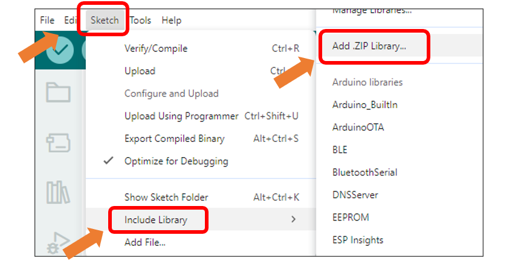
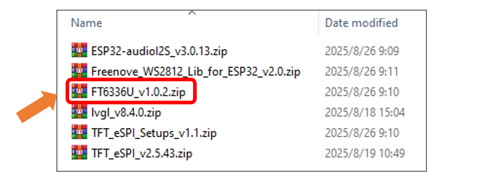
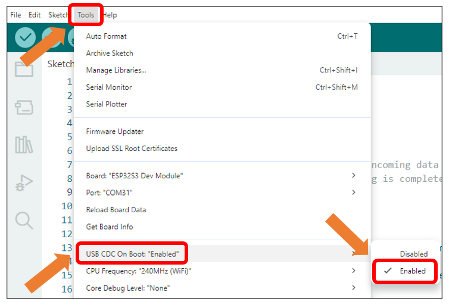
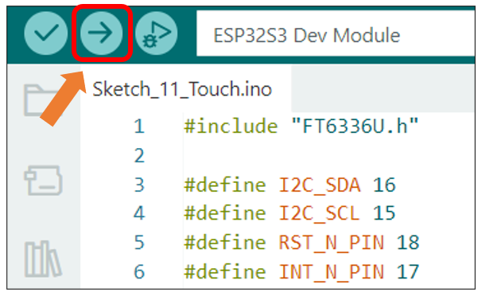
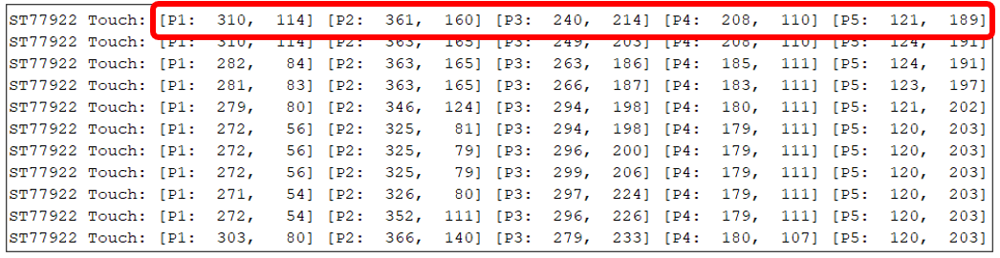

##############################################################################
Chapter 11 TFT Touch
##############################################################################

Project 11.1 TFT Touch
*****************************************

Component List
=========================================

.. table::
    :align: center
    :class: table-line

    +-------------------------------+----------------+
    | Freenove ESP32-S3 Display x 1 | USB cable x1   |
    |                               |                |
    | |Chapter11_04|                | |Chapter11_07| |
    +-------------------------------+----------------+

.. |Chapter11_04| image:: ../_static/imgs/11_TFT_Touch/Chapter11_04.png
.. |Chapter11_07| image:: ../_static/imgs/11_TFT_Touch/Chapter11_07.png

Circuit
=========================================

Connect Freenove ESP32 -S3 to the computer using the USB cable. 

.. image:: ../_static/imgs/11_TFT_Touch/Chapter11_05.png
    :align: center

Sketch
=========================================

Open **“Sketch_11.1_Touch”** folder under **“Freenove_ESP32_S3_Display\\Tutorial_With_Touch\\Sketches”** and double-click **“Sketch_11.1_Touch.ino”**.

Install the needed libraries.
------------------------------------------

Click **Sketch** -> **Include Library** -> **Add .ZIP Library...**

Select **ESP32-audioI2S_v3.0.13.zip**

Next, we download the code to Freenove_ESP32_S3_Display to test. Open **“Sketch_11.1_Touch”** folder under **“Freenove_ESP32_S3_Display\\Tutorial_With_Touch\\Sketcheses”** and double-click **“Sketch_11.1_Touch.ino”**.

Sketch_11.1_Touch
----------------------------------------

The following is the program code:

.. literalinclude:: /freenove_Kit/Tutorial_With_Touch/Sketches/Sketch_11.1_Touch/Sketch_11.1_Touch.ino
    :linenos:
    :language: C
    :dedent:

Enable the **"USB CDC On Boot"** feature. 

Click **“Upload”** to upload the code to Freenove ESP32 Display, set the baud rate to 115200.

When touching the screen, the serial monitor will print coordinates in real-time, as shown in the image below:

:combo:`red font-bolder:Please Note: Only the 3.5-inch Freenove ESP32-S3 Display supports 5-point multi-touch; other models support only single-point touch.`

