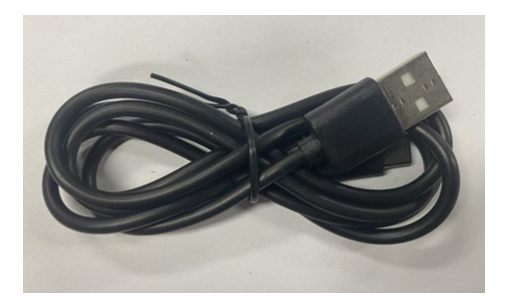
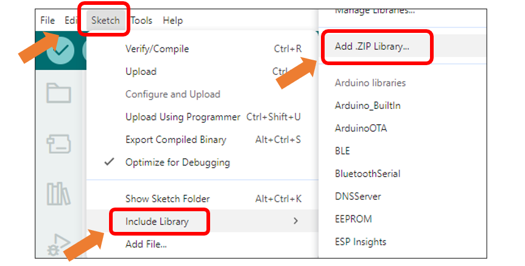

##############################################################################
Chapter 11 TFT Touch
##############################################################################

Project 11.1 TFT Touch
*****************************************

Component List
=========================================

.. table::
    :align: center
    :class: table-line
    :width: 80%

    +-------------------------------+----------------+
    | Freenove ESP32 S3 Display x 1 | USB cable x1   |
    |                               |                |
    | |Chapter01_07|                | |Chapter01_08| |
    +-------------------------------+----------------+

.. |Chapter01_07| image:: ../_static/imgs/1_Serial/Chapter01_07.png

Circuit
=========================================

Connect Freenove ESP32 -S3 to the computer using the USB cable. 

.. image:: ../_static/imgs/Preface/Preface09.png
    :align: center

Sketch
=========================================

Open **“Sketch_11.1_Touch”** folder under **“Freenove_ESP32_S3_Display\\Sketches”** and double-click **“Sketch_11.1_Touch.ino”**.

Install the needed libraries.

Click **Sketch** -> **Include Library** -> **Add .ZIP Library...**

Select **ESP32-audioI2S_v3.0.13.zip**

Next, we download the code to Freenove_ESP32_S3_Display to test. Open **“Sketch_11_Touch”** folder under **“Freenove_ESP32_S3_Display\\Sketcheses”** and double-click **“Sketch_11.1_Touch.ino”**.

Sketch_11.1_Touch
----------------------------------------

The following is the program code:

.. literalinclude:: /freenove_Kit/Touch/Sketches/Sketch_11_Touch/Sketch_11_Touch.ino
    :linenos:
    :language: C
    :dedent:

Code Explanation
---------------------------------------

Include the necessary header files.

.. literalinclude:: /freenove_Kit/Touch/Sketches/Sketch_11_Touch/Sketch_11_Touch.ino
    :linenos:
    :lines: 1-1
    :dedent:

Initialize the screen.

.. literalinclude:: /freenove_Kit/Touch/Sketches/Sketch_11_Touch/Sketch_11_Touch.ino
    :linenos:
    :lines: 8-9
    :dedent:

Set the baud rate to 115200.

.. literalinclude:: /freenove_Kit/Touch/Sketches/Sketch_11_Touch/Sketch_11_Touch.ino
    :linenos:
    :lines: 12-12
    :dedent:

Scan touch point data and output it via the serial port.

.. literalinclude:: /freenove_Kit/Touch/Sketches/Sketch_11_Touch/Sketch_11_Touch.ino
    :linenos:
    :lines: 12-12
    :dedent:

Enable the **"USB CDC On Boot"** feature. 

Click **“Upload”** to upload the code to Freenove ESP32 Display, set the baud rate to 115200.

