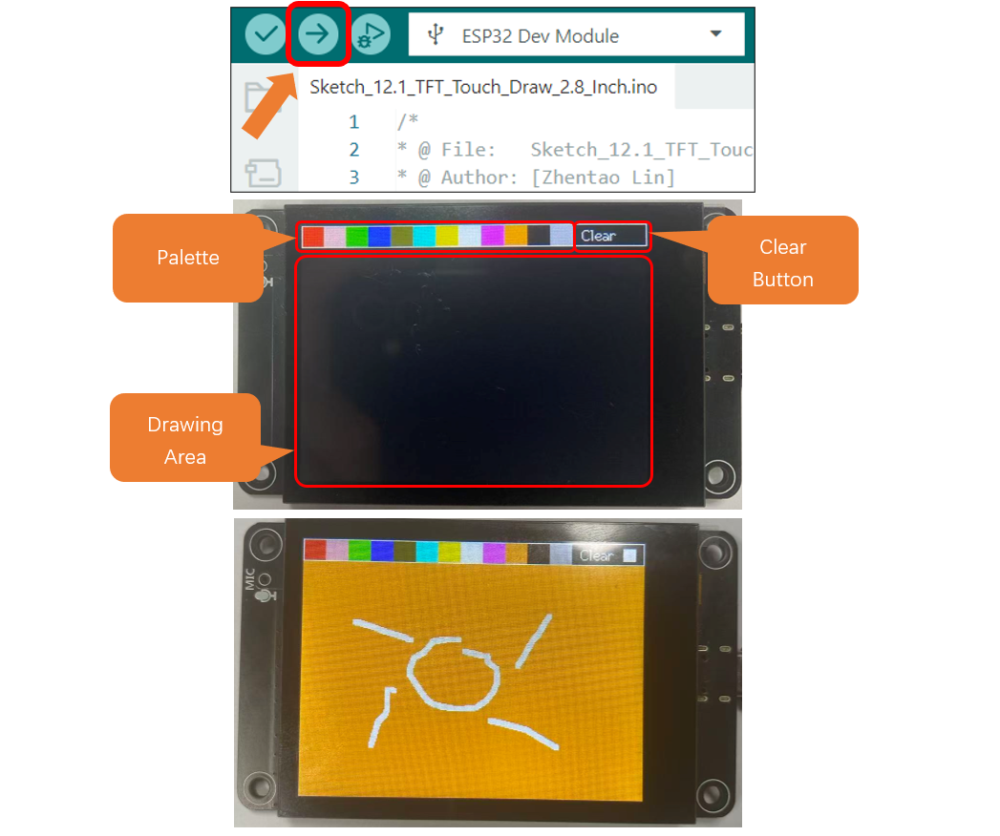

##############################################################################
Chapter 12 TFT Touch Drawing
##############################################################################

After learning this chapter, you will be able to draw freely on the screen.

Project 12.1 TFT Touch Drawing
**********************************************

Component List
==============================================

.. table::
    :align: center
    :class: table-line
    :width: 80%

    +-------------------------------+----------------+
    | Freenove ESP32 S3 Display x 1 | USB cable x1   |
    |                               |                |
    | |Chapter01_07|                | |Chapter01_08| |
    +-------------------------------+----------------+

.. |Chapter01_07| image:: ../_static/imgs/1_Serial/Chapter01_07.png
.. |Chapter01_08| image:: ../_static/imgs/1_Serial/Chapter01_08.png

Circuit
=========================================

Connect Freenove ESP32 -S3 to the computer using the USB cable. 

.. image:: ../_static/imgs/Preface/Preface09.png
    :align: center

Sketch
=========================================

Open **“Sketch_12.1_TFT_Touch_Draw”** folder under **“Freenove_ESP32_S3_Display\\Sketches”** and double-click **“Sketch_12.1_TFT_Touch_Draw.ino”**.

Sketch_12.1_TFT_Touch_Draw
-----------------------------------------

The following is the program code:

.. literalinclude:: /freenove_Kit/Sketches/Sketch_12.1_TFT_Touch_Draw_2.8_Inch/Sketch_12.1_TFT_Touch_Draw_2.8_Inch.ino
    :linenos:
    :language: C
    :dedent:

Code Explanation
-----------------------------------------

Include the necessary header files.

.. literalinclude:: /freenove_Kit/Sketches/Sketch_12.1_TFT_Touch_Draw_2.8_Inch/Sketch_12.1_TFT_Touch_Draw_2.8_Inch.ino
    :linenos:
    :language: C
    :lines: 10-11
    :dedent:

Create TFT object instance.

.. literalinclude:: /freenove_Kit/Sketches/Sketch_12.1_TFT_Touch_Draw_2.8_Inch/Sketch_12.1_TFT_Touch_Draw_2.8_Inch.ino
    :linenos:
    :language: C
    :lines: 13-14
    :dedent:

Define screen resolution.

.. literalinclude:: /freenove_Kit/Sketches/Sketch_12.1_TFT_Touch_Draw_2.8_Inch/Sketch_12.1_TFT_Touch_Draw_2.8_Inch.ino
    :linenos:
    :language: C
    :lines: 16-26
    :dedent:

Draw color palette.

.. literalinclude:: /freenove_Kit/Sketches/Sketch_12.1_TFT_Touch_Draw_2.8_Inch/Sketch_12.1_TFT_Touch_Draw_2.8_Inch.ino
    :linenos:
    :language: C
    :lines: 40-42
    :dedent:

Detect whether the screen is pressed.

.. literalinclude:: /freenove_Kit/Sketches/Sketch_12.1_TFT_Touch_Draw_2.8_Inch/Sketch_12.1_TFT_Touch_Draw_2.8_Inch.ino
    :linenos:
    :language: C
    :lines: 81-81
    :dedent:

Store the x and y coordinates of the touch point in variables.

.. literalinclude:: /freenove_Kit/Sketches/Sketch_12.1_TFT_Touch_Draw_2.8_Inch/Sketch_12.1_TFT_Touch_Draw_2.8_Inch.ino
    :linenos:
    :language: C
    :lines: 85-86
    :dedent:

When the Clear button is pressed, fill the screen with the current color.

.. literalinclude:: /freenove_Kit/Sketches/Sketch_12.1_TFT_Touch_Draw_2.8_Inch/Sketch_12.1_TFT_Touch_Draw_2.8_Inch.ino
    :linenos:
    :language: C
    :lines: 99-102
    :dedent:

Calculate the selected color based on the coordinates of the touch point

.. literalinclude:: /freenove_Kit/Sketches/Sketch_12.1_TFT_Touch_Draw_2.8_Inch/Sketch_12.1_TFT_Touch_Draw_2.8_Inch.ino
    :linenos:
    :language: C
    :lines: 104-110
    :dedent:

Draw a line based on coordinates

.. literalinclude:: /freenove_Kit/Sketches/Sketch_12.1_TFT_Touch_Draw_2.8_Inch/Sketch_12.1_TFT_Touch_Draw_2.8_Inch.ino
    :linenos:
    :language: C
    :lines: 117-129
    :dedent:

Click “Upload” to upload the code to Freenove ESP32 Display. Set the baud rate to115200

Tips: Aliasing & Anti-aliasing

In computer graphics, **aliasing** refers to the **jagged or stair-step appearance** of lines and curves in digital images, particularly noticeable on diagonal lines and edges. This occurs due to the discrete nature of pixel grids - screens compose images from tiny square pixels that cannot perfectly represent continuous geometry.

**Anti-aliasing** mitigates these artifacts through technical means to **smooth edges**, achieving more natural-looking graphics. The core technique blends transitional colors at boundary pixels, simulating human visual perception of soft edges.