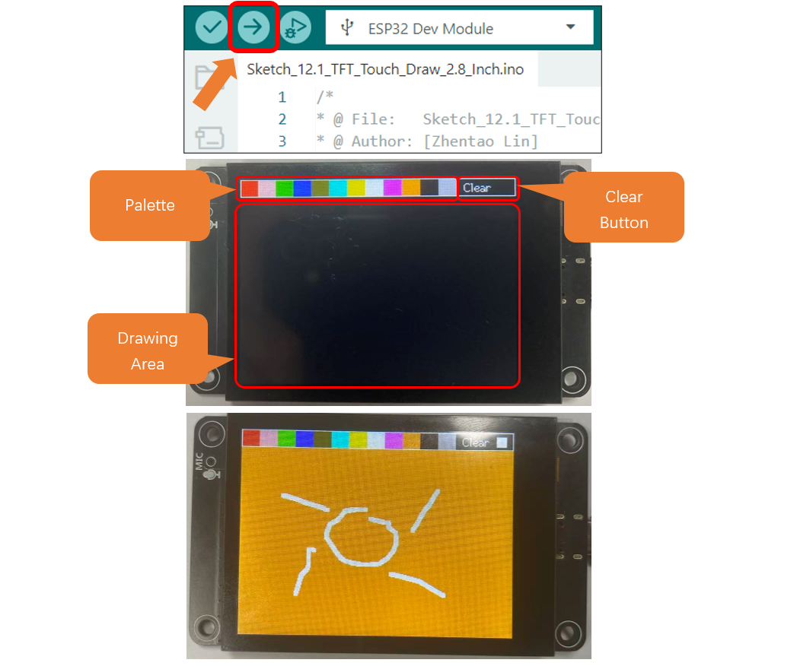

##############################################################################
Chapter 12 TFT Touch Drawing
##############################################################################

After learning this chapter, you will be able to draw freely on the screen.

Project 12.1 TFT Touch Drawing
**********************************************

Component List
==============================================

.. table::
    :align: center
    :class: table-line

    +-------------------------------+----------------+
    | Freenove ESP32-S3 Display x 1 | USB cable x1   |
    |                               |                |
    | |Chapter11_04|                | |Chapter11_07| |
    +-------------------------------+----------------+

.. |Chapter11_04| image:: ../_static/imgs/11_TFT_Touch/Chapter11_04.png
.. |Chapter11_07| image:: ../_static/imgs/11_TFT_Touch/Chapter11_07.png

Circuit
=========================================

Connect Freenove ESP32 -S3 to the computer using the USB cable. 

.. image:: ../_static/imgs/11_TFT_Touch/Chapter11_05.png
    :align: center

Sketch
=========================================

Open **"Sketch_12.1_TFT_Touch_Draw"** folder under **"Freenove_ESP32_S3_Display\\Tutorial_With_Touch\\Sketches"** and double-click **"Sketch_12.1_TFT_Touch_Draw.ino"**.

Sketch_12.1_TFT_Touch_Draw
-----------------------------------------

The following is the program code:

.. literalinclude:: /freenove_Kit/Tutorial_With_Touch/Sketches/Sketch_12.1_TFT_Touch_Draw/Sketch_12.1_TFT_Touch_Draw.ino
    :linenos:
    :language: C
    :dedent:

Click "**Upload**" to upload the code to Freenove ESP32 Display. Set the baud rate to115200

Tips: Aliasing & Anti-aliasing

In computer graphics, **aliasing** refers to the **jagged or stair-step appearance** of lines and curves in digital images, particularly noticeable on diagonal lines and edges. This occurs due to the discrete nature of pixel grids - screens compose images from tiny square pixels that cannot perfectly represent continuous geometry.

**Anti-aliasing** mitigates these artifacts through technical means to **smooth edges**, achieving more natural-looking graphics. The core technique blends transitional colors at boundary pixels, simulating human visual perception of soft edges.