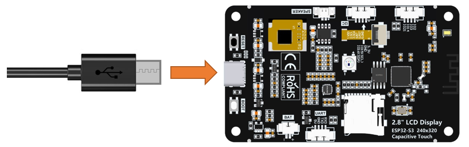
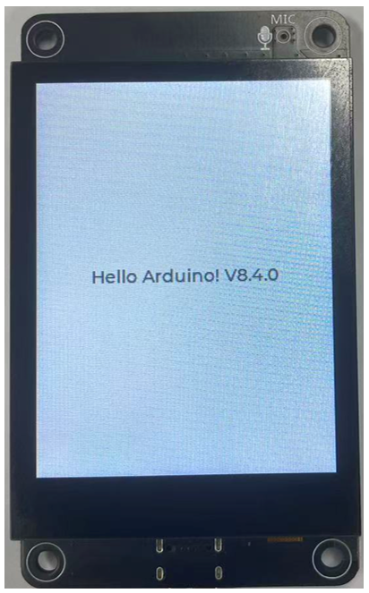

##############################################################################
Chapter 13 LVGL
##############################################################################

Project 13.1 LVGL
**********************************************

Component List
=============================================

LVGL is a widely-used embedded GUI library that is implemented in pure C, making it highly portable and performant. It offers rich features and content, supporting both display and input devices such as touchscreens and keyboards.

.. table:: 
    :align: center
    :class: zebra

    +-----+-----------------------------------------------------------------------------------------------------------------+
    |     |                                           Features supported by LVGL                                            |
    +=====+=================================================================================================================+
    | 1   | Powerful building blocks such as buttons, charts, lists, sliders, images, and more.                             |
    +-----+-----------------------------------------------------------------------------------------------------------------+
    | 2   | Advanced graphics with animation, anti-aliasing, opacity, and smooth scrolling.                                 |
    +-----+-----------------------------------------------------------------------------------------------------------------+
    | 3   | Various input devices, such as touchpads, mice, keyboards, encoders, and more.                                  |
    +-----+-----------------------------------------------------------------------------------------------------------------+
    | 4   | Multiple languages with UTF-8 encoding.                                                                         |
    +-----+-----------------------------------------------------------------------------------------------------------------+
    | 5   | Multiple display types, including TFT and monochrome displays.                                                  |
    +-----+-----------------------------------------------------------------------------------------------------------------+
    | 6   | Fully customizable graphical elements.                                                                          |
    +-----+-----------------------------------------------------------------------------------------------------------------+
    | 7   | LVGL can be used independently of any microcontroller or display hardware.                                      |
    +-----+-----------------------------------------------------------------------------------------------------------------+
    | 8   | Highly extensible and can be configured to use very little memory (e.g. 64 kB of flash and 16 kB of RAM)        |
    +-----+-----------------------------------------------------------------------------------------------------------------+
    | 9   | It can be used with or without an operating system, and supports external memory and GPUs as optional features. |
    +-----+-----------------------------------------------------------------------------------------------------------------+
    | 10  | Single-frame buffer operation, even with advanced graphics effects.                                             |
    +-----+-----------------------------------------------------------------------------------------------------------------+
    | 11  | Written in C language to achieve maximum compatibility (compatible with C++ as well).                           |
    +-----+-----------------------------------------------------------------------------------------------------------------+
    | 12  | LVGL has a simulator that allows for embedded GUI design on a PC without any embedded hardware.                 |
    +-----+-----------------------------------------------------------------------------------------------------------------+
    | 13  | Resources to help developers quickly get started with the library, including tutorials, examples, and themes.   |
    +-----+-----------------------------------------------------------------------------------------------------------------+
    | 14  | A wide range of resources.                                                                                      |
    +-----+-----------------------------------------------------------------------------------------------------------------+

Circuit
==========================================

Connect Freenove ESP32 -S3 to the computer using the USB cable. 

Sketch
=======================================

Install Libraries
---------------------------------------

Click **Sketch** -> **Include Library** -> **Add .ZIP Library...**

Install **lvgl_v8.4.0.zip**

Open **“Sketch_13.1_LVGL”** folder under **“Freenove_ESP32_S3_Display\\Sketches”** and double-click **“Sketch_13.1_LVGL.ino”**.

Sketch_13.1_LVGL
--------------------------------------

The following is the program code:

.. literalinclude:: /freenove_Kit/Sketches/Sketch_13.1_LVGL/Sketch_13.1_LVGL.ino
    :linenos:
    :language: C
    :dedent:

Code Explanation
--------------------------------------

Include the header file.

.. literalinclude:: /freenove_Kit/Sketches/Sketch_13.1_LVGL/Sketch_13.1_LVGL.ino
    :linenos:
    :language: C
    :lines: 7-7
    :dedent:

Set the baud rate to 115200

.. literalinclude:: /freenove_Kit/Sketches/Sketch_13.1_LVGL/Sketch_13.1_LVGL.ino
    :linenos:
    :language: C
    :lines: 14-14
    :dedent:

Initialize the screen.

.. literalinclude:: /freenove_Kit/Sketches/Sketch_13.1_LVGL/Sketch_13.1_LVGL.ino
    :linenos:
    :language: C
    :lines: 17-17
    :dedent:

Configure the screen interface.

.. literalinclude:: /freenove_Kit/Sketches/Sketch_13.1_LVGL/Sketch_13.1_LVGL.ino
    :linenos:
    :language: C
    :lines: 19-28
    :dedent:

Let the LVGL handle the tasks.

.. literalinclude:: /freenove_Kit/Sketches/Sketch_13.1_LVGL/Sketch_13.1_LVGL.ino
    :linenos:
    :language: C
    :lines: 35-35
    :dedent:

Enable the "USB CDC On Boot" feature. 

Click **“Upload”** to upload the code to Freenove ESP32 Display. Set the baud rate to 115200.

Data will be printed on the serial monitor.

The text **“Hello Arduino! V8.4.0”** will be displayed on the screen.

