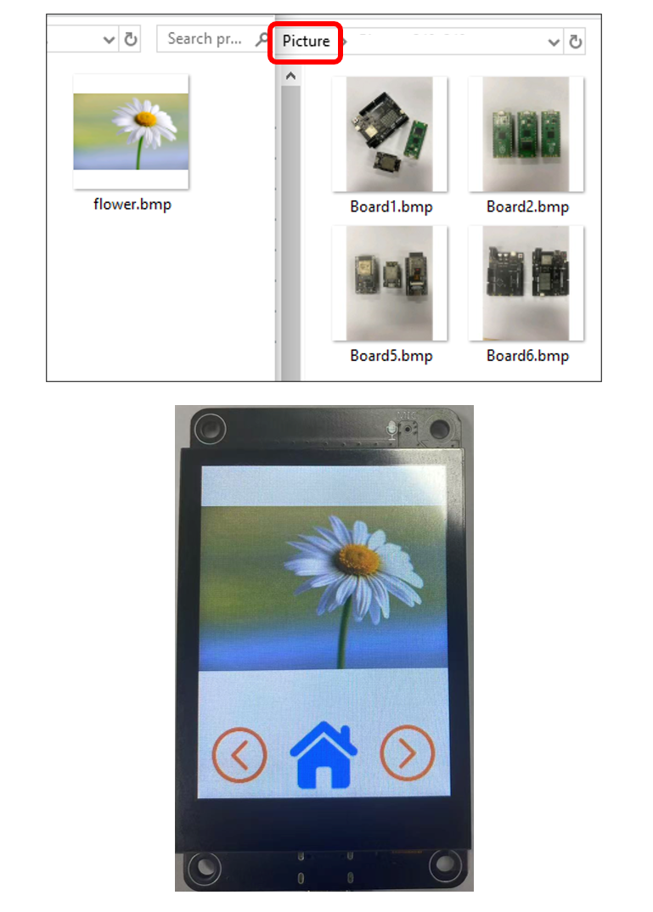

##############################################################################
Chapter 14 LVGL Picture
##############################################################################

Project 14.1 LVGL Picture
******************************************************************************

Component List 
==============================================================================

.. table::
    :align: center
    :class: table-line
    :width: 80%

    +-------------------------------+----------------+
    | Freenove ESP32 S3 Display x 1 | USB cable x1   |
    |                               |                |
    | |Chapter01_07|                | |Chapter01_08| |
    +-------------------------------+----------------+

.. |Chapter01_07| image:: ../_static/imgs/1_Serial/Chapter01_07.png
.. |Chapter01_08| image:: ../_static/imgs/1_Serial/Chapter01_08.png

Circuit
==============================================================================

Before connecting the USB cable, insert the SD card into the SD card slot on the back of the ESP32-S3.

:combo:`red font-bolder:Please note that this kit does not include SD card and card reader; please buy them yourself.`

Connect Freenove ESP32-S3 to the computer using the USB cable. 

If you have any concerns, please feel free to contact us via support@freenove.com

Sketch
==========================================

Open **“Sketch_14.1_Lvgl_Picture”** folder under **“Freenove_ESP32_S3_Display\\Sketches”** and double-click **“Sketch_14.1_Lvgl_Picture.ino”**. 

Sketch_14.1_Lvgl_Picture
------------------------------------------

The following is the program code:	

.. literalinclude:: /freenove_Kit/Touch/Sketches/Sketch_14.1_Lvgl_Picture/Sketch_14.1_Lvgl_Picture.ino
    :linenos:
    :language: C
    :dedent:

Code Explanation
------------------------------------------

Include the header files.

.. literalinclude:: /freenove_Kit/Touch/Sketches/Sketch_14.1_Lvgl_Picture/Sketch_14.1_Lvgl_Picture.ino
    :linenos:
    :language: C
    :lines: 10-12
    :dedent:

Define the pins.

.. literalinclude:: /freenove_Kit/Touch/Sketches/Sketch_14.1_Lvgl_Picture/Sketch_14.1_Lvgl_Picture.ino
    :linenos:
    :language: C
    :lines: 14-19
    :dedent:

Set the baud rate to 115200

.. literalinclude:: /freenove_Kit/Touch/Sketches/Sketch_14.1_Lvgl_Picture/Sketch_14.1_Lvgl_Picture.ino
    :linenos:
    :language: C
    :lines: 25-25
    :dedent:

Initialize configuration.

.. literalinclude:: /freenove_Kit/Touch/Sketches/Sketch_14.1_Lvgl_Picture/Sketch_14.1_Lvgl_Picture.ino
    :linenos:
    :language: C
    :lines: 27-28
    :dedent:

Create and load the interface.

.. literalinclude:: /freenove_Kit/Touch/Sketches/Sketch_14.1_Lvgl_Picture/Sketch_14.1_Lvgl_Picture.ino
    :linenos:
    :language: C
    :lines: 42-43
    :dedent:

LVGL Task Processor

.. literalinclude:: /freenove_Kit/Touch/Sketches/Sketch_14.1_Lvgl_Picture/Sketch_14.1_Lvgl_Picture.ino
    :linenos:
    :language: C
    :lines: 50-50
    :dedent:

Copy the Picture folder under the Freenove_ESP32_S3_Display\\Sketches\\Sketch_14.1_Lvgl_Picture directory to the SD card root directory.

Click **“Upload”** to upload the code to Freenove ESP32 Display. Set the baud rate to 115200

.. image:: ../_static/imgs/14_LVGL_Picture/Chapter14_02.png
    :align: center

Custom image display
------------------------------------

You can customize the image displayed on the display according to your personal preferences.

First, open **Freenove_ESP32_S3_Display\\Sketches\\Sketch_14.1_Lvgl_Picture\\Freenove Image Tool.exe**

Click **“Add File”**

Select any image you like.

The image files from your folder will now appear in the Pending File List.

Click “Select…” to choose the image saving location.

Select BMP for the format, set the resolution to 240x240.

Wait for the progress bar to complete.

Copy or replace the generated image to the folder corresponding to the Picture folder in the root directory of the SD card. 

