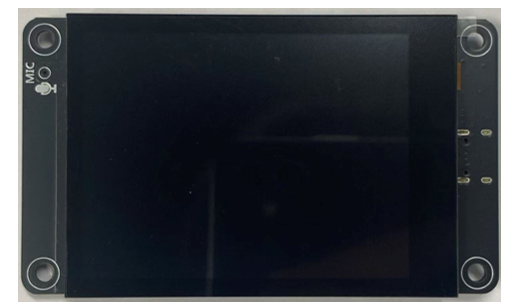
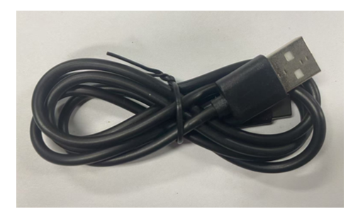
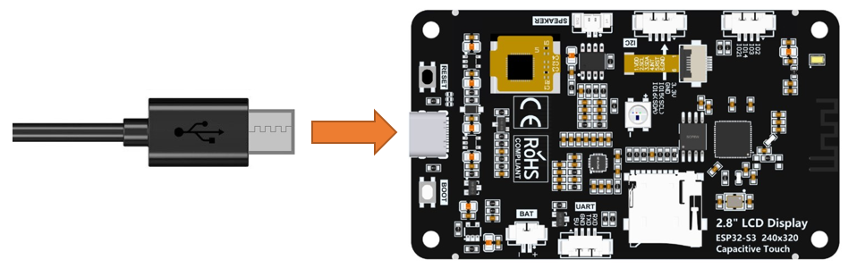
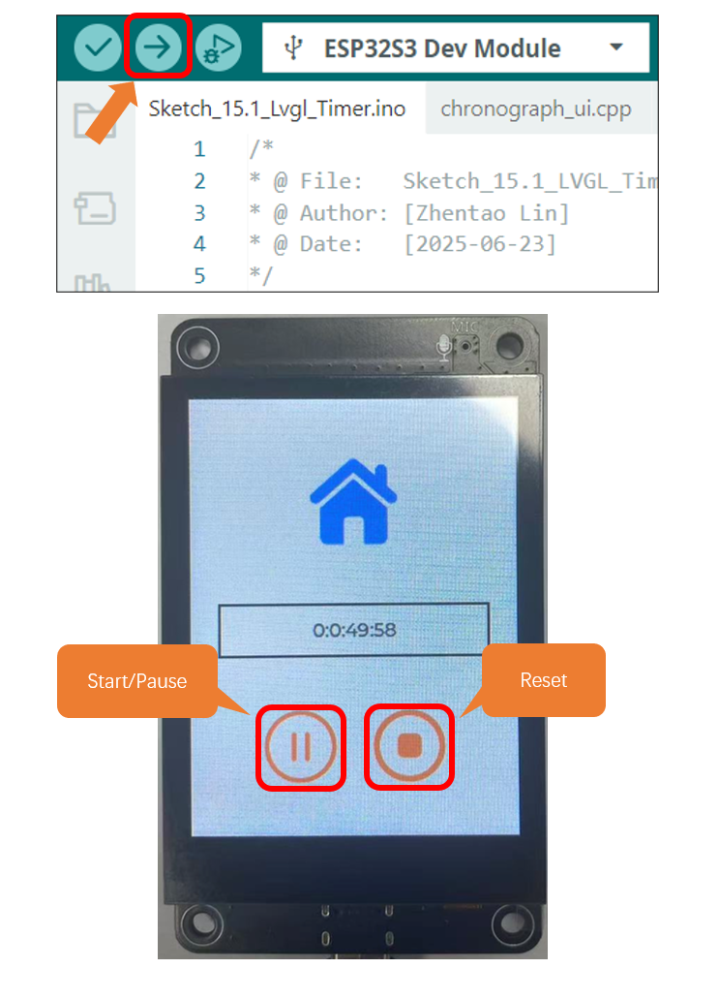

##############################################################################
Chapter 15 LVGL Timer
##############################################################################

Project 15.1 LVGL Timer
*******************************

Component List 
==================================

.. table::
    :align: center
    :class: table-line
    :width: 80%

    +-------------------------------+----------------+
    | Freenove ESP32 S3 Display x 1 | USB cable x1   |
    |                               |                |
    | |Chapter01_07|                | |Chapter01_08| |
    +-------------------------------+----------------+

Circuit
==========================================

Connect Freenove ESP32 -S3 to the computer using the USB cable. 

Sketch
==========================================

Open **“Sketch_15.1_Lvgl_Timer”** folder under **“Freenove_ESP32_S3_Display\\Sketches”** and double-click **“Sketch_15.1_Lvgl_Timer.ino”**.

Sketch_15.1_Lvgl_Timer
------------------------------------------

The following is the program code:

.. literalinclude:: /freenove_Kit/Touch/Sketches/Sketch_15.1_Lvgl_Timer/Sketch_15.1_Lvgl_Timer.ino
    :linenos:
    :language: C
    :dedent:

Code Explanation
------------------------------------------

Include the header files.

.. literalinclude:: /freenove_Kit/Touch/Sketches/Sketch_15.1_Lvgl_Timer/Sketch_15.1_Lvgl_Timer.ino
    :linenos:
    :language: C
    :lines: 7-8
    :dedent:

Set the baud rate to 115200.

.. literalinclude:: /freenove_Kit/Touch/Sketches/Sketch_15.1_Lvgl_Timer/Sketch_15.1_Lvgl_Timer.ino
    :linenos:
    :language: C
    :lines: 12-12
    :dedent:

Initialize configuration.

.. literalinclude:: /freenove_Kit/Touch/Sketches/Sketch_15.1_Lvgl_Timer/Sketch_15.1_Lvgl_Timer.ino
    :linenos:
    :language: C
    :lines: 15-15
    :dedent:

Create and load the interface.

.. literalinclude:: /freenove_Kit/Touch/Sketches/Sketch_15.1_Lvgl_Timer/Sketch_15.1_Lvgl_Timer.ino
    :linenos:
    :language: C
    :lines: 25-26
    :dedent:

LVGL task processor.

.. literalinclude:: /freenove_Kit/Touch/Sketches/Sketch_15.1_Lvgl_Timer/Sketch_15.1_Lvgl_Timer.ino
    :linenos:
    :language: C
    :lines: 30-30
    :dedent:

Click “Upload” to upload the code to Freenove ESP32 S3 Display. Set the baud rate to 115200.

