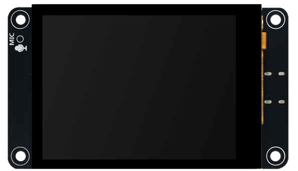
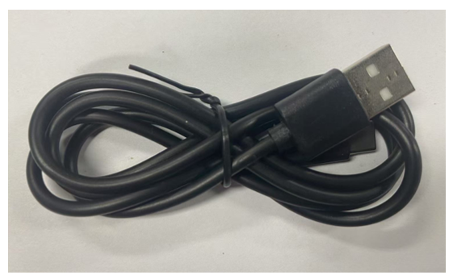
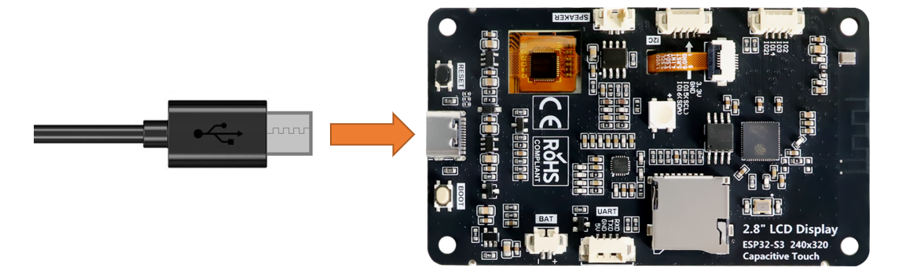

##############################################################################
Chapter 16 Lvgl RGB
##############################################################################

Project 16.1 LVGL RGB
*******************************************

Component List 
==================================

.. table::
    :align: center
    :class: table-line

    +-------------------------------+----------------+
    | Freenove ESP32-S3 Display x 1 | USB cable x1   |
    |                               |                |
    | |Chapter11_04|                | |Chapter11_07| |
    +-------------------------------+----------------+

Circuit
==========================================

Connect Freenove ESP32 -S3 to the computer using the USB cable. 

Sketch
==========================================

Open **“Sketch_16.1_Lvgl_WS2812”** folder under **“Freenove_ESP32_S3_Display\\Tutorial_With_Touch\\Sketches”** and double-click **“Sketch_16.1_Lvgl_WS2812.ino”**.

Sketch_16.1_Lvgl_WS2812
------------------------------------------

The following is the program code:

.. literalinclude:: /freenove_Kit/Tutorial_With_Touch/Sketches/Sketch_16.1_Lvgl_WS2812/Sketch_16.1_Lvgl_WS2812.ino
    :linenos:
    :language: C
    :dedent:

Code Explanation
-----------------------------------------

Include the header files.

.. literalinclude:: /freenove_Kit/Tutorial_With_Touch/Sketches/Sketch_16.1_Lvgl_WS2812/Sketch_16.1_Lvgl_WS2812.ino
    :linenos:
    :language: C
    :lines: 1-4
    :dedent:

Set the baud rate to 115200

.. literalinclude:: /freenove_Kit/Tutorial_With_Touch/Sketches/Sketch_16.1_Lvgl_WS2812/Sketch_16.1_Lvgl_WS2812.ino
    :linenos:
    :language: C
    :lines: 7-7
    :dedent:

Initialize the RGB LED.

.. literalinclude:: /freenove_Kit/Tutorial_With_Touch/Sketches/Sketch_16.1_Lvgl_WS2812/Sketch_16.1_Lvgl_WS2812.ino
    :linenos:
    :language: C
    :lines: 10-10
    :dedent:

Create and load the interface.

.. literalinclude:: /freenove_Kit/Tutorial_With_Touch/Sketches/Sketch_16.1_Lvgl_WS2812/Sketch_16.1_Lvgl_WS2812.ino
    :linenos:
    :language: C
    :lines: 20-21
    :dedent:

LVGL task processor.

.. literalinclude:: /freenove_Kit/Tutorial_With_Touch/Sketches/Sketch_16.1_Lvgl_WS2812/Sketch_16.1_Lvgl_WS2812.ino
    :linenos:
    :language: C
    :lines: 25-25
    :dedent:

Click **“Upload”** to upload the code to Freenove ESP32 Display. Set the baud rate to 115200.

.. image:: ../_static/imgs/16_LVGL_RGB/Chapter16_00.png
    :align: center

Drag to adjust the value of the red (R), green (G), and blue (B) color, and you will see the color of the LED change.

.. image:: ../_static/imgs/16_LVGL_RGB/Chapter16_01.png
    :align: center