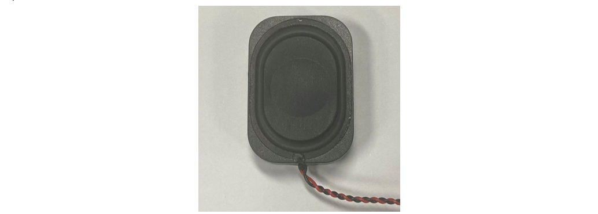
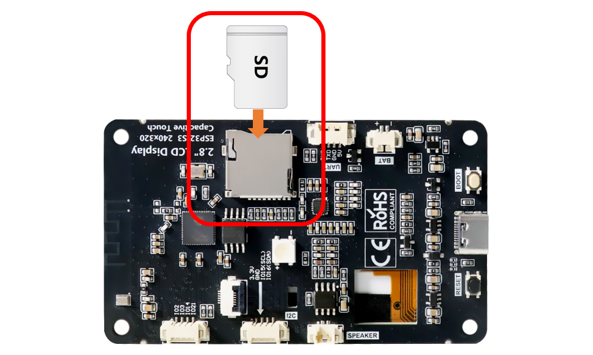
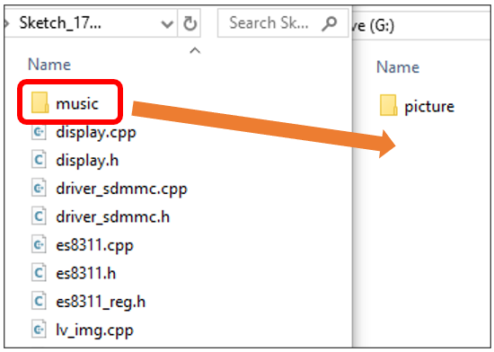
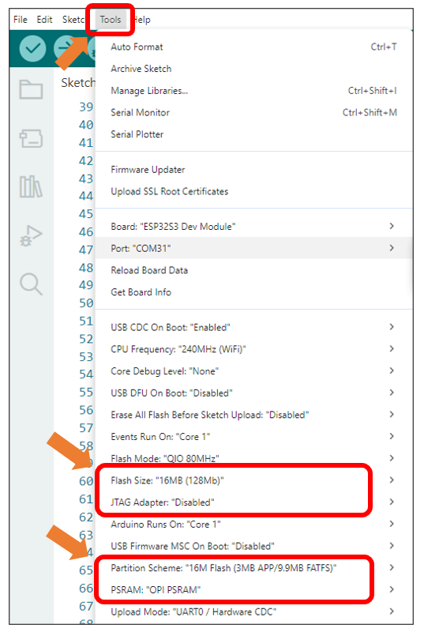
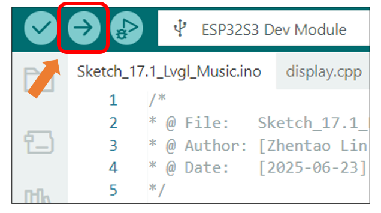
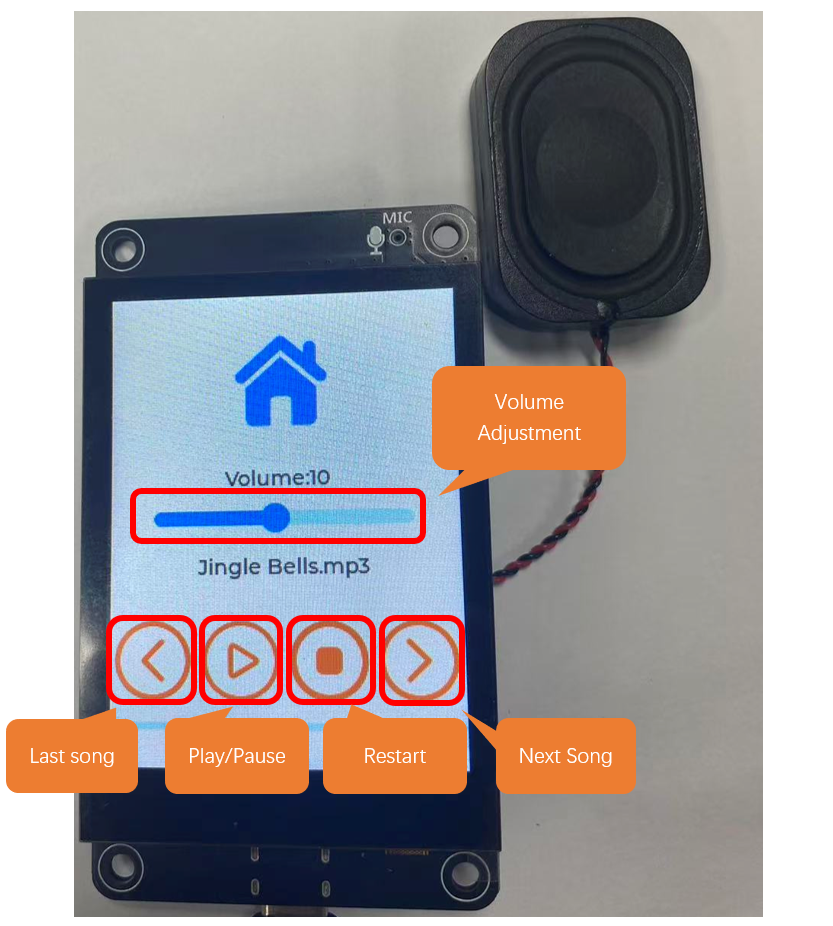

##############################################################################
Chapter 17 LVGL Music
##############################################################################

Project 17.1 LVGL Music
**************************************

Component List 
==================================

.. table::
    :align: center
    :class: table-line

    +-------------------------------+----------------+
    | Freenove ESP32-S3 Display x 1 | USB cable x1   |
    |                               |                |
    | |Chapter11_04|                | |Chapter11_07| |
    +-------------------------------+----------------+
    | Speaker x1                                     |
    |                                                |
    | |Chapter07_02|                                 |
    +------------------------------------------------+

.. |Chapter11_04| image:: ../_static/imgs/11_TFT_Touch/Chapter11_04.png
.. |Chapter11_07| image:: ../_static/imgs/11_TFT_Touch/Chapter11_07.png

.. note::
    
    :combo:`red font-bolder:This kit does not include SD card, or SD card reader. Please buy them yourself!`

Circuit
=================================

Connect Freenove ESP32-S3 to the computer using the USB cable. 

Connect Freenove ESP32-S3 to the computer using the USB cable. 

.. image:: ../_static/imgs/11_TFT_Touch/Chapter11_05.png
    :align: center

Sketch
================================

Open **“Sketch_17.1_Lvgl_Music”** folder under **“Freenove_ESP32_S3_Display\\Tutorial_With_Touch\\Sketches”** and double-click **“Sketch_17.1_Lvgl_Music.ino”**.

Sketch_17.1_Lvgl_Music
------------------------------------------

The following is the program code:

.. literalinclude:: /freenove_Kit/Tutorial_With_Touch/Sketches/Sketch_17.1_Lvgl_Music/Sketch_17.1_Lvgl_Music.ino
    :linenos:
    :language: C
    :dedent:

Code Explanation
-------------------------------------------

Include the header files.

.. literalinclude:: /freenove_Kit/Tutorial_With_Touch/Sketches/Sketch_17.1_Lvgl_Music/Sketch_17.1_Lvgl_Music.ino
    :linenos:
    :language: C
    :lines: 7-13
    :dedent:

Define the pins.

.. literalinclude:: /freenove_Kit/Tutorial_With_Touch/Sketches/Sketch_17.1_Lvgl_Music/Sketch_17.1_Lvgl_Music.ino
    :linenos:
    :language: C
    :lines: 15-52
    :dedent:

Set the baud rate to 115200

.. literalinclude:: /freenove_Kit/Tutorial_With_Touch/Sketches/Sketch_17.1_Lvgl_Music/Sketch_17.1_Lvgl_Music.ino
    :linenos:
    :language: C
    :lines: 71-71
    :dedent:

Initialize configuration.

.. literalinclude:: /freenove_Kit/Tutorial_With_Touch/Sketches/Sketch_17.1_Lvgl_Music/Sketch_17.1_Lvgl_Music.ino
    :linenos:
    :language: C
    :lines: 74-81
    :dedent:

Create and load the interface.

.. literalinclude:: /freenove_Kit/Tutorial_With_Touch/Sketches/Sketch_17.1_Lvgl_Music/Sketch_17.1_Lvgl_Music.ino
    :linenos:
    :language: C
    :lines: 88-89
    :dedent:

LVGL task processor.

.. literalinclude:: /freenove_Kit/Tutorial_With_Touch/Sketches/Sketch_17.1_Lvgl_Music/Sketch_17.1_Lvgl_Music.ino
    :linenos:
    :language: C
    :lines: 95-95
    :dedent:

Insert the SD card to the card reader and plug them to the computer. Copy the **Music** folder under the **Freenove_ESP32_S3_Display\\Tutorial_With_Touch\\Sketches\\Sketch_17.1_Lvgl_Music** directory to the root directory of the SD card.

It is necessary to change the settings in Arduino IDE before clicking the Uploading button, as shown below.

.. caution::
    
    :combo:`red font-bolder:Incorrect settings will result in compilation error or uploading failure. To achieve desired result, please configure exactly the same as below.`

Click **“Upload”** to upload the code to Freenove ESP32 Display. Set the baud rate to 115200.

.. note::
    
    :combo:`red font-bolder:If the screen flickers during playback, it may be due to insufficient power supply. You can try powering with a battery.`