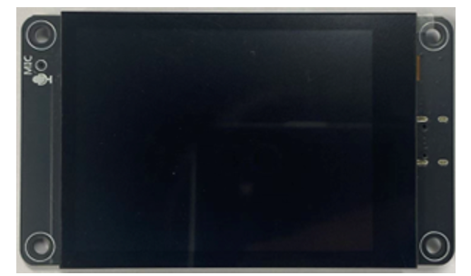
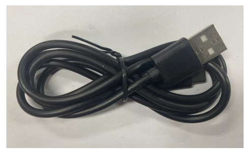
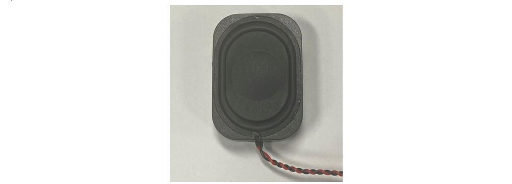
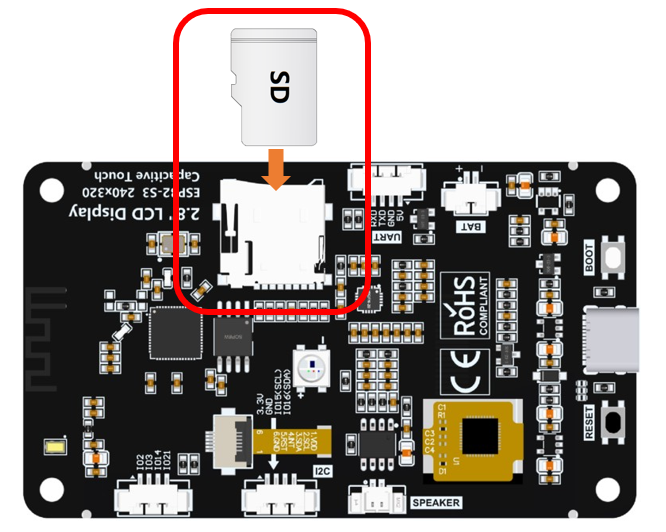
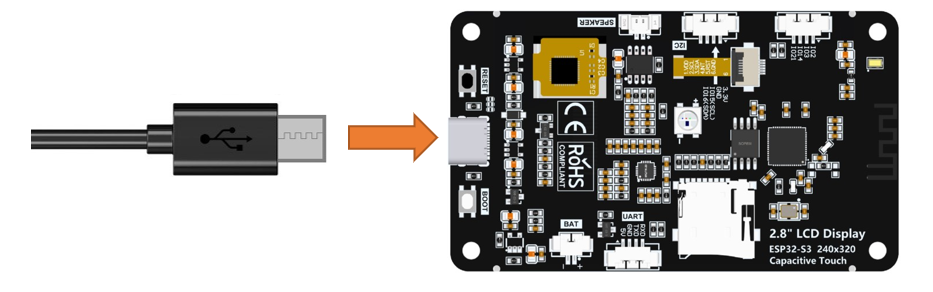
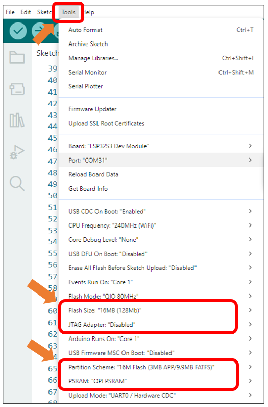
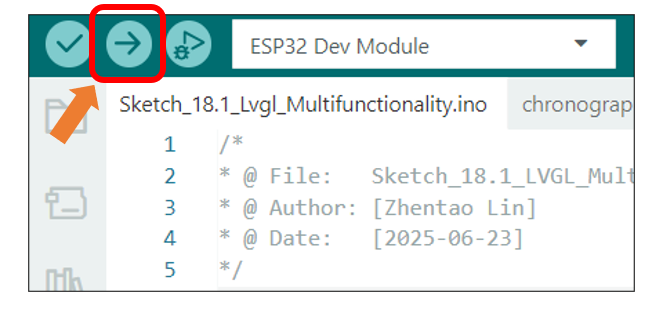
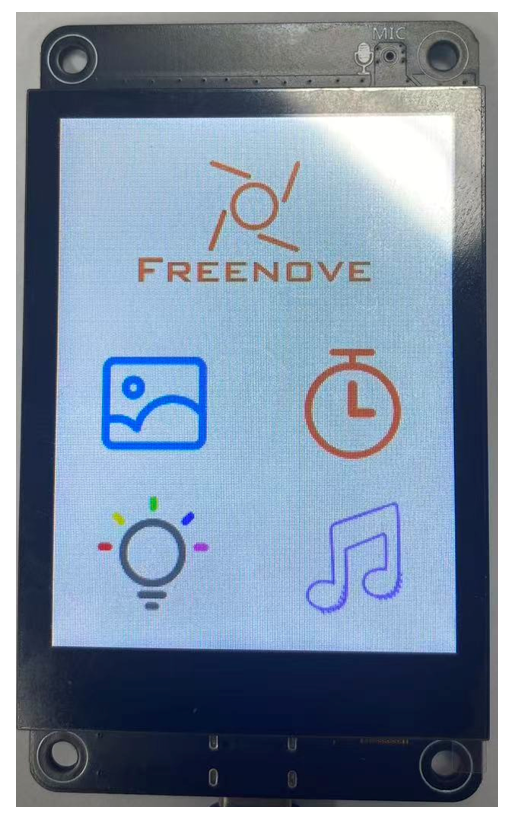

##############################################################################
Chapter 18 LVGL Multifunctionality
##############################################################################

Project 18.1 LVGL Multifunctionality
***************************************

Component List
==================================

.. table::
    :align: center
    :class: table-line
    :width: 80%

    +-------------------------------+----------------+
    | Freenove ESP32 S3 Display x 1 | USB cable x1   |
    |                               |                |
    | |Chapter07_00|                | |Chapter07_01| |
    +-------------------------------+----------------+
    | Speaker x1                                     |
    |                                                |
    | |Chapter07_02|                                 |
    +------------------------------------------------+

Circuit
=================================

Connect Freenove ESP32-S3 to the computer using the USB cable. 

Connect Freenove ESP32-S3 to the computer using the USB cable. 

Sketch
================================

Open **“Sketch_18.1_Lvgl_Multifunctionality”** folder under **“Freenove_ESP32_S3_Display\\Sketches”** and double-click **“Sketch_18.1_Lvgl_Multifunctionality.ino”**.

Sketch_18.1_Lvgl_Multifunctionality
------------------------------------------

The following is the program code:

.. literalinclude:: /freenove_Kit/Sketches/Sketch_18.1_Lvgl_Multifunctionality/Sketch_18.1_Lvgl_Multifunctionality.ino
    :linenos:
    :language: C
    :dedent:

It is necessary to change the settings in Arduino IDE before clicking the Uploading button, as shown below.

.. caution::

    :combo:`red font-bolder:Incorrect settings will result in compilation error or uploading failure. To achieve desired result, please configure exactly the same as below.`

Click “Upload” to upload the code to Freenove ESP32 Display. Set the baud rate to 115200.

