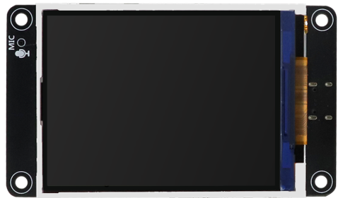
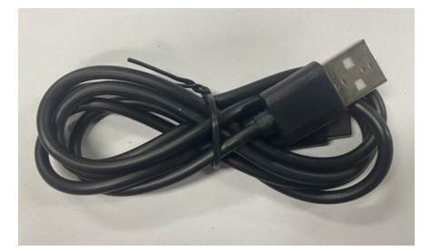
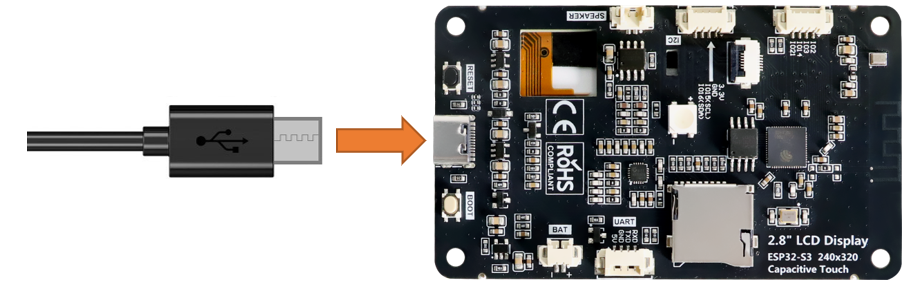
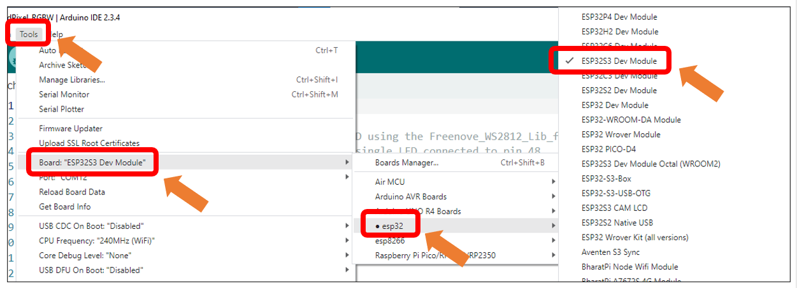
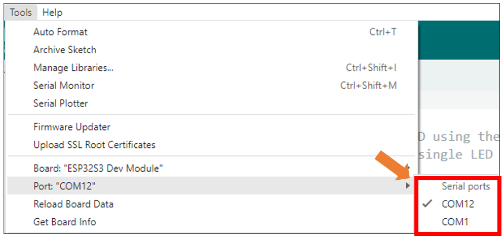
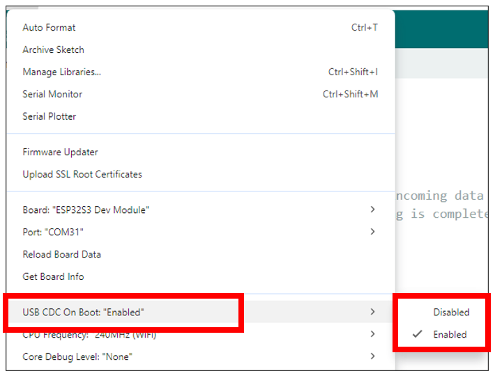
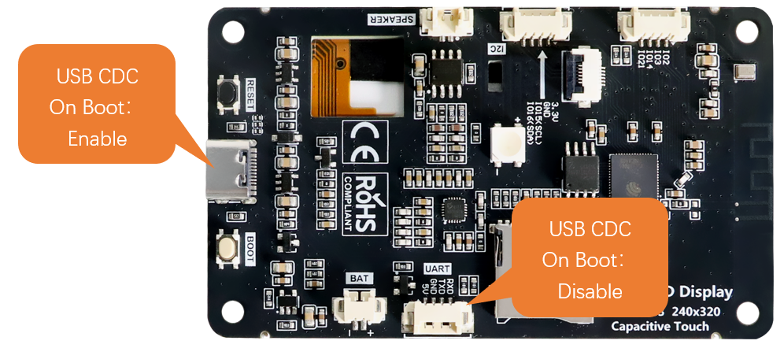
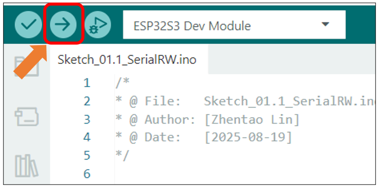
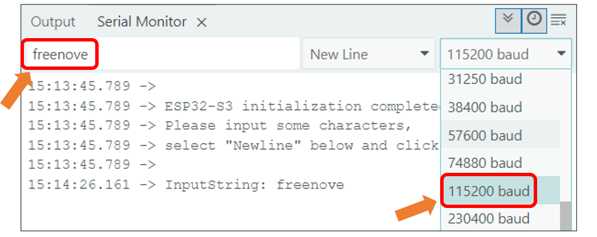

##############################################################################
Chapter 1 Serial
##############################################################################

Project 1.1 USB_Serial
*************************************

The Freenove ESP32-S3 Display is equipped with an onboard USB2.0 port, which can be used to upload code to the ESP32-S3.

Meanwhile, it can also abstract the physical USB channel into a virtual COM port based on the USB CDC protocol, enabling the computer host to communicate with the ESP32-S3 through standard serial port tools without requiring additional hardware.

In this section, we will upload code via the USB interface and virtualize it as a serial port (COM) to enable data communication with the computer.

Component List 
===================================

.. table::
    :align: center
    :class: table-line

    +-------------------------------+----------------+
    | Freenove ESP32-S3 Display x 1 | USB cable x1   |
    |                               |                |
    | |Chapter01_07|                | |Chapter01_08| |
    +-------------------------------+----------------+

Circuit
====================================

Connect Freenove ESP32-S3 Display to the computer with USB cable.

Configuration
====================================

If you have not installed ESP32 SDK in Arduino IDE, please refer to Environment Configuration.

If you have installed it, please continue to proceed.

Select **Tools** -> **Board** -> **esp32** -> **ESP32S3 Dev Module.** 

After connecting the Freenove ESP32-S3 Display, the system will assign a serial communication port named in the format 'COMx' (where 'x' is a numeric ID that may vary across computers). You must select the correct port under Tools → Port.

:combo:`red font-bolder:Note: COM1 is typically NOT the port of the Freenove ESP32-S3 Display.`

Enable the "USB CDC On Boot" feature.

Please note that when "USB CDC On Boot" is set to "Enable", the ESP32-S3 will virtualize the onboard USB as a serial port after code upload, enabling serial communication with external devices via the data cable.

If "USB CDC On Boot" is set to "Disable", the onboard USB interface can only be used to upload code.

Sketch
====================================

Open **"Sketch_01.1_SerialRW"** folder under **"Freenove_ESP32_S3_Display\\Tutorial_With_Touch\\Sketches"** and double-click "Sketch_01.1_SerialRW.ino".

Sketch_01.1_SerialRW
-------------------------------------

.. literalinclude:: /freenove_Kit/Tutorial_With_Touch/Sketches/Sketch_01.1_SerialRW/Sketch_01.1_SerialRW.ino
    :linenos:
    :language: C
    :dedent:

Code Explanation
-------------------------------------

Set the baud rate to 115200.

.. literalinclude:: /freenove_Kit/Tutorial_With_Touch/Sketches/Sketch_01.1_SerialRW/Sketch_01.1_SerialRW.ino
    :linenos:
    :language: C
    :lines: 11-11
    :dedent:

Determine whether there is data in the serial port buffer.

.. literalinclude:: /freenove_Kit/Tutorial_With_Touch/Sketches/Sketch_01.1_SerialRW/Sketch_01.1_SerialRW.ino
    :linenos:
    :language: C
    :lines: 14-14
    :dedent:

Receive serial port data and save it in the inputString string.

.. literalinclude:: /freenove_Kit/Tutorial_With_Touch/Sketches/Sketch_01.1_SerialRW/Sketch_01.1_SerialRW.ino
    :linenos:
    :language: C
    :lines: 20-21
    :dedent:

The purpose of this code is to display data on the serial monitor. Click "Upload" to upload the code to Freenove ESP32-S3 Display.

After downloading the code, open the serial port monitor, and set the baud rate to 115200, input any data in the messages bard and press Enter key, Freenove ESP32-S3 Display will print the received data.

If your serial monitor remains unresponsive, please verify that "USB CDC On Boot" is set to "Enable", then recompile and upload the code.

:combo:`red:Important notes:`

:combo:`red:1. When "USB CDC On Boot" is enabled, the USB port serves both for code uploading and as a Serial interface, while the hardware UART port operates as Serial1.`

:combo:`red:2. When "USB CDC On Boot" is disabled, the USB port is used exclusively for code uploading and cannot function as a Serial interface. In this case, the UART port is Serial.`

:combo:`red:3. All examples in this tutorial require "USB CDC On Boot" to be enabled by default. To communicate with external devices via the onboard UART, use Serial1 instead, which shares identical usage methods with Serial.`

Reference
-------------------------------

.. c:function:: int available() 	
    
    Serial.available() checks the number of bytes currently available to read in the Serial receive buffer. It returns the number of bytes available (int type), or 0 if the buffer is empty.

.. c:function:: int read ()	

    Serial.read() reads one byte of data from the Serial receive buffer and returns it as an int. If no data is available to read, it returns -1.