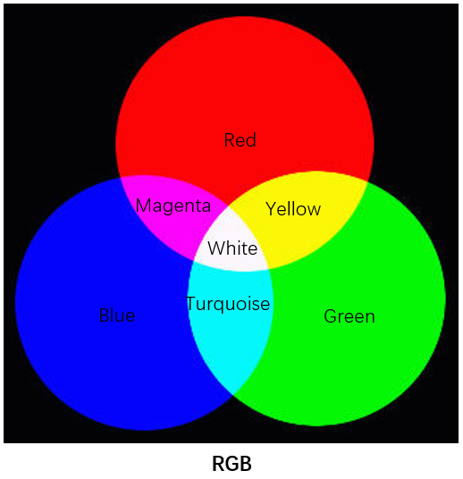
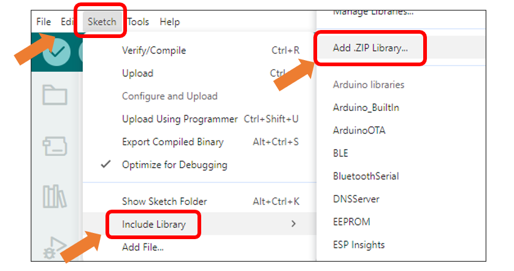
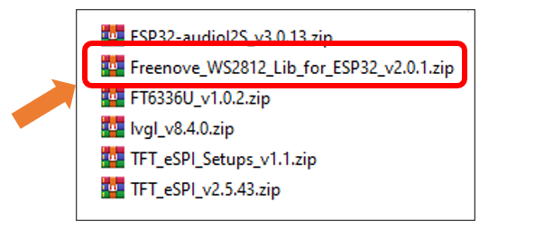
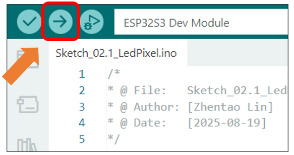
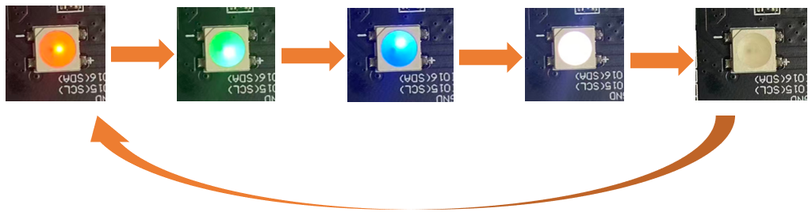
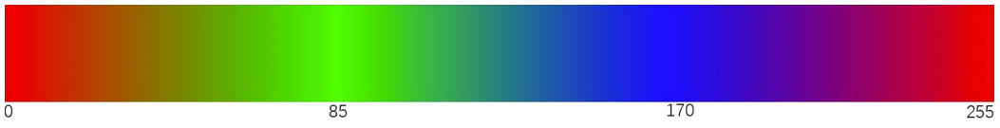
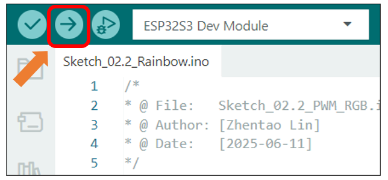
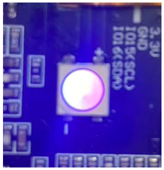

##############################################################################
Chapter 2 RGB
##############################################################################

Project 2.1 RGB
**********************************

Related Knowledge
===================================

Red, green, and blue are called the three primary colors. When you combine these three primary colors of different brightness, it can produce almost all kinds of visible light.

The onboard RGB LED can emit three basic colors of red, green and blue, and supports 256-level brightness adjustment, which means that it can emit 2^24=16,777,216 different colors.

Component List 
====================================

.. table::
    :align: center
    :class: table-line
    :width: 80%

    +-------------------------------+----------------+
    | Freenove ESP32 S3 Display x 1 | USB cable x1   |
    |                               |                |
    | |Chapter01_07|                | |Chapter01_08| |
    +-------------------------------+----------------+

.. |Chapter01_07| image:: ../_static/imgs/1_Serial/Chapter01_07.png
.. |Chapter01_08| image:: ../_static/imgs/1_Serial/Chapter01_08.png

Circuit
====================================

Connect Freenove ESP32 S3 Display to the computer with USB cable. 

.. image:: ../_static/imgs/Preface/Preface09.png
    :align: center

Sketch
====================================

Open **“Sketch_02.1_LedPixel”** folder under **“Freenove_ESP32_S3_Display\\Sketches”** and double-click “Sketch_02.1_LedPixel.ino”.

Install the needed libraries.
------------------------------------

Click **Sketch** -> **Include Library** -> **Add .ZIP Library...**

Select **Freenove_WS2812_Lib_for_ESP32_v2.0.1.zip**

Sketch_02.1_LedPixel
------------------------------------

The following is the program code:

.. literalinclude:: /freenove_Kit/Sketches/Sketch_02.1_LedPixel/Sketch_02.1_LedPixel.ino
    :linenos:
    :language: C
    :dedent:

Code Explanation
-----------------------------------

Define the pins for the RGB LED.

.. literalinclude:: /freenove_Kit/Sketches/Sketch_02.1_LedPixel/Sketch_02.1_LedPixel.ino
    :linenos:
    :language: C
    :lines: 9-11
    :dedent:

Initialize the LED, set the brightness to 10

.. literalinclude:: /freenove_Kit/Sketches/Sketch_02.1_LedPixel/Sketch_02.1_LedPixel.ino
    :linenos:
    :language: C
    :lines: 19-20
    :dedent:

Cycle through five different colors.

.. literalinclude:: /freenove_Kit/Sketches/Sketch_02.1_LedPixel/Sketch_02.1_LedPixel.ino
    :linenos:
    :language: C
    :lines: 23-30
    :dedent:

Click “Upload” to upload the code to Freenove_ESP32_S3_Display.

The RGB LEDs will cycle through Red -> Green -> Blue -> White -> Off every 500ms after code upload.

Reference
----------------------------

.. py:function:: Freenove_ESP32_WS2812(u16 n = 8, u8 pin_gpio = 2, u8 chn = 0, LED_TYPE t = TYPE_GRB)

    Constructor to create a ws2812 object.
    
    Before each use of the constructor, please add **“#include "Freenove_WS2812_Lib_for_ESP32.h”**
    
    **Parameters**
    
    **n:** The number of led.
    
    **pin_gpio:** The pin connected to the LED.
    
    **Chn:** RMT channel, which has eight channels, 0-7, and uses channel 0 by default. This means that you can use eight ws2812 modules for the display at the same time, and these modules do not interfere with each other. 
    
    **t:** Types of LED.
    
        :red:`TYPE_RGB`: The sequence of ws2812 module loading color is red, green and blue.

        :red:`TYPE_RBG`: The sequence of ws2812 module loading color is red, blue and green.

        :red:`TYPE_GRB`: The sequence of ws2812 module loading color is green, red and blue.

        :red:`TYPE_GBR`: The sequence of ws2812 module loading color is green, blue and red.

        :red:`TYPE_BRG`: The sequence of ws2812 module loading color is blue, red and green. 

        :red:`TYPE_BGR`: The sequence of ws2812 module loading color is blue, green and red. 

Project 2.2 Rainbow
**********************************

In the previous project, we have mastered the use of LEDPixel. This project will realize a slightly complicated rainbow light. The component list and the circuit are exactly the same as the project fashionable light.

Sketch
===================================

Continue to use the following color model to equalize the color distribution of the LED and gradually change. 

Component List 
====================================

.. table::
    :align: center
    :class: table-line
    :width: 80%

    +-------------------------------+----------------+
    | Freenove ESP32 S3 Display x 1 | USB cable x1   |
    |                               |                |
    | |Chapter01_07|                | |Chapter01_08| |
    +-------------------------------+----------------+

Circuit
====================================

Connect Freenove ESP32 S3 Display to the computer with USB cable. 

.. image:: ../_static/imgs/Preface/Preface09.png
    :align: center

Sketch
====================================

Open **“Sketch_02.2_Rainbow”** folder under **“Freenove_ESP32_S3_Display\\Sketches”** and double-click **“Sketch_02.2_Rainbow”**.

Sketch_02.2_Rainbow
------------------------------------

The following is the program code:

.. literalinclude:: /freenove_Kit/Sketches/Sketch_02.2_Rainbow/Sketch_02.2_Rainbow.ino
    :linenos:
    :language: C
    :dedent:

Code Explanation
-------------------------------------

In the loop(), two “for” loops are used, the internal “for” loop(for-j) is used to set the color of each LED, and the external “for” loop(for-i) is used to change the color, in which the self-increment value in i+=2 can be changed to change the color step distance. Changing the delay parameter changes the speed of the color change. ``strip.Wheel((i * 256 / LEDS_COUNT + j) & 255)`` will take color from the color model at equal intervals starting from i.

.. literalinclude:: /freenove_Kit/Sketches/Sketch_02.2_Rainbow/Sketch_02.2_Rainbow.ino
    :linenos:
    :language: C
    :lines: 20-26
    :dedent:

This code achieves the function of printing data on serial monitor. Click “Upload” to upload the code to Freenove_ESP32_S3_Display.

After uploading the code, the LED lights will display a smooth rainbow gradient effect.

Reference
-----------------------------------

.. c:function:: bool ledcAttachChannel(uint8_t pin, uint32_t freq, uint8_t resolution, uint8_t channel);	
    
    This function binds the specified PWM channel to a GPIO pin and configures the frequency and resolution of the PWM signal.

    **Parameters:**
    
    pin: GPIO pin number to bind
    
    freq: PWM signal frequency in Hz
    
    resolution: Bit depth for PWM duty cycle resolution (range: 1-16 bits). 
                
                For example, 8 represents 2^8 (0~255) levels.
    
    channel: PWM channel number to assign (integer)

.. c:function:: void ledcWrite(uint8_t channel, uint32_t duty);	

    This function sets the duty cycle for a specified PWM channel to control output signal intensity.

    **Parameters:**

    channel: PWM channel number

    duty: Duty cycle value (range determined by resolution bit depth)