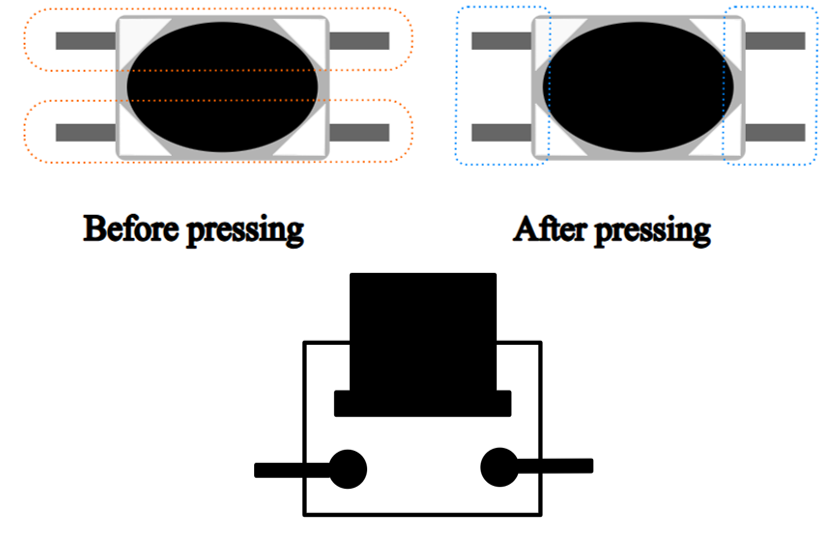
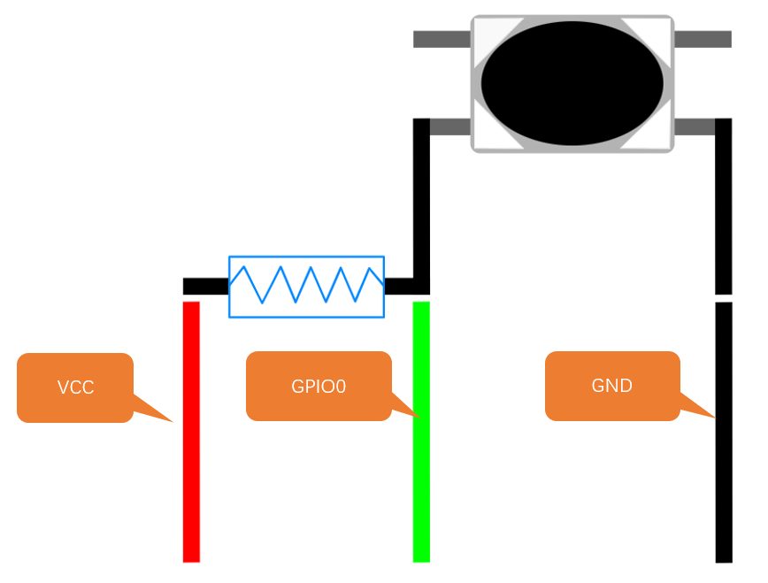
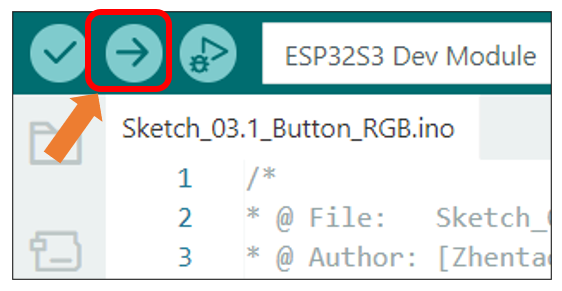
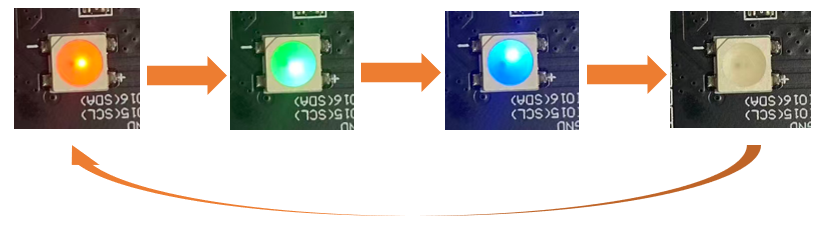

##############################################################################
Chapter 3 Button
##############################################################################

The Boot button on the Freenove ESP32 S3 Display can be configured as a regular input button after the program starts.

Project 3.1 Button RGB
*************************************

In the previous chapter, we learned about RGB LEDs. In this section, we will further explore how to integrate RGB LEDs with buttons.

Related Knowledge
====================================

Button
-------------------------------------

In embedded systems, buttons are one of the most common human-machine input devices. When a button is not pressed, its opposing contacts are connected while adjacent contacts remain disconnected. Conversely, when the button is pressed, adjacent contacts connect while opposing contacts disconnect.

**Usage of the Boot Button on the Freenove CYD Board:**

**Manual Entry into Download Mode:**

When the board is powered on or reset, pressing and holding the Boot button forces the board into download mode.

In this mode, users can upload programs to the board via the serial port.

**Use as a Regular Input Button:**

If the Boot button is not pressed during power-on or reset, the board enters normal operation mode.

Once in operation mode, the Boot button can function as GPIO0, typically configured as a standard input button for user interaction.

Pull-up Resistor
-------------------------------------

The primary function of a pull-up resistor is to ensure that the button maintains a stable high-level state when not pressed, preventing false triggering caused by floating pins or signal noise. The pull-up resistor is connected between the GPIO pin and VCC.

When the button is not pressed, Vcc is connected to GPIO0 through the resistor, resulting in a high-level signal at this pin.

When the button is pressed, GPIO0 is connected to GND, resulting in a low-level signal.

Therefore, by reading the GPIO0 pin state, we can determine whether the button is pressed or not.

Component List
====================================

.. table::
    :align: center
    :class: table-line
    :width: 80%

    +-------------------------------+----------------+
    | Freenove ESP32 S3 Display x 1 | USB cable x1   |
    |                               |                |
    | |Chapter01_07|                | |Chapter01_08| |
    +-------------------------------+----------------+

.. |Chapter01_07| image:: ../_static/imgs/1_Serial/Chapter01_07.png
.. |Chapter01_08| image:: ../_static/imgs/1_Serial/Chapter01_08.png

Circuit
====================================

Connect Freenove ESP32 S3 Display to the computer with USB cable. 

.. image:: ../_static/imgs/Preface/Preface09.png
    :align: center

Sketch
====================================

Open **“Sketch_03.1_Button_RGB”** folder under **“Freenove_ESP32_S3_Display\\Sketches”** and double-click **“Sketch_03.1_Button_RGB.ino”**.

Sketch_03.1_Button_RGB
------------------------------------

The following is the program code:

.. literalinclude:: /freenove_Kit/Sketches/Sketch_03.1_Button_RGB/Sketch_03.1_Button_RGB.ino
    :linenos:
    :language: C
    :dedent:

Code Explanation
----------------------------------

Define the pins for the button and the RGB LED.

.. literalinclude:: /freenove_Kit/Sketches/Sketch_03.1_Button_RGB/Sketch_03.1_Button_RGB.ino
    :linenos:
    :language: C
    :lines: 10-13
    :dedent:

Initialize the RGB LED and the button. 

.. literalinclude:: /freenove_Kit/Sketches/Sketch_03.1_Button_RGB/Sketch_03.1_Button_RGB.ino
    :linenos:
    :language: C
    :lines: 53-55
    :dedent:

Control the color of the RGB LED through the button.

.. literalinclude:: /freenove_Kit/Sketches/Sketch_03.1_Button_RGB/Sketch_03.1_Button_RGB.ino
    :linenos:
    :language: C
    :lines: 60-70
    :dedent:

Click “Upload” to upload the code to Freenove_ESP32_S3_Display.

The RGB LEDs will cycle through Red -> Green -> Blue -> OFF every 500ms after code upload.

