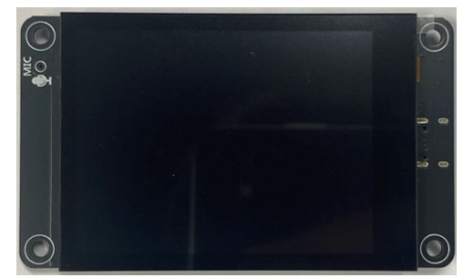

##############################################################################
Chapter 5 Battery Voltage
##############################################################################

Project 5.1 Battery Voltage
*************************************

Related Knowledge
=====================================

ADC
-------------------------------------

ADC is an electronic integrated circuit used to convert analog signals such as voltages to digital or binary form consisting of 1s and 0s. The range of our ADC on Raspberry Pi Pico (W) is 10 bits, which means the resolution is 2^10=1024, and it represents a range (at 3.3V) will be divided equally to 1024 parts. The rage of analog values corresponds to ADC values. So the more bits the ADC has, the denser the partition of analog will be and the greater the precision of the resulting conversion.

Subsection 1: the analog in rang of 0V---3.3/1023 V corresponds to digital 0;

Subsection 2: the analog in rang of 3.3/1023 V---2*3.3 /1023V corresponds to digital 1;

The following analog will be divided accordingly.

The conversion formula is as follows:

.. math::

    \text{ADC Value} = \frac{\text{Analog Voltage}}{3.3} \times 1023

Battery Voltage
-------------------------------------

From the schematic diagram, we can know that Freenove_ESP32_S3_Display reads the battery voltage through the ADC pin (GPIO9).

The ADC pin on this board has a voltage sampling range of 0~3.3V. However, when powered by a 3.7V lithium battery, the output voltage in a fully charged state can reach 4.2V, exceeding the ADC's rated input range.

To ensure accurate voltage measurement and ADC pin protection, the circuit employs a resistive voltage divider that scales the battery voltage down by a factor of 0.5. At a full charge (4.2V), the divided voltage at the ADC input is 2.1V, well within the safe operating range. This design enables reliable battery monitoring while preventing overvoltage damage to the ADC.

:combo:`red font-bolder:Please note that this kit does not include a lithium battery, please buy one yourself. For more information about battery, please refer to` :ref:`Battery <fnk0104/codes/main/preface:battery (optional)>`.

Component List
====================================

.. table::
    :align: center
    :class: table-line
    :width: 80%

    +-------------------------------+----------------+
    | Freenove ESP32 S3 Display x 1 | USB cable x1   |
    |                               |                |
    | |Chapter01_07|                | |Chapter01_08| |
    +-------------------------------+----------------+

.. |Chapter01_08| image:: ../_static/imgs/1_Serial/Chapter01_08.png

Circuit
====================================

Connect Freenove ESP32 S3 Display to the computer with USB cable. 

.. image:: ../_static/imgs/Preface/Preface09.png
    :align: center

Sketch
====================================

Next, we download the code to Freenove_ESP32_S3_Display to test Serial. Open“Sketch_05.1_Battery_Voltage.ino” folder under “Freenove_ESP32_S3_Display\\Sketches” and double-click “Sketch_05.1_Battery_Voltage.ino”.

Sketch_05.1_Battery_Voltage
-------------------------------------

The following is the program code:

.. literalinclude:: /freenove_Kit/Touch/Sketches/Sketch_05.1_Battery_Voltage/Sketch_05.1_Battery_Voltage.ino
    :linenos:
    :language: C
    :dedent:

Code Explanation
-------------------------------------

Define the pins for the button and RGB LED.

.. literalinclude:: /freenove_Kit/Touch/Sketches/Sketch_05.1_Battery_Voltage/Sketch_05.1_Battery_Voltage.ino
    :linenos:
    :language: C
    :lines: 7-7
    :dedent:

Set the battery voltage detecting pin to input mode.

.. literalinclude:: /freenove_Kit/Touch/Sketches/Sketch_05.1_Battery_Voltage/Sketch_05.1_Battery_Voltage.ino
    :linenos:
    :language: C
    :lines: 10-10
    :dedent:

Set the battery voltage detecting pin to input mode.

.. literalinclude:: /freenove_Kit/Touch/Sketches/Sketch_05.1_Battery_Voltage/Sketch_05.1_Battery_Voltage.ino
    :linenos:
    :language: C
    :lines: 11-11
    :dedent:

Measure the battery voltage every 300ms and outputs the reading to the serial monitor.

.. literalinclude:: /freenove_Kit/Touch/Sketches/Sketch_05.1_Battery_Voltage/Sketch_05.1_Battery_Voltage.ino
    :linenos:
    :language: C
    :lines: 14-19
    :dedent:

Enable the "USB CDC On Boot" feature.

Click “Upload” to upload the code to Freenove_ESP32_S3_Display.

Once the program starts, open the serial monitor to view the battery voltage readings, updated every 300ms. 

Reference
-----------------------------

.. c:function:: uint32_t analogReadMilliVolts(uint8_t pin)	

    This function reads the voltage directly from the analog pin and returns the value in millivolts (mV), with a maximum return value of 3300mV (3.3V)