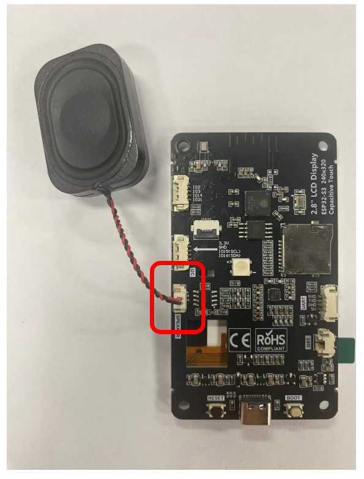
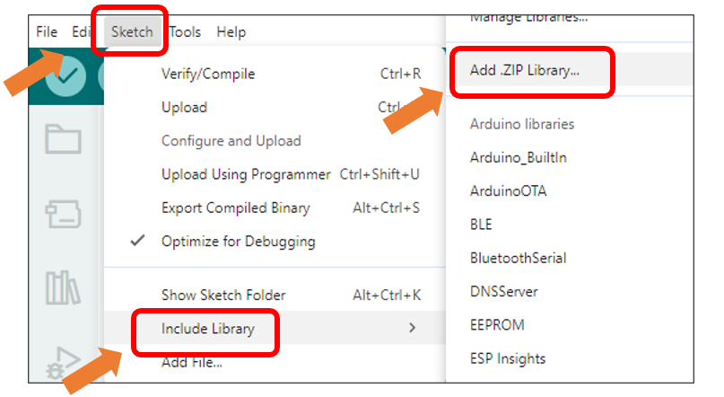
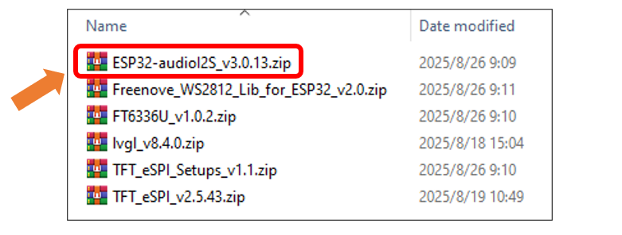
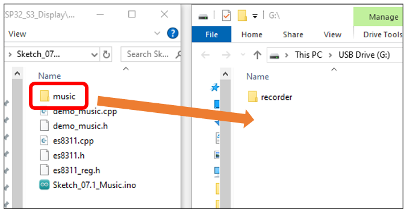
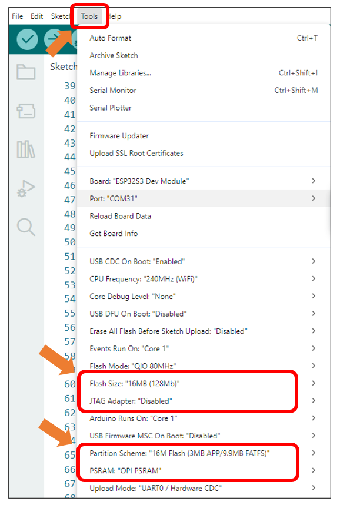
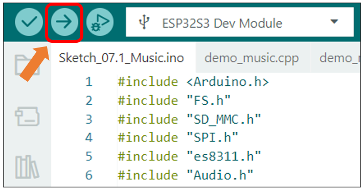
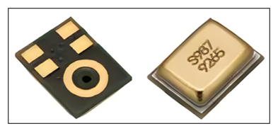

##############################################################################
Chapter 7 Music
##############################################################################

Project 7.1 Music
*************************************

Component List
====================================

.. table::
    :align: center
    :class: table-line

    +-------------------------------+----------------+
    | Freenove ESP32-S3 Display x 1 | USB cable x1   |
    |                               |                |
    | |Chapter01_07|                | |Chapter01_08| |
    +-------------------------------+----------------+
    | Speaker x1                                     |
    |                                                |
    | |Chapter07_02|                                 |
    +------------------------------------------------+

.. |Chapter01_07| image:: ../_static/imgs/1_Serial/Chapter01_07.png
.. |Chapter01_08| image:: ../_static/imgs/1_Serial/Chapter01_08.png
.. |Chapter07_02| image:: ../_static/imgs/7_Music/Chapter07_02.png

:combo:`red font-bolder:Please note that this kit does not include SD card and card reader, please buy them by yourself.`

Circuit
====================================

Before connecting the USB cable, insert the SD card into the SD card slot on the back of the ESP32-S3.

Please note that this kit does not include SD card and card reader; please buy them yourself.

.. image:: ../_static/imgs/6_SD_Card/Chapter06_13.png
    :align: center

Connect speaker

Connect Freenove ESP32-S3 to the computer using the USB cable. 

.. image:: ../_static/imgs/Preface/Preface09.png
    :align: center

Sketch
=====================================

Install the needed libraries.
-------------------------------------

Click **Sketch** -> **Include Library** -> **Add .ZIP Library...**

Select **ESP32-audioI2S_v3.0.13.zip**

Next, we download the code to Freenove_ESP32_S3_Display to test. Open **"Sketch_07.1_Music"** folder under **"Freenove_ESP32_S3_Display\\Tutorial_With_Touch\\Sketches"** and double-click **"Sketch_07.1_Music.ino"**.

Sketch_07.1_Music
-------------------------------------

The following is the program code:

.. literalinclude:: /freenove_Kit/Tutorial_With_Touch/Sketches/Sketch_07.1_Music/Sketch_07.1_Music.ino
    :linenos:
    :language: C
    :dedent:

Code Explanation
-------------------------------------

Include necessary header files.

.. literalinclude:: /freenove_Kit/Tutorial_With_Touch/Sketches/Sketch_07.1_Music/Sketch_07.1_Music.ino
    :linenos:
    :language: C
    :lines: 7-15
    :dedent:

Define the pins.

.. literalinclude:: /freenove_Kit/Tutorial_With_Touch/Sketches/Sketch_07.1_Music/Sketch_07.1_Music.ino
    :linenos:
    :language: C
    :lines: 17-59
    :dedent:

Declare an I2S object

.. literalinclude:: /freenove_Kit/Tutorial_With_Touch/Sketches/Sketch_07.1_Music/Sketch_07.1_Music.ino
    :linenos:
    :language: C
    :lines: 61-62
    :dedent:

Set the baud rate to 115200

.. literalinclude:: /freenove_Kit/Tutorial_With_Touch/Sketches/Sketch_07.1_Music/Sketch_07.1_Music.ino
    :linenos:
    :language: C
    :lines: 77-77
    :dedent:

SD card init

.. literalinclude:: /freenove_Kit/Tutorial_With_Touch/Sketches/Sketch_07.1_Music/Sketch_07.1_Music.ino
    :linenos:
    :language: C
    :lines: 79-87
    :dedent:

Read audio data and play it.

.. literalinclude:: /freenove_Kit/Tutorial_With_Touch/Sketches/Sketch_07.1_Music/Sketch_07.1_Music.ino
    :linenos:
    :language: C
    :lines: 94-99
    :dedent:

play music

.. literalinclude:: /freenove_Kit/Tutorial_With_Touch/Sketches/Sketch_07.1_Music/Sketch_07.1_Music.ino
    :linenos:
    :language: C
    :lines: 102-102
    :dedent:

Before compiling and uploading the code, please be sure to confirm the hardware model you are using. Based on your device, please modify the macro definition (#define) at the top of the code: remove the comment symbols (//) in front of the corresponding model, and ensure that the other models remain commented out. The default setting is the 2.8-inch model.

.. code-block:: c
    :linenos:
    :dedent:

    #define FNK0104AB_2P8_240x320_ILI9341
    //#define FNK0104N_3P5_320x480_ST77922
    //#define FNK0104S_4P0_320x480_ST7796

:combo:`red font-bolder:This product does not include SD card, and SD card reader, please buy them by yourself. For more information, please refer to` :ref:`SD card <fnk0104/codes/main/preface:sd card>` :combo:`red font-bolder:sections.`

Before uploading the code, copy the music to the root directory of the SD card with the SD card reader.

It is necessary to change the settings in Arduino IDE before clicking the Uploading button, as shown below.

:combo:`red font-bolder:Caution: Incorrect settings will result in compilation error or uploading failure. To achieve desired result, please configure exactly the same as below.`

Click **"Upload"** to upload the code to Freenove ESP32-S3 Display.

The speaker plays the music in the SD card.

Project 7.2 Echo
************************************

Component List
====================================

.. table::
    :align: center
    :class: table-line

    +-------------------------------+----------------+
    | Freenove ESP32-S3 Display x 1 | USB cable x1   |
    |                               |                |
    | |Chapter01_07|                | |Chapter01_08| |
    +-------------------------------+----------------+
    | Speaker x1                                     |
    |                                                |
    | |Chapter07_02|                                 |
    +------------------------------------------------+

:combo:`red font-bolder:Please note that this kit does not include SD card and card reader, please buy them by yourself.`

Component knowledge
====================================

MEMS-MIC
-------------------------------------

A MEMS Microphone (Micro-Electro-Mechanical Systems Microphone) is a miniature microphone manufactured using MEMS technology. It integrates mechanical sensing elements and electronic circuits on the same chip to achieve sound signal acquisition and conversion. Its working principle primarily involves a tiny vibrating diaphragm that detects sound pressure changes, then converts these mechanical vibrations into electrical signals, enabling sound capture and transmission.

MEMS microphones are characterized by their compact size, high sensitivity, excellent stability, and ease of mass production. They are widely used in electronic devices such as smartphones, earphones, and smart speakers. Compared to traditional microphones, MEMS microphones better meet the dual demands of modern electronic products for both miniaturization and performance.

Circuit
====================================

Before connecting the USB cable, insert the SD card into the SD card slot on the back of the ESP32-S3.

:combo:`red font-bolder:Please note that this kit does not include SD card and card reader; please buy them yourself.`

.. image:: ../_static/imgs/6_SD_Card/Chapter06_13.png
    :align: center

Connect speaker

Connect Freenove ESP32-S3 to the computer using the USB cable. 

.. image:: ../_static/imgs/Preface/Preface09.png
    :align: center

Sketch
====================================

Sketch_07.2_Echo
-------------------------------------

The following is the program code:

.. literalinclude:: /freenove_Kit/Tutorial_With_Touch/Sketches/Sketch_07.2_Echo/Sketch_07.2_Echo.ino
    :linenos:
    :language: C
    :dedent:

Code Explanation
-------------------------------------

Include necessary header files.

.. literalinclude:: /freenove_Kit/Tutorial_With_Touch/Sketches/Sketch_07.2_Echo/Sketch_07.2_Echo.ino
    :linenos:
    :language: C
    :lines: 7-14
    :dedent:

Define the pins.

.. literalinclude:: /freenove_Kit/Tutorial_With_Touch/Sketches/Sketch_07.2_Echo/Sketch_07.2_Echo.ino
    :linenos:
    :language: C
    :lines: 16-58
    :dedent:

Declare an I2S object

.. literalinclude:: /freenove_Kit/Tutorial_With_Touch/Sketches/Sketch_07.2_Echo/Sketch_07.2_Echo.ino
    :linenos:
    :language: C
    :lines: 60-60
    :dedent:

Set the baud rate to 115200

.. literalinclude:: /freenove_Kit/Tutorial_With_Touch/Sketches/Sketch_07.2_Echo/Sketch_07.2_Echo.ino
    :linenos:
    :language: C
    :lines: 68-68
    :dedent:

Initialize the audio device.

.. literalinclude:: /freenove_Kit/Tutorial_With_Touch/Sketches/Sketch_07.2_Echo/Sketch_07.2_Echo.ino
    :linenos:
    :language: C
    :lines: 81-86
    :dedent:

Implement audio recording and playback functionality

.. literalinclude:: /freenove_Kit/Tutorial_With_Touch/Sketches/Sketch_07.2_Echo/Sketch_07.2_Echo.ino
    :linenos:
    :language: C
    :lines: 91-106
    :dedent:

Before compiling and uploading the code, please be sure to confirm the hardware model you are using. Based on your device, please modify the macro definition (#define) at the top of the code: remove the comment symbols (//) in front of the corresponding model, and ensure that the other models remain commented out. The default setting is the 2.8-inch model.

.. code-block:: c
    :linenos:
    :dedent:

    #define FNK0104AB_2P8_240x320_ILI9341
    //#define FNK0104N_3P5_320x480_ST77922
    //#define FNK0104S_4P0_320x480_ST7796