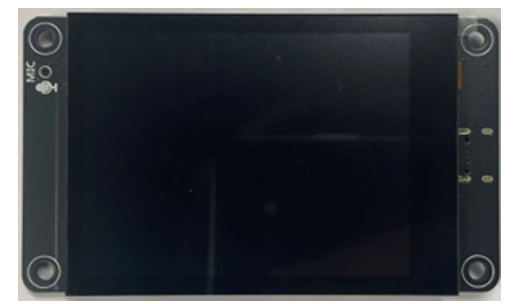
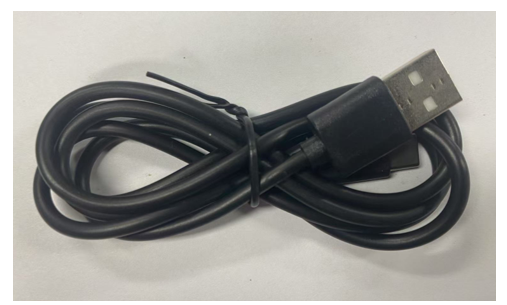
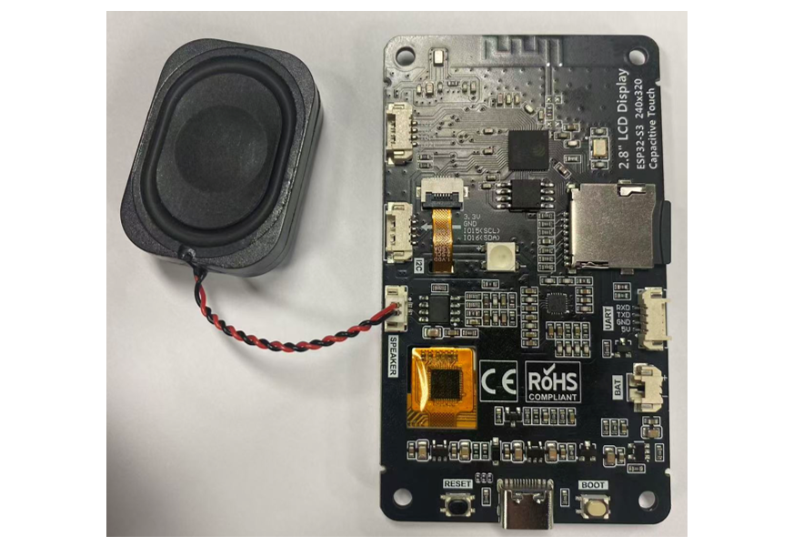

##############################################################################
Chapter 7 Music
##############################################################################

Project 7.1 Music
*************************************

Component List
====================================

.. table::
    :align: center
    :class: table-line
    :width: 80%

    +-------------------------------+----------------+
    | Freenove ESP32 S3 Display x 1 | USB cable x1   |
    |                               |                |
    | |Chapter07_00|                | |Chapter07_01| |
    +-------------------------------+----------------+
    | Speaker x1                                     |
    |                                                |
    | |Chapter07_02|                                 |
    +------------------------------------------------+

.. |Chapter07_02| image:: ../_static/imgs/7_Music/Chapter07_02.png

:combo:`red font-bolder:Please note that this kit does not include SD card and card reader, please buy them by yourself.`

Circuit
====================================

Before connecting the USB cable, insert the SD card into the SD card slot on the back of the ESP32-S3.

Please note that this kit does not include SD card and card reader; please buy them yourself.

Connect speaker

Connect Freenove ESP32-S3 to the computer using the USB cable. 

Sketch
=====================================

Install the needed libraries.

Click **Sketch** -> **Include Library** -> **Add .ZIP Library...**

Select ESP32-audioI2S_v3.0.13.zip

Next, we download the code to Freenove_ESP32_S3_Display to test. Open **“Sketch_07.1_Music”** folder under **“Freenove_ESP32_S3_Display\\Sketches”** and double-click **“Sketch_07.1_Music.ino”**.

Sketch_07.1_Music
-------------------------------------

The following is the program code:

.. literalinclude:: /freenove_Kit/Touch/Sketches/Sketch_07.1_Music/Sketch_07.1_Music.ino
    :linenos:
    :language: C
    :dedent:

Code Explanation
-------------------------------------

Include necessary header files.

.. literalinclude:: /freenove_Kit/Touch/Sketches/Sketch_07.1_Music/Sketch_07.1_Music.ino
    :linenos:
    :language: C
    :lines: 1-9
    :dedent:

Define the pins.

.. literalinclude:: /freenove_Kit/Touch/Sketches/Sketch_07.1_Music/Sketch_07.1_Music.ino
    :linenos:
    :language: C
    :lines: 11-28
    :dedent:

Declare an I2S object

.. literalinclude:: /freenove_Kit/Touch/Sketches/Sketch_07.1_Music/Sketch_07.1_Music.ino
    :linenos:
    :language: C
    :lines: 30-31
    :dedent:

Set the baud rate to 115200

.. literalinclude:: /freenove_Kit/Touch/Sketches/Sketch_07.1_Music/Sketch_07.1_Music.ino
    :linenos:
    :language: C
    :lines: 46-46
    :dedent:

SD card init

.. literalinclude:: /freenove_Kit/Touch/Sketches/Sketch_07.1_Music/Sketch_07.1_Music.ino
    :linenos:
    :language: C
    :lines: 48-62
    :dedent:

Read audio data and play it.

.. literalinclude:: /freenove_Kit/Touch/Sketches/Sketch_07.1_Music/Sketch_07.1_Music.ino
    :linenos:
    :language: C
    :lines: 63-68
    :dedent:

play music

.. literalinclude:: /freenove_Kit/Touch/Sketches/Sketch_07.1_Music/Sketch_07.1_Music.ino
    :linenos:
    :language: C
    :lines: 71-71
    :dedent:

:combo:`red font-bolder:This product does not include SD card, and SD card reader, please buy them by yourself. For more information, please refer to` :ref:`SD card <fnk0104/codes/main/preface:sd card>` :combo:`red font-bolder:sections.`

Before uploading the code, copy the music to the root directory of the SD card with the SD card reader.

It is necessary to change the settings in Arduino IDE before clicking the Uploading button, as shown below.

:combo:`red font-bolder:Caution: Incorrect settings will result in compilation error or uploading failure. To achieve desired result, please configure exactly the same as below.`

Click **“Upload”** to upload the code to Freenove ESP32 S3 Display.

The speaker plays the music in the SD card.

Project 7.2 Echo
************************************

Component List
====================================

.. table::
    :align: center
    :class: table-line
    :width: 80%

    +-------------------------------+----------------+
    | Freenove ESP32 S3 Display x 1 | USB cable x1   |
    |                               |                |
    | |Chapter07_00|                | |Chapter07_01| |
    +-------------------------------+----------------+
    | Speaker x1                                     |
    |                                                |
    | |Chapter07_02|                                 |
    +------------------------------------------------+

:combo:`red font-bolder:Please note that this kit does not include SD card and card reader, please buy them by yourself.`

Component knowledge
====================================

MEMS-MIC
-------------------------------------

A MEMS Microphone (Micro-Electro-Mechanical Systems Microphone) is a miniature microphone manufactured using MEMS technology. It integrates mechanical sensing elements and electronic circuits on the same chip to achieve sound signal acquisition and conversion. Its working principle primarily involves a tiny vibrating diaphragm that detects sound pressure changes, then converts these mechanical vibrations into electrical signals, enabling sound capture and transmission.

MEMS microphones are characterized by their compact size, high sensitivity, excellent stability, and ease of mass production. They are widely used in electronic devices such as smartphones, earphones, and smart speakers. Compared to traditional microphones, MEMS microphones better meet the dual demands of modern electronic products for both miniaturization and performance.

Circuit
====================================

Before connecting the USB cable, insert the SD card into the SD card slot on the back of the ESP32-S3.

:combo:`red font-bolder:Please note that this kit does not include SD card and card reader; please buy them yourself.`

Connect speaker

Connect Freenove ESP32 S3 Display to the computer using the USB cable.

Sketch
====================================

Sketch_07.2_Echo
-------------------------------------

The following is the program code:

.. literalinclude:: /freenove_Kit/Touch/Sketches/Sketch_07.2_Echo/Sketch_07.2_Echo.ino
    :linenos:
    :language: C
    :dedent:

Code Explanation
-------------------------------------

Include necessary header files.

.. literalinclude:: /freenove_Kit/Touch/Sketches/Sketch_07.2_Echo/Sketch_07.2_Echo.ino
    :linenos:
    :language: C
    :lines: 1-8
    :dedent:

Define the pins.

.. literalinclude:: /freenove_Kit/Touch/Sketches/Sketch_07.2_Echo/Sketch_07.2_Echo.ino
    :linenos:
    :language: C
    :lines: 1-8
    :dedent:

Declare an I2S object

.. literalinclude:: /freenove_Kit/Touch/Sketches/Sketch_07.2_Echo/Sketch_07.2_Echo.ino
    :linenos:
    :language: C
    :lines: 29-29
    :dedent:

Set the baud rate to 115200

.. literalinclude:: /freenove_Kit/Touch/Sketches/Sketch_07.2_Echo/Sketch_07.2_Echo.ino
    :linenos:
    :language: C
    :lines: 45-45
    :dedent:

Initialize the audio device.

.. literalinclude:: /freenove_Kit/Touch/Sketches/Sketch_07.2_Echo/Sketch_07.2_Echo.ino
    :linenos:
    :language: C
    :lines: 50-55
    :dedent:

Implement audio recording and playback functionality

.. literalinclude:: /freenove_Kit/Touch/Sketches/Sketch_07.2_Echo/Sketch_07.2_Echo.ino
    :linenos:
    :language: C
    :lines: 60-75
    :dedent:
