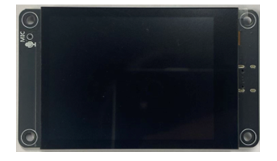
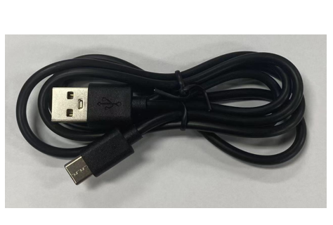
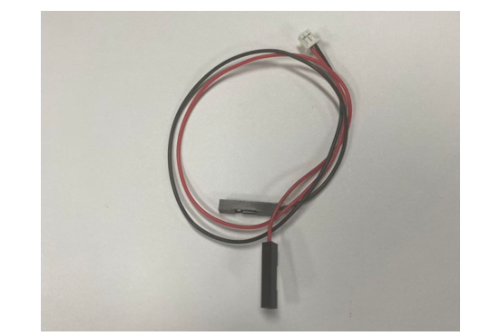
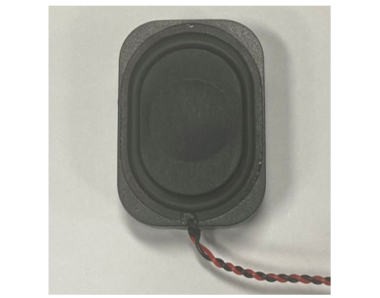
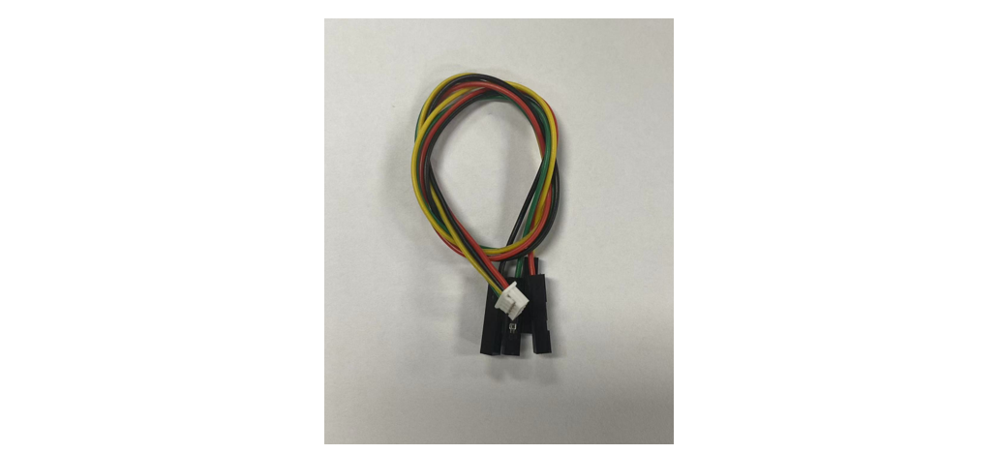
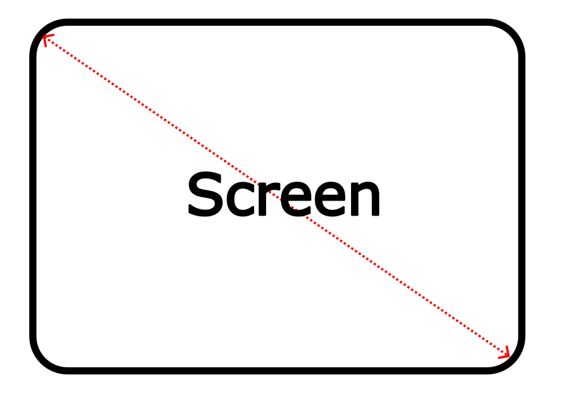
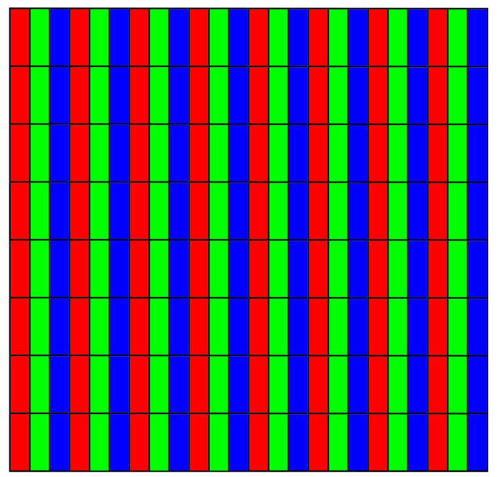

##############################################################################
List
##############################################################################

**If you have any concerns, please feel free to contact us via** support@freenove.com

.. table:: 
    :align: center
    :class: table-line
    
    +----------------------------+----------------------+
    | Freenove ESP32 Display x 1 | USB-C Data Cable x 1 |
    |                            |                      |
    | |List00|                   | |List01|             |
    +----------------------------+----------------------+
    | Battery adapter cable x1   | Speaker x1           |
    |                            |                      |
    | |List02|                   | |List03|             |
    +----------------------------+----------------------+
    | Jumper Wire x1                                    |
    |                                                   |
    | |List04|                                          |
    +---------------------------------------------------+

Related Knowledge
**************************

Screen Size
=====================

An internationally recognized unit of length, the inch (equivalent to 2.54 centimeters) has been the standard measurement for screen sizes in the display industry with a long history. This convention originated in the early television era when British manufacturers first adopted inches to measure cathode-ray tube (CRT) dimensions. The practice quickly became the global norm and remains the industry standard today.

A critical clarification: screen size always refers to the diagonal measurement of the display panel. For instance, a 4-inch display features a 4-inch (10.16 cm) diagonal, ensuring standardized and comparable sizing across all devices.

Resolution
=====================

**Screen resolution** quantifies a display's pixel density along its horizontal and vertical axes, expressed as **width x height** (e.g., 320 x 480). This specification applies universally across displays, such as smartphones, monitors, and television screens.

* **Pixel**: The smallest unit of a display, composed of red (R), green (G), and blue (B) subpixels. Through precise brightness variation, these subpixels generate the complete color spectrum.

* **Resolution vs. Clarity**: Higher resolution means more pixels per unit area, resulting in sharper and more detailed imagery.

Display Driver  
=====================

The display driver IC serves as the core component of display panels, processing signals from the main controller and controlling pixel illumination. Below is an overview of three widely used display driver ICs.

.. table:: 
    :align: center
    :class: table-line
    
    +-------------------+--------------------+-----------------------------------------------+
    | Display Driver IC | Resolution         | Advantages                                    |
    +===================+====================+===============================================+
    | ILI9341           | 240x320            | widely used with abundant resources available |
    +-------------------+--------------------+-----------------------------------------------+
    | ST77922           | 320x480 or 480x480 | Suitable for learning and development         |
    +-------------------+--------------------+-----------------------------------------------+
    | ST7796            | 320x480            | High-definition display with richer colors    |
    +-------------------+--------------------+-----------------------------------------------+
