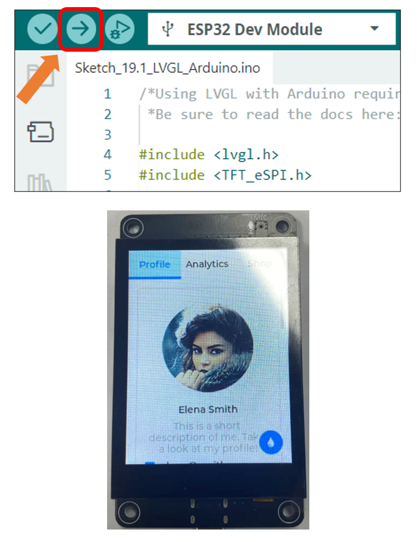

##############################################################################
Chapter 12 LVGL Arduino
##############################################################################

Project 12.1 LVGL Arduino
*****************************************

Component List 
==================================

.. table::
    :align: center
    :class: table-line
    :width: 80%

    +-------------------------------+----------------+
    | Freenove ESP32 S3 Display x 1 | USB cable x1   |
    |                               |                |
    | |Chapter01_07|                | |Chapter01_08| |
    +-------------------------------+----------------+

.. |Chapter01_07| image:: ../_static/imgs/1_Serial/Chapter01_07.png
.. |Chapter01_08| image:: ../_static/imgs/1_Serial/Chapter01_08.png

Circuit
==========================================

Connect Freenove ESP32 -S3 to the computer using the USB cable. 

.. image:: ../_static/imgs/Preface/Preface09.png
    :align: center

Sketch
==========================================

Open“Sketch_12.1_Lvgl_Arduino” folder under “Freenove_ESP32_S3_Display\\Sketches” and double-click “Sketch_12.1_Lvgl_Arduino.ino”.

Sketch_12.1_Lvgl_Arduino
------------------------------------------

The following is the program code:

.. literalinclude:: /freenove_Kit/Touch/Sketches/Sketch_19.1_Lvgl_Arduino/Sketch_19.1_Lvgl_Arduino.ino
    :linenos:
    :language: C
    :dedent:

Click “Upload” to upload the code to Freenove ESP32 Display

