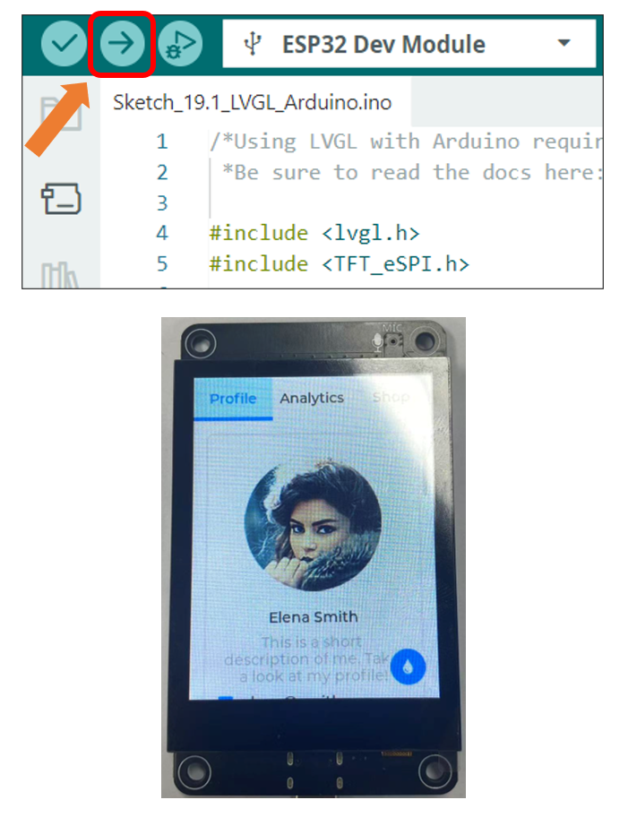

##############################################################################
Chapter 12 LVGL Arduino
##############################################################################

Project 12.1 LVGL Arduino
*****************************************

Component List 
==================================

.. table::
    :align: center
    :class: table-line

    +-------------------------------+----------------+
    | Freenove ESP32-S3 Display x 1 | USB cable x1   |
    |                               |                |
    | |Chapter11_04|                | |Chapter11_07| |
    +-------------------------------+----------------+

.. |Chapter11_04| image:: ../_static/imgs/11_TFT_Touch/Chapter11_04.png
.. |Chapter11_07| image:: ../_static/imgs/11_TFT_Touch/Chapter11_07.png

Circuit
==========================================
  
Connect Freenove ESP32 -S3 to the computer using the USB cable. 

.. image:: ../_static/imgs/11_TFT_Touch/Chapter11_05.png
    :align: center

Sketch
==========================================

Open“Sketch_12.1_Lvgl_Arduino” folder under **“Freenove_ESP32_S3_Display\\Tutorial_With_Touch\\Sketches”** and double-click **“Sketch_12.1_Lvgl_Arduino.ino”**.

Sketch_12.1_Lvgl_Arduino
------------------------------------------

The following is the program code:

.. literalinclude:: /freenove_Kit/Tutorial_With_Touch/Sketches/Sketch_19.1_Lvgl_Arduino/Sketch_19.1_Lvgl_Arduino.ino
    :linenos:
    :language: C
    :dedent:

Click **“Upload”** to upload the code to Freenove ESP32 Display

.. note::
    
    :combo:`red font-bolder:The examples in this section require touch interaction. If you are using a non-touchscreen version of the Freenove ESP32-S3 Display, the interface will render correctly but will not respond to touch input. Nevertheless, You may still use these examples as a reference for exploring other LVGL features.`