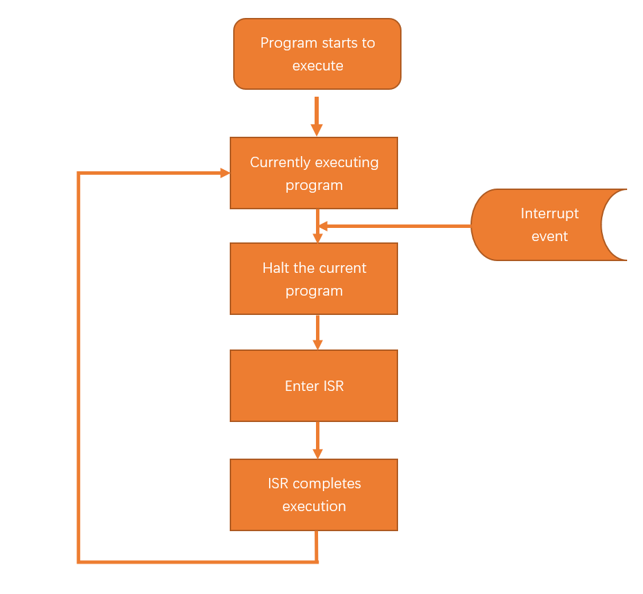
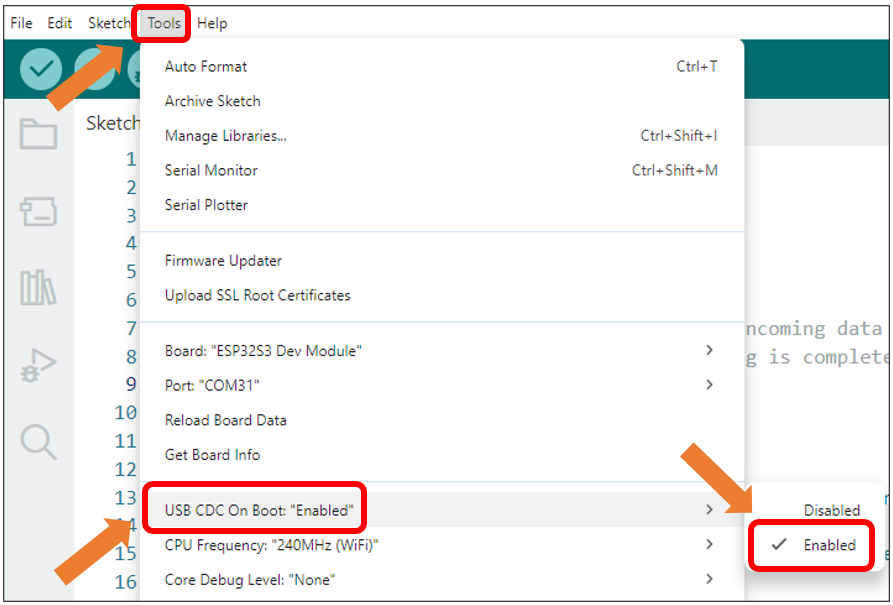
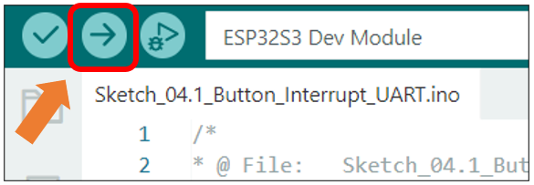
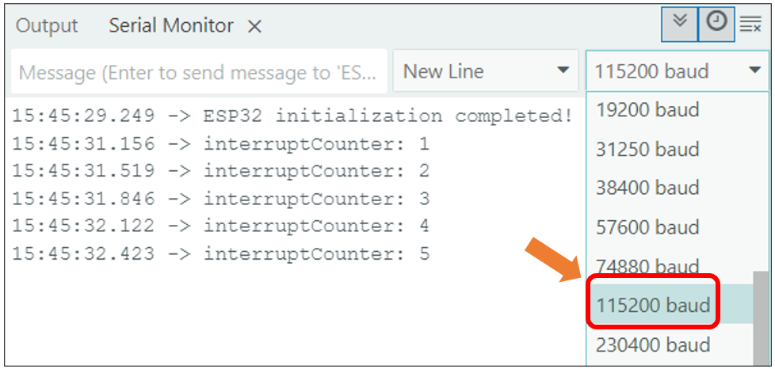

##############################################################################
Chapter 4 Button Interrupt
##############################################################################

In this chapter will learn to use interrupt to detect the button state.

Project 4.1 Button Interrupt UART
******************************************

Related Knowledge
==========================================

How Interrupts Work
------------------------------------------

When an interrupt event is triggered, the Raspberry Pi Pico (W) receives an interrupt signal. At this moment, the Raspberry Pi Pico (W) pauses the currently executing program and instead executes the Interrupt Service Routine (ISR). The ISR contains the code that needs to be processed after the interrupt event occurs. Once the ISR execution is complete, the Raspberry Pi Pico will return to the state it was in before the interrupt occurred and continue executing the paused program, as shown in the diagram below.

Component List
====================================

.. table::
    :align: center
    :class: table-line
    :width: 80%

    +-------------------------------+----------------+
    | Freenove ESP32 S3 Display x 1 | USB cable x1   |
    |                               |                |
    | |Chapter01_07|                | |Chapter01_08| |
    +-------------------------------+----------------+

.. |Chapter01_07| image:: ../_static/imgs/1_Serial/Chapter01_07.png
.. |Chapter01_08| image:: ../_static/imgs/1_Serial/Chapter01_08.png

Circuit
====================================

Connect Freenove ESP32 S3 Display to the computer with USB cable. 

.. image:: ../_static/imgs/Preface/Preface09.png
    :align: center

Sketch
====================================

Open **“Sketch_04.1_Button_Interrupt_UART”** folder under **“Freenove_ESP32_S3_Display\\Sketches”** and double-click **“Sketch_04.1_Button_Interrupt_UART.ino”**.

Sketch_04.1_Button_Interrupt_UART
-------------------------------------

The following is the program code:

.. literalinclude:: /freenove_Kit/Touch/Sketches/Sketch_04.1_Button_Interrupt_UART/Sketch_04.1_Button_Interrupt_UART.ino
    :linenos:
    :language: C
    :dedent:

Code Explanation
-------------------------------------

Define the pin of the button.

.. literalinclude:: /freenove_Kit/Touch/Sketches/Sketch_04.1_Button_Interrupt_UART/Sketch_04.1_Button_Interrupt_UART.ino
    :linenos:
    :language: C
    :lines: 9-9  
    :dedent:

Configure the button pin hardware interrupt to trigger on the falling edge signal.

.. literalinclude:: /freenove_Kit/Touch/Sketches/Sketch_04.1_Button_Interrupt_UART/Sketch_04.1_Button_Interrupt_UART.ino
    :linenos:
    :language: C
    :lines: 16-16
    :dedent:

The interrupt processing function, counting how many times the button is pressed.

.. literalinclude:: /freenove_Kit/Touch/Sketches/Sketch_04.1_Button_Interrupt_UART/Sketch_04.1_Button_Interrupt_UART.ino
    :linenos:
    :language: C
    :lines: 28-33
    :dedent:

When the number of button presses changes, print new data in the serial monitor.

.. literalinclude:: /freenove_Kit/Touch/Sketches/Sketch_04.1_Button_Interrupt_UART/Sketch_04.1_Button_Interrupt_UART.ino
    :linenos:
    :language: C
    :lines: 42-47
    :dedent:

Enable the "USB CDC On Boot" feature. 

Click “Upload” to upload the code to Freenove_ESP32_S3_Display.

When the code finishes uploading, open the serial monitor and set the baud rate to 115200. The serial monitor will print the number of button presses.

Reference
-----------------------------

.. py:function:: void attachInterrupt(uint8_t pin, void (*)(void), int mode);

    external interrupts
    
    Parameters:
    
    pin: The digital pin number for the interrupt
    
    void: The name of the interrupt function
    
    mode:
    
        LOW (trigger on low level)
    
        CHANGE (trigger on change)
    
        RISING (trigger on rising edge)
    
        FALLING (trigger on falling edge)