##############################################################################
Chapter 6 SD Card
##############################################################################

Project 6.1 SD Test
*************************************

Component List
====================================

.. table::
    :align: center
    :class: table-line
    :width: 80%

    +-------------------------------+----------------+
    | Freenove ESP32 S3 Display x 1 | USB cable x1   |
    |                               |                |
    | |Chapter01_07|                | |Chapter01_08| |
    +-------------------------------+----------------+

.. |Chapter01_07| image:: ../_static/imgs/1_Serial/Chapter01_07.png
.. |Chapter01_08| image:: ../_static/imgs/1_Serial/Chapter01_08.png

:combo:`red font-bolder:Please note that this kit does not include SD card and card reader, please buy them by yourself.`

Component Knowledge
=====================================

Format SD card
-------------------------------------

To initiate the project, you'll first need to prepare a blank SD card and a compatible card reader. The initial setup involves assigning a drive letter to the SD card and formatting it properly. Below you'll find system-specific instructions to complete these preparatory steps. Please follow the guide corresponding to your operating system.

Windows
-------------------------------------

Insert the SD card into the card reader, and then insert the card reader into the computer.

In the Windows search box, enter "Disk Management" and select "Create and format hard disk partitions".

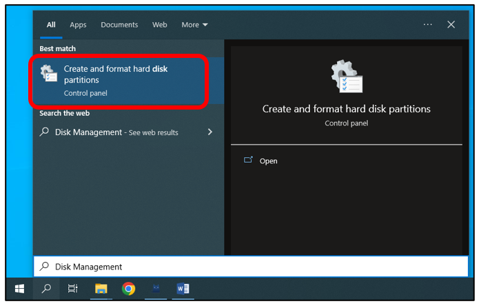

In the newly opened window, locate an unallocated volume with a size close to 1GB.

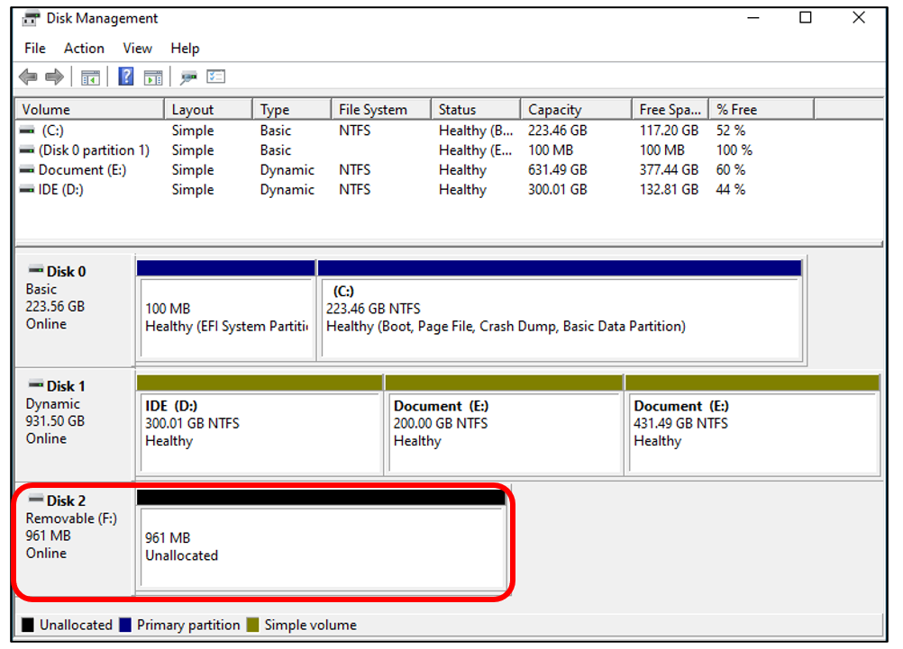

Click to select the volume, right-click and select "New Simple Volume".

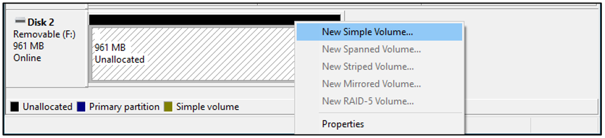

Click Next.

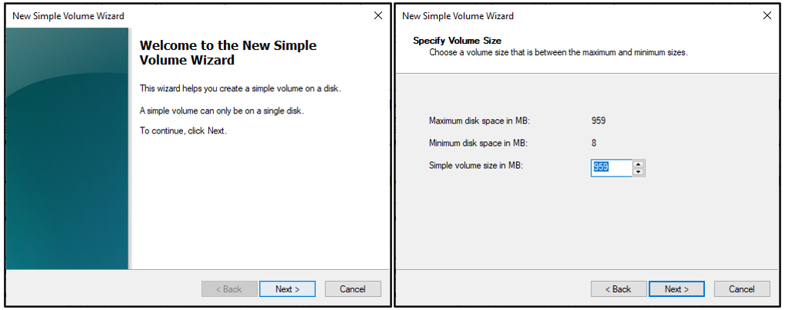

On the right-hand side, you can select a preferred drive letter for the SD card or simply proceed with the default setting by clicking on the "Next" button.

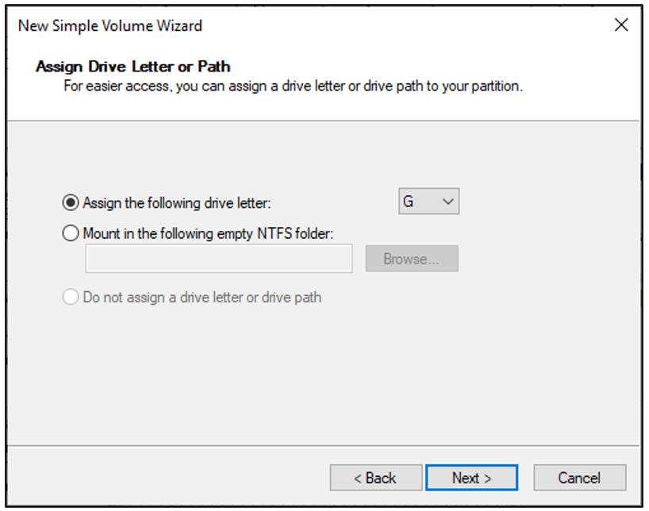

When formatting the SD card, select the file system as FAT (or FAT32) and set the allocation unit size to 16K. You can set the volume label to any name of your choice. Once you have made these selections, click on the "Next" button to proceed.

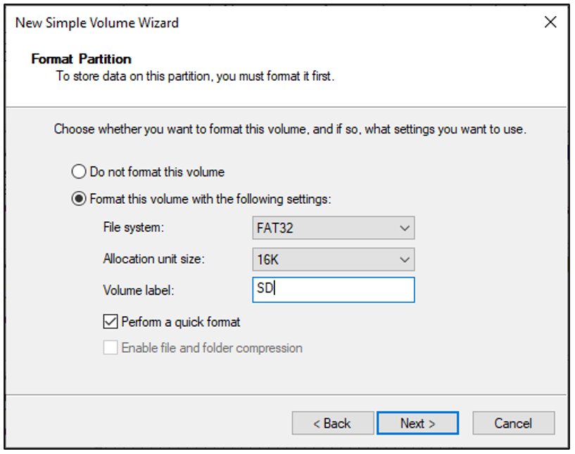

Click Finish. Wait for the SD card initialization to complete.

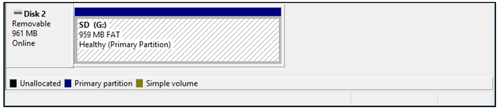

After completing the formatting process, you should be able to see the SD card in the "This PC" section of your computer.

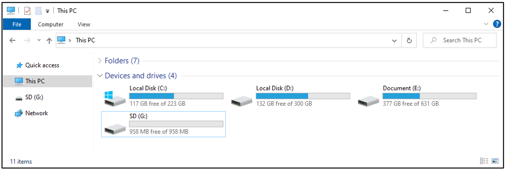

MAC
-------------------------------------

Insert the SD card into the card reader and then insert the card reader into your computer. Some computers may display a prompt with the following message. In this case, please click on the "Ignore" option to proceed.

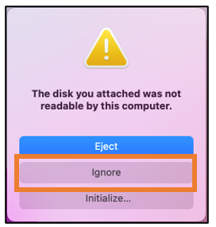

Find "Disk Utility" in the MAC system and click to open it.

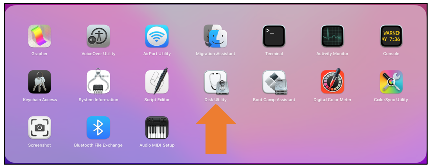

Select "Generic MassStorageClass Media", note that its size is about 1G. It is important to select the correct item to avoid accidentally erasing other device. Once you have verified that you have selected the correct device, click on the "Erase" button to proceed with erasing the SD card.

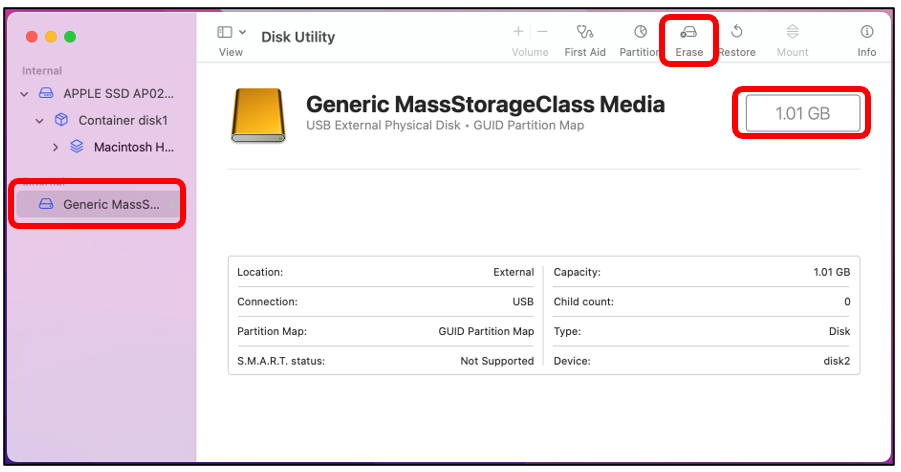

Select the configuration as shown in the figure below, and then click "Erase".

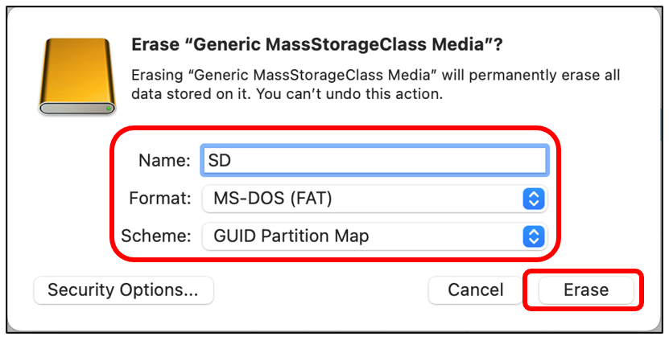

Please wait for the formatting process to complete. Once it is finished, the interface should resemble the image below. You should now be able to see a new disk named "SD" on your desktop.

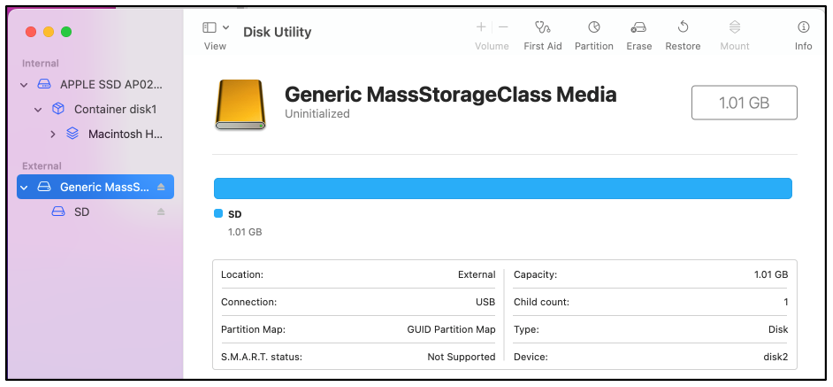

Circuit
=====================================

Before connecting the USB cable, insert the SD card into the SD card slot on the back of the ESP32-S3.

:combo:`red font-bolder:Please note that this kit does not include SD card and card reader; please buy them yourself.`

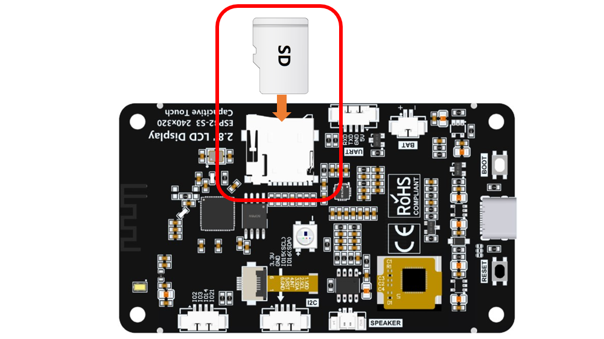

Connect Freenove ESP32-S3 to the computer using the USB cable. 

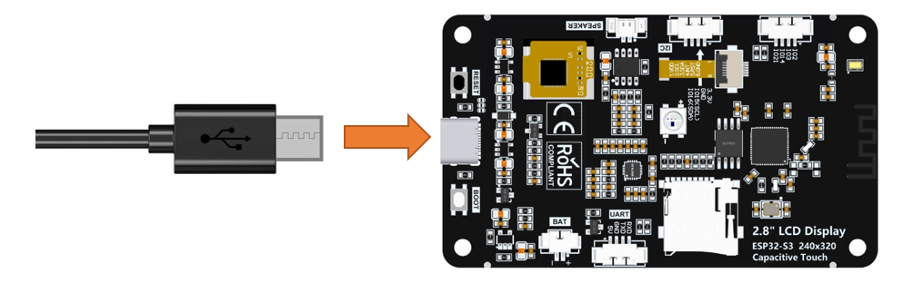

**If you have any concerns, please feel free to contact us via** support@freenove.com

Sketch
=====================================

Next, we download the code to Freenove_ESP32_S3_Display to test Serial. Open **“Sketch_06.1_SD_Test.ino”** folder under **“Freenove_ESP32_S3_Display\\Sketches”** and double-click **“Sketch_06.1_SD_Test.ino”**.

Sketch_06.1_SD_Test
-------------------------------------

The following is the program code:

.. literalinclude:: /freenove_Kit/Touch/Sketches/Sketch_06.1_SDMMC_Test/Sketch_06.1_SDMMC_Test.ino
    :linenos:
    :language: C
    :dedent:

Code Explanation
-------------------------------------

Include necessary header files.

.. literalinclude:: /freenove_Kit/Touch/Sketches/Sketch_06.1_SDMMC_Test/Sketch_06.1_SDMMC_Test.ino
    :linenos:
    :language: C
    :lines: 7-7
    :dedent:

Define SD card pins. In this example, we read and write the SD card via SPI.

.. literalinclude:: /freenove_Kit/Touch/Sketches/Sketch_06.1_SDMMC_Test/Sketch_06.1_SDMMC_Test.ino
    :linenos:
    :language: C
    :lines: 9-14
    :dedent:

Set the baud rate to 115200. 

.. literalinclude:: /freenove_Kit/Touch/Sketches/Sketch_06.1_SDMMC_Test/Sketch_06.1_SDMMC_Test.ino
    :linenos:
    :language: C
    :lines: 18-18
    :dedent:

Initialize the SD card

.. literalinclude:: /freenove_Kit/Touch/Sketches/Sketch_06.1_SDMMC_Test/Sketch_06.1_SDMMC_Test.ino
    :linenos:
    :language: C
    :lines: 22-22
    :dedent:

List all files under the root directory.

.. literalinclude:: /freenove_Kit/Touch/Sketches/Sketch_06.1_SDMMC_Test/Sketch_06.1_SDMMC_Test.ino
    :linenos:
    :language: C
    :lines: 25-26
    :dedent:

Create a directory named “mydir” and list all files under the root directory.

.. literalinclude:: /freenove_Kit/Touch/Sketches/Sketch_06.1_SDMMC_Test/Sketch_06.1_SDMMC_Test.ino
    :linenos:
    :language: C
    :lines: 29-30
    :dedent:

Delete the “mydir” directory and list all files under the root directory.

.. literalinclude:: /freenove_Kit/Touch/Sketches/Sketch_06.1_SDMMC_Test/Sketch_06.1_SDMMC_Test.ino
    :linenos:
    :language: C
    :lines: 34-35
    :dedent:

Write "Hello" in the hello.txt file, append "World!" to it, then read and print the file contents.

.. literalinclude:: /freenove_Kit/Touch/Sketches/Sketch_06.1_SDMMC_Test/Sketch_06.1_SDMMC_Test.ino
    :linenos:
    :language: C
    :lines: 38-49
    :dedent:

Rename foo.txt to hello.txt and read the file.

.. literalinclude:: /freenove_Kit/Touch/Sketches/Sketch_06.1_SDMMC_Test/Sketch_06.1_SDMMC_Test.ino
    :linenos:
    :language: C
    :lines: 51-54
    :dedent:

Enable the "USB CDC On Boot" feature.

.. literalinclude:: /freenove_Kit/Touch/Sketches/Sketch_06.1_SDMMC_Test/Sketch_06.1_SDMMC_Test.ino
    :linenos:
    :language: C
    :lines: 56-56
    :dedent:

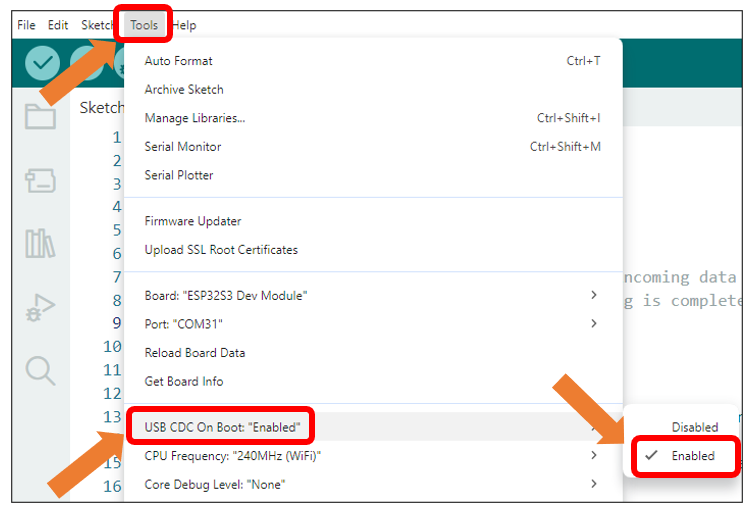

Click **“Upload”** to upload the code to Freenove_ESP32_S3_Display.

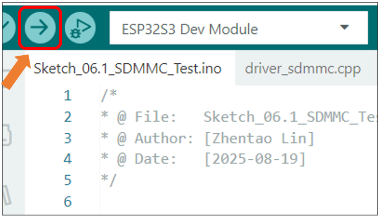

Upon the code runs, open the serial and set the baud rate to 115200.

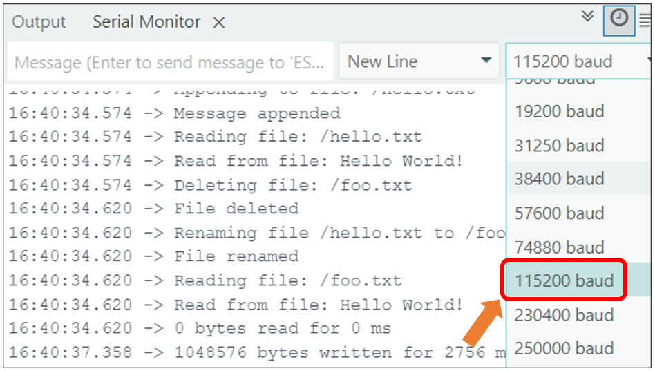