##############################################################################
Chapter 8 BLE
##############################################################################

Project 8.1 BLE USART
**********************************

.. table::
    :align: center
    :class: table-line
    :width: 80%

    +-------------------------------+----------------+
    | Freenove ESP32 S3 Display x 1 | USB cable x1   |
    |                               |                |
    | |Chapter01_07|                | |Chapter01_08| |
    +-------------------------------+----------------+

.. |Chapter01_07| image:: ../_static/imgs/1_Serial/Chapter01_07.png
.. |Chapter01_08| image:: ../_static/imgs/1_Serial/Chapter01_08.png

Component Knowledge
=================================

BLE(Bluetooth Low Energy)
---------------------------------

Low Energy Bluetooth (BLE) is a new feature introduced in the Bluetooth 4.0 specification, specifically designed for low-power devices and suitable for applications involving intermittent transmission of small amounts of data.  

The BLE architecture follows a client-server model and consists of the following key components:  

**GATT (Generic Attribute Protocol):** The foundational protocol for BLE communication, defining a hierarchical data structure of services and characteristics.  

**Service:** A collection of data that performs a specific function or feature, containing one or more characteristics.  

**Characteristic:** A specific data point within a service, consisting of a value and descriptors.  

**UUID:** A 128-bit universally unique identifier used to distinguish services and characteristics.  

BLE device can function simultaneously as a Peripheral (providing services) and a Central (connecting to peripherals). In this section, we will learn how to configure the Freenove_ESP32_S3_Display as a peripheral device to provide services.

Circuit
=================================

Connect Freenove ESP32-S3 to the computer using the USB cable. 

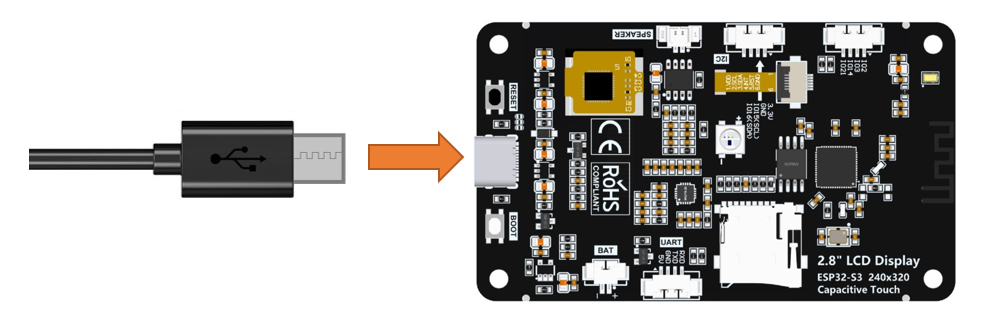

Sketch
=================================

Next, we download the code to Freenove_ESP32_S3_Display to test. Open **“Sketch_08.1_BLE_USART”** folder under **“Freenove_ESP32_S3_Display\\Sketches”** and double-click **“Sketch_08.1_BLE_USART.ino”**.

Sketch_08.1_BLE_USART
---------------------------------

The following is the program code:

.. literalinclude:: /freenove_Kit/Touch/Sketches/Sketch_08.1_BLE_USART/Sketch_08.1_BLE_USART.ino
    :linenos:
    :language: C
    :dedent:

Code Explanation
---------------------------------

Include the necessary header libraries.

.. literalinclude:: /freenove_Kit/Touch/Sketches/Sketch_08.1_BLE_USART/Sketch_08.1_BLE_USART.ino
    :linenos:
    :language: C
    :lines: 8-12
    :dedent:

Define service UUID and characteristic UUID.

.. literalinclude:: /freenove_Kit/Touch/Sketches/Sketch_08.1_BLE_USART/Sketch_08.1_BLE_USART.ino
    :linenos:
    :language: C
    :lines: 20-22
    :dedent:

The MyServerCallbacks class handles device connection and disconnection events and updates the deviceConnected status.

.. literalinclude:: /freenove_Kit/Touch/Sketches/Sketch_08.1_BLE_USART/Sketch_08.1_BLE_USART.ino
    :linenos:
    :language: C
    :lines: 24-31
    :dedent:

The MyServerCallbacks class handles the received data and save them to the rxload string.

.. literalinclude:: /freenove_Kit/Touch/Sketches/Sketch_08.1_BLE_USART/Sketch_08.1_BLE_USART.ino
    :linenos:
    :language: C
    :lines: 33-43
    :dedent:

Set the baud rate to 115200.

.. literalinclude:: /freenove_Kit/Touch/Sketches/Sketch_08.1_BLE_USART/Sketch_08.1_BLE_USART.ino
    :linenos:
    :language: C
    :lines: 61-61
    :dedent:

BLE Device Initialization, Service Creation, and Characteristic Setup

.. literalinclude:: /freenove_Kit/Touch/Sketches/Sketch_08.1_BLE_USART/Sketch_08.1_BLE_USART.ino
    :linenos:
    :language: C
    :lines: 62-62
    :dedent:

The Loop function check the connection status and serial data every 100 milliseconds.

.. literalinclude:: /freenove_Kit/Touch/Sketches/Sketch_08.1_BLE_USART/Sketch_08.1_BLE_USART.ino
    :linenos:
    :language: C
    :lines: 65-80
    :dedent:

Enable the "USB CDC On Boot" feature.

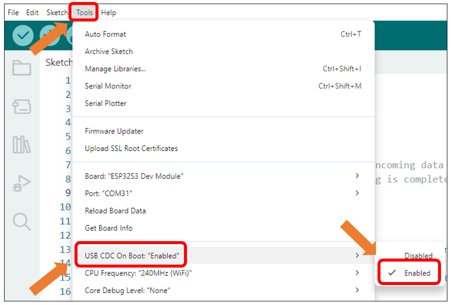

LightBlue
-----------------------------------

If you do not have this software installed on your phone, you can refer to this link:

https://apps.apple.com/us/app/lightblue/id557428110

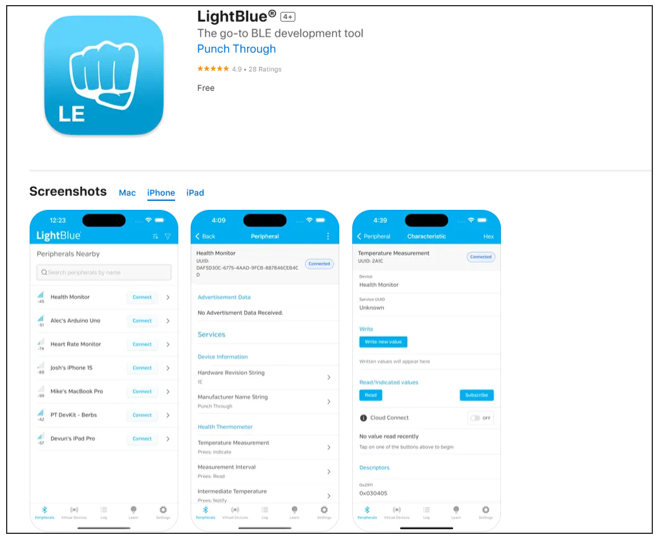

Click **“Upload”** to upload the code to Freenove ESP32 S3 Display.

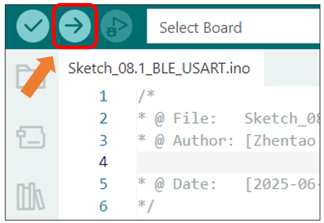

Turn ON Bluetooth on your phone, and open the LightBlue APP. 

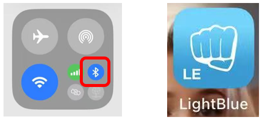

In the Scan page, swipe down to refresh the name of Bluetooth that the phone searches for. Click the Connection button of ESP32S3_BLE

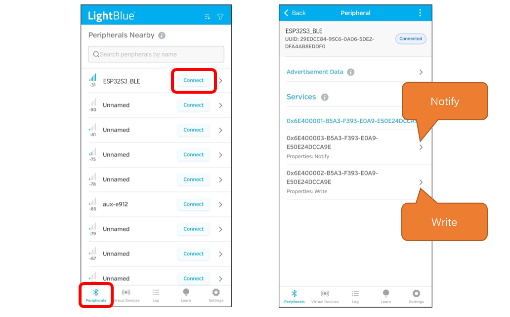

Receiving Data 
-----------------------------------

Click Notify

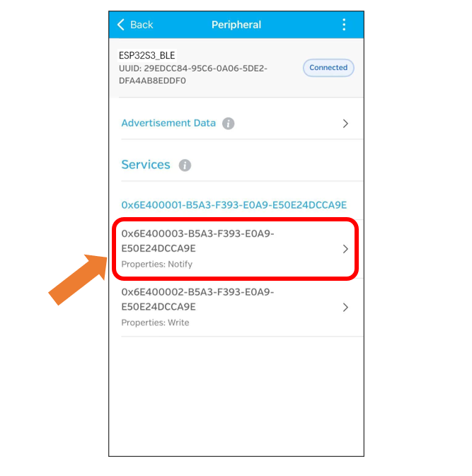

click the top right corner to change the string type. 

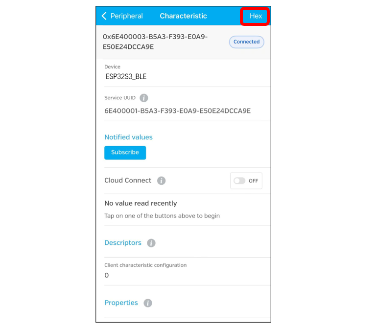

Select UTF-8 String, and click “Save”.

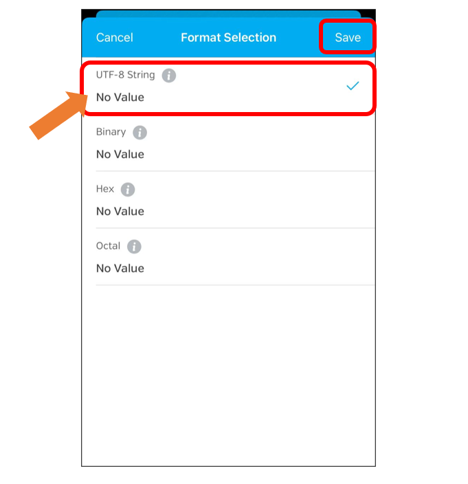

Click Subscribe

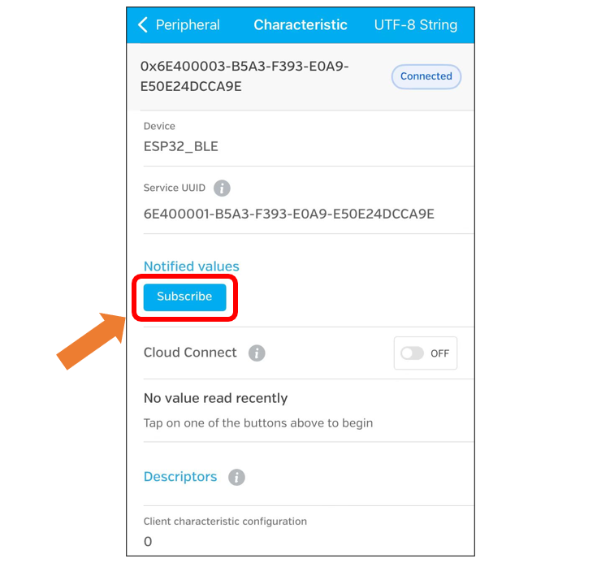

Send data on the serial monitor.

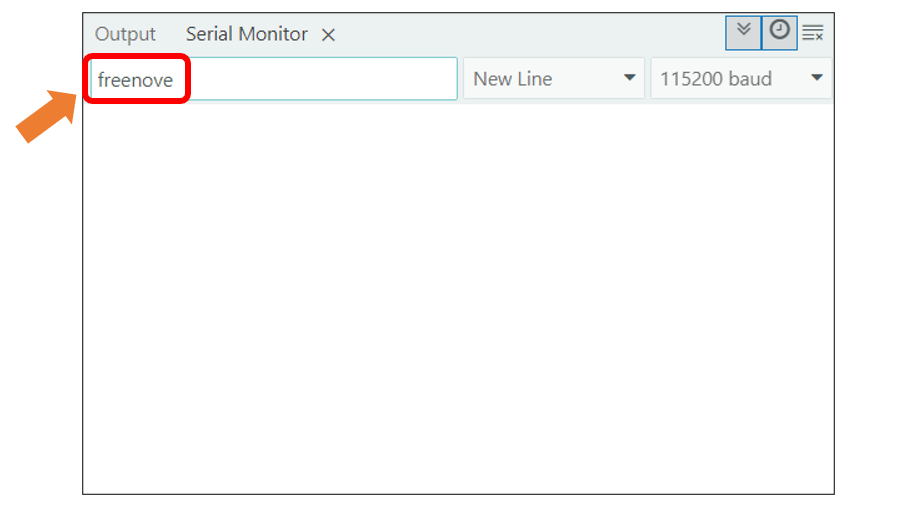

Data will be received on the LightBlue app.

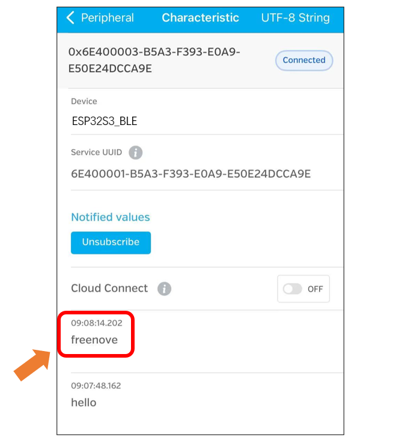

Sending Data
---------------------------------

Click Write

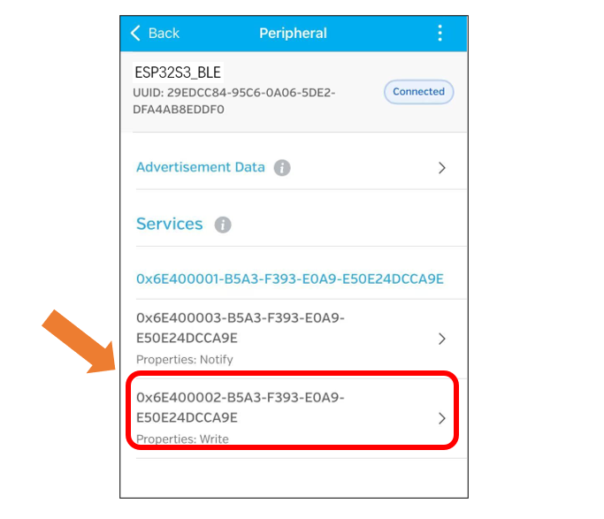

Click the top right corner to change the string type.

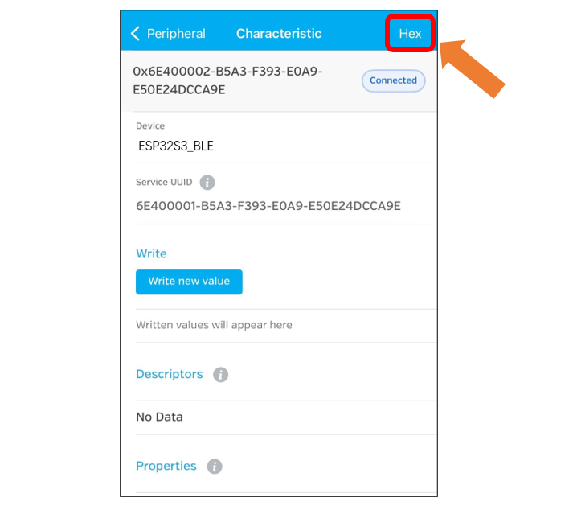

Select UTF-8 String and click “Save”.

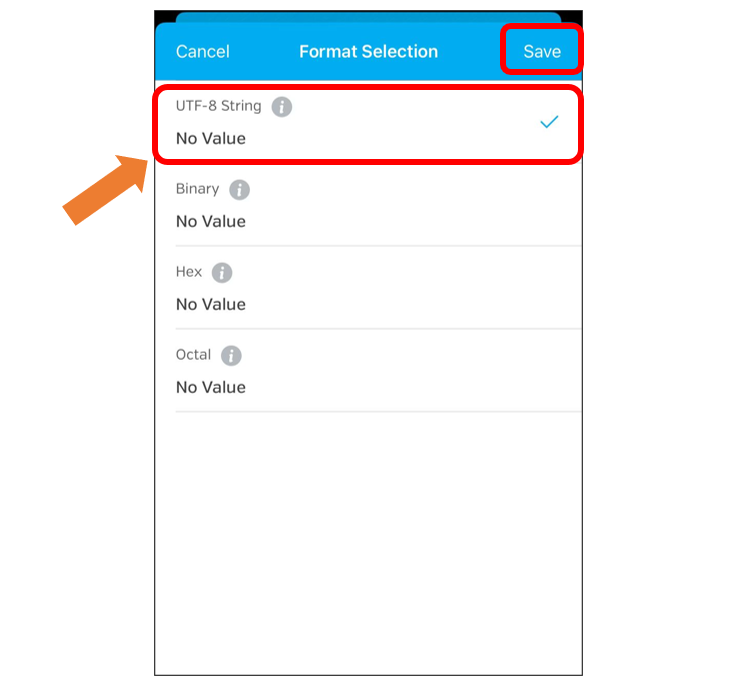

Click “Write new value” 

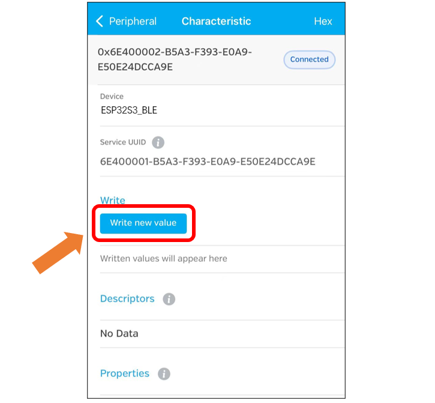

Enter the messages to send.

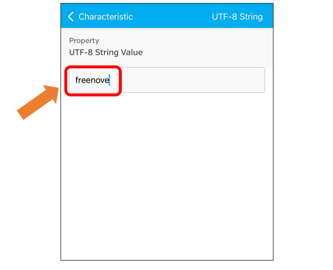

**Set the baud rate to 115200,** and the serial monitor will print the data received.

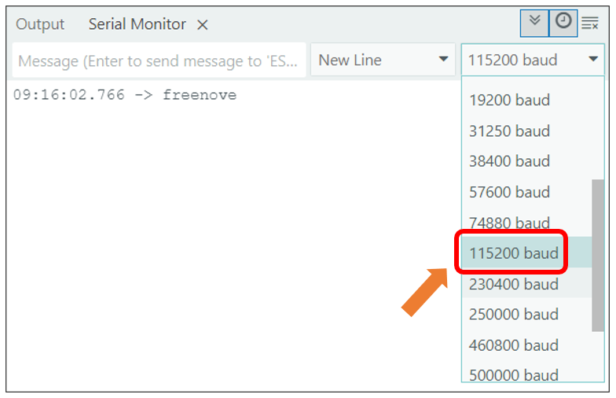

Project 8.2 BLE RGB
*******************************

In this section we will control the RGB LED via BLE.

Component List
===============================

.. table::
    :align: center
    :class: table-line
    :width: 80%

    +-------------------------------+----------------+
    | Freenove ESP32 S3 Display x 1 | USB cable x1   |
    |                               |                |
    | |Chapter01_07|                | |Chapter01_08| |
    +-------------------------------+----------------+

Circuit
==============================

Connect Freenove ESP32-S3 to the computer using the USB cable. 

Sketch
==============================

Next, we download the code to Freenove_ESP32_S3_Display to test. Open“Sketch_08.2_BLE_RGB” folder under “Freenove_ESP32_S3_Display\\Sketches” and double-click “Sketch_08.2_BLE_RGB.ino”.

Sketch_08.2_BLE_RGB
------------------------------

The following is the program code:

.. literalinclude:: /freenove_Kit/Touch/Sketches/Sketch_08.2_BLE_RGB/Sketch_08.2_BLE_RGB.ino
    :linenos:
    :language: C
    :dedent:

Code Explanation
------------------------------

Include the necessary header files.

.. literalinclude:: /freenove_Kit/Touch/Sketches/Sketch_08.2_BLE_RGB/Sketch_08.2_BLE_RGB.ino
    :linenos:
    :language: C
    :lines: 7-12
    :dedent:

Define Service UUID and Characteristic UUID.

.. literalinclude:: /freenove_Kit/Touch/Sketches/Sketch_08.2_BLE_RGB/Sketch_08.2_BLE_RGB.ino
    :linenos:
    :language: C
    :lines: 20-22
    :dedent:

Define pins for the RGB LED.

.. literalinclude:: /freenove_Kit/Touch/Sketches/Sketch_08.2_BLE_RGB/Sketch_08.2_BLE_RGB.ino
    :linenos:
    :language: C
    :lines: 24-27
    :dedent:

The MyServerCallbacks class handles device connection and disconnection events and updates the deviceConnected status.

.. literalinclude:: /freenove_Kit/Touch/Sketches/Sketch_08.2_BLE_RGB/Sketch_08.2_BLE_RGB.ino
    :linenos:
    :language: C
    :lines: 60-67
    :dedent:

The MyCallbacks class handles the receiving data and save them to the rxload string.

.. literalinclude:: /freenove_Kit/Touch/Sketches/Sketch_08.2_BLE_RGB/Sketch_08.2_BLE_RGB.ino
    :linenos:
    :language: C
    :lines: 69-76
    :dedent:

Set the baud rate to 115200

.. literalinclude:: /freenove_Kit/Touch/Sketches/Sketch_08.2_BLE_RGB/Sketch_08.2_BLE_RGB.ino
    :linenos:
    :language: C
    :lines: 97-97
    :dedent:

Initialize RGB LED setting, initialize the BLE device, create services, and set up characteristics.

.. literalinclude:: /freenove_Kit/Touch/Sketches/Sketch_08.2_BLE_RGB/Sketch_08.2_BLE_RGB.ino
    :linenos:
    :language: C
    :lines: 98-100
    :dedent:

The Loop function checks the sending command every 100 milliseconds.

.. literalinclude:: /freenove_Kit/Touch/Sketches/Sketch_08.2_BLE_RGB/Sketch_08.2_BLE_RGB.ino
    :linenos:
    :language: C
    :lines: 103-131
    :dedent:

Enable the "USB CDC On Boot" feature. 

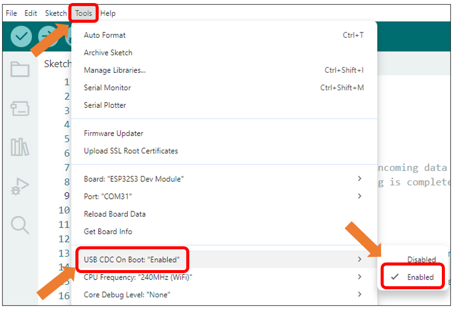

Click **“Upload”** to upload the code to Freenove ESP32 S3 Display.

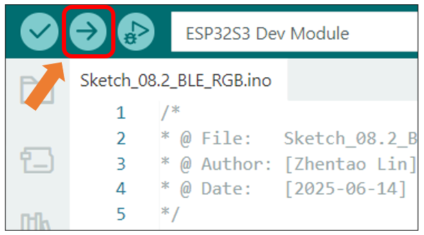

Click “Write new value”

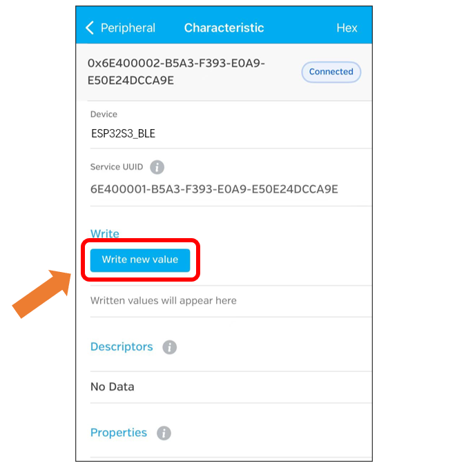

Enter the messages to send. Here we take “red_on” as an example.

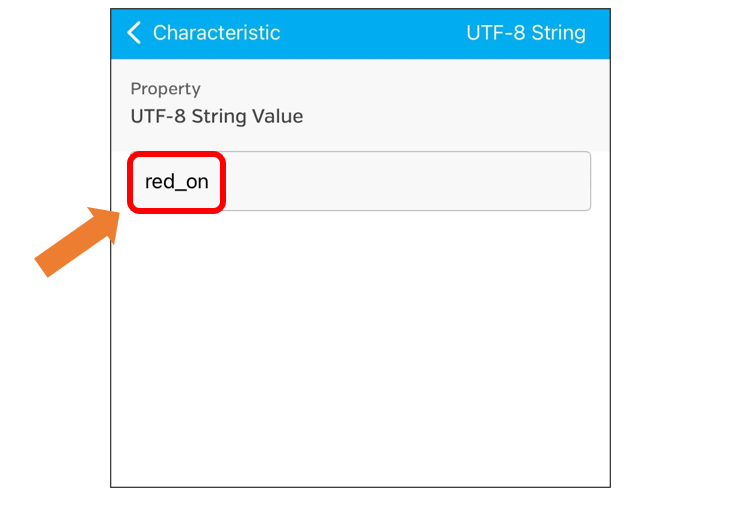

The RGB LED on the Freenove ESP32 S3 Display emits red light.

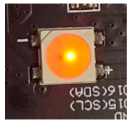

You can also use the following instructions to control the RGB LED:

red_off: red light off

green_on: green light on

green_off: green light off

blue_on: blue light on

blue_off: blue light off