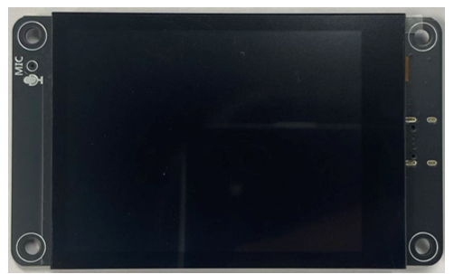
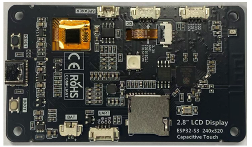

##############################################################################
Preface
##############################################################################

Freenove ESP32S3 Display
************************************

.. table::
    :align: center
    :class: table-line

    +-------------+-------------+
    | Top         | Bottom      |
    |             |             |
    | |Preface00| | |Preface01| |
    +-------------+-------------+

Hardware Interfaces
************************************

Battery (Optional)
==================================

:combo:`red font-bolder:Please note that this product does not come with lithium batteries; please purchase them yourself.`

This device supports both **USB-powered and lithium battery-powered operation**. For optimal safety, USB power is recommended. Due to the :combo:`red font-bolder:hazardous nature of lithium batteries`, we advise against their use unless absolutely necessary.

This device features an **MX1.25mm** connector and supports lithium batteries of various capacities. Note: The input voltage must be maintained within **3.7-4.2V** range.

Market-available batteries may feature **two distinct wiring configurations where the positive (+) and negative (-) terminals are reversed between models.** Please verify the battery's wiring matches the product requirements (refer to the diagram below) to prevent equipment failure or safety risks due to improper connection.

**The** :combo:`red font-bolder:red cable` **is the positive terminal while the black one is negative.**

We recommend using a charger specially designed for lithium batteries. Due to various specifications and quality of lithium batteries, using a proper charger helps ensure peak performance, safety, and battery longevity.

While our product also supports USB charging as a backup option, please note that this method does not support fast charging and is limited to standard slow charging.

Speaker
==================================

There is a speaker connector (PH1.25mm) on the Freenove ESP32 S3 Display. 

SD Card
==================================

The connector circuit uses SPI communication and supports high-speed Micro SD card storage.

.. table::
    :align: center
    :class: zebra text-center
    :width: 70%

    +---------+--------+------------+
    |  Item   |  Pins  | Definition |
    +=========+========+============+
    |         | GPIO23 | SD_CMD     |
    |         +--------+------------+
    |         | GPIO18 | SD_CLK     |
    | SD Card +--------+------------+
    |         | GPIO19 | SD_D0      |
    |         +--------+------------+
    |         | GPIO5  | SD_CS      |
    +---------+--------+------------+

.. note::
    
    :combo:`red font-bolder:This product does not include SD cards or SD card readers. Please buy them yourself`

TFT Screen
==================================

.. table::
    :align: center
    :class: zebra text-center
    :width: 70%

    +------------+--------+------------+
    |    Item    |  Pins  | Definition |
    +============+========+============+
    |            | GPIO13 | LCD_MOSI   |
    |            +--------+------------+
    |            | GPIO12 | LCD_MISO   |
    |            +--------+------------+
    | TFT Screen | GPIO14 | LCD_SCK    |
    |            +--------+------------+
    |            | GPIO2  | LCD_RS     |
    |            +--------+------------+
    |            | GPIO15 | LCD_CS     |
    +------------+--------+------------+

Screen Size
-----------------------------------

An internationally recognized unit of length, the inch (equivalent to 2.54 centimeters) has been the standard measurement for screen sizes in the display industry with a long history. This convention originated in the early television era when British manufacturers first adopted inches to measure cathode-ray tube (CRT) dimensions. The practice quickly became the global norm and remains the industry standard today.

A critical clarification: screen size always refers to the diagonal measurement of the display panel. For instance, a 3.5-inch display features a 3.5-inch (8.89 cm) diagonal, ensuring standardized and comparable sizing across all devices.

Resolution
-----------------------------------

**Screen resolution** quantifies a display's pixel density along its horizontal and vertical axes, expressed as width x height (e.g., 320 x 480). This specification applies universally across displays, such as smartphones, monitors, and television screens.

- **Pixel**: The smallest unit of a display, composed of red (R), green (G), and blue (B) subpixels. Through precise brightness variation, these subpixels generate the complete color spectrum.

- **Resolution vs. Clarity**: Higher resolution means more pixels per unit area, resulting in sharper and more detailed imagery.

RGB LED
==================================

The Freenove ESP32 S3 Display includes an RGB LED (red, green, blue) that can blend colors to create various lighting effects.

.. table:: 
    :align: center
    :width: 70%
    :class: zebra text-center

    +------+--------+
    | Item |  Pins  |
    +======+========+
    | R    | GPIO22 |
    +------+--------+
    | G    | GPIO16 |
    +------+--------+
    | B    | GPIO17 |
    +------+--------+

GPIO Pinout Table
==================================

To learn what each GPIO corresponds to, please refer to the following table.

The functions of the pins are allocated as follows:

.. table:: 
    :align: center
    :width: 70%
    :class: zebra text-center

    +----------------+-----------+-------------+
    | ESP32-S3 N16R8 | Functions | Description |
    +================+===========+=============+
    | GPIO22         | R         | RGB         |
    +----------------+-----------+             |
    | GPIO16         | G         |             |
    +----------------+-----------+             |
    | GPIO17         | B         |             |
    +----------------+-----------+-------------+
    | GPIO13         | LCD_MOSI  | TFT_LCD     |
    +----------------+-----------+             |
    | GPIO12         | LCD_MISO  |             |
    +----------------+-----------+             |
    | GPIO14         | LCD_SCK   |             |
    +----------------+-----------+             |
    | GPIO2          | LCD_RS    |             |
    +----------------+-----------+             |
    | GPIO15         | LCD_CS    |             |
    +----------------+-----------+-------------+
    | GPIO23         | SD_CMD    | SD Card     |
    +----------------+-----------+             |
    | GPIO18         | SD_CLK    |             |
    +----------------+-----------+             |
    | GPIO19         | SD_D0     |             |
    +----------------+-----------+             |
    | GPIO5          | SD_CS     |             |
    +----------------+-----------+-------------+

For more information, refer to the schematic.

**If you have any concerns, please feel free to contact us via** support@freenove.com

Programming Software
*********************************

We use the Arduino Software (IDE) to write and upload the code for this product.

First, install Arduino Software (IDE): visit https://www.arduino.cc/en/software/, Select and download corresponding installer according to your operating system. If you are a Windows user, please select the "Windows" to download and install it correctly. 

After the download completes, run the installer. For Windows users, there may pop up an installation dialog box of driver during the installation process. When it popes up, please allow the installation.

After installation completes, an Arduino Software shortcut will be generated in the desktop. Run the Arduino Software.

The interface of Arduino Software is as follows:

Programs written with Arduino Software (IDE) are called sketches. These sketches are written in the text editor and saved with the file extension.ino. The editor features text cutting/pasting and searching/replacing. The message area gives feedback while saving and exporting and also displays errors. The console displays text output by the Arduino Software (IDE), including complete error messages and other information. The bottom right-hand corner of the window displays the configured board and serial port. The toolbar buttons allow you to verify and upload programs, create, open, and save sketches, and open the serial monitor.

.. table:: 
    :align: center
    :width: 70%
    :class: table-line

    +-------------+-----------------------------------------------------------------------------------------+
    | |Preface37| | Verify                                                                                  |
    |             |                                                                                         |
    |             | Check your code for compile errors.                                                     |
    +-------------+-----------------------------------------------------------------------------------------+
    | |Preface38| | Upload                                                                                  |
    |             |                                                                                         |
    |             | Compile your code and upload them to the configured board.                              |
    +-------------+-----------------------------------------------------------------------------------------+
    | |Preface39| | Debug                                                                                   |
    |             |                                                                                         |
    |             | Debug code running on the board. (Some development boards do not support this function) |
    +-------------+-----------------------------------------------------------------------------------------+
    | |Preface40| | Development board selection                                                             |
    |             |                                                                                         |
    |             | Configure the support package and upload port of the development board.                 |
    +-------------+-----------------------------------------------------------------------------------------+
    | |Preface41| | Serial Plotter                                                                          |
    |             |                                                                                         |
    |             | Receive serial port data and plot it in a discounted graph.                             |
    +-------------+-----------------------------------------------------------------------------------------+
    | |Preface42| | Serial Monitor                                                                          |
    |             |                                                                                         |
    |             | Open the serial monitor.                                                                |
    +-------------+-----------------------------------------------------------------------------------------+

Additional commands are found within the five menus: File, Edit, Sketch, Tools, Help. The menus are context sensitive, which means only those items relevant to the work currently being carried out are available.

Environment Configuration
*****************************************

First, open the software platform Arduino, and then click File in Menus and select Preferences.

Second, click on the symbol behind "Additional Boards Manager URLs"

Third, fill in https://raw.githubusercontent.com/espressif/arduino-esp32/gh-pages/package_esp32_index.json in the new window, click OK, and click OK on the Preferences window again.

.. note::
    
    If you copy and paste the URL directly, you may lose the "-". Please check carefully to make sure the link is correct.

Fourth, click "Boards Manager". Enter “esp32” in Boards manager, select 3.2.0, and click “INSTALL”.

Arduino will download these files automatically. Wait for the installation to complete. 

When finishing installation, click Tools in the Menus again and select Board: "ESP32S3 Dev Module", and then you can see information of ESP32S3. 

.. image:: ../_static/imgs/Preface/Preface48.png
    :align: center

Library Installation
******************************************

Before starting the learning process, it is necessary to install some libraries in advance to enable the code to be compiled properly. For convenience, we have already packaged these libraries and placed them in the Freenove_ESP32_S3_Display/Libraries folder. Please refer to the following steps to install these libraries into the Arduino IDE.

1. Open Arduino IDE.

2. Select Sketch -> Include Library -> Add .ZIP library...

3. On the newly pop-up window, select the files from the Freenove_ESP32_S3_Display /Libraries. Click Open to install the library.

4.	Repeat the above steps until all the six libraries are installed to Arduino. So far, all libraries have been installed.

.. note::
    
    :combo:`red font-bolder:Some libraries are not the latest version. Please do not update them even if it prompts every time you open the IDE. Just click LATER. Otherwise, it may lead to compilation failure.`

