##############################################################################
AI Voice Assistant Based on XiaoZhi AI
##############################################################################

This project applies the Freenove ESP32 S3 Display to implement an AI voice assistant, which requires a certain level of programming proficiency as well as familiarity with ESP-IDF and open-source large models.

About the Project
*********************************

This voice assistant project (https://github.com/Freenove/xiaozhi-esp32) is derived from the open-source project (https://github.com/78/xiaozhi-esp32 ). It enables the invocation of most mainstream large language models (LLMs) on embedded devices and achieves voice conversation functionality through multiple services, including Voice Activity Detection (VAD), Automatic Speech Recognition (ASR), Speech-to-Text (STT), Text-to-Speech (TTS), Memory Storage, and Intent Recognition. Freenove has adapted this project for its Media Kit product. This article will explain how to run the project on the Media Kit.

There are two ways to run this project - online or offline.

1.	Online: Connected to the xiaozhi.me server, currently available for free trial to individual users.

2.	Offline: All the aforementioned services (VAD, ASR, STT, TTS, Memory, Intent Recognition, etc.) must be deployed locally on a personal computer. The user experience depends entirely on the selected models and the performance of the local machine. The local server project (https://github.com/Freenove/xiaozhi-esp32-server) is derived from the open-source project (https://github.com/xinnan-tech/xiaozhi-esp32-server).

For users who prefer AI assistants, we recommend using the online version.  

For developer-oriented users, you can try deploying the offline version to gain a deeper understanding of the various services required for an AI assistant. However, it's important to note that personal computers may struggle to run all these services simultaneously—especially the core LLM (Large Language Model) service—which could result in a poor AI assistant experience. Therefore, the offline version is primarily valuable for learning and research purposes.

Cautions
*********************************

* Project Copyright:

- Voice Assistant Project: Originally developed by "Xiage", this project was forked and adapted by Freenove for the Media Kit, released under MIT License.

- Local Server Project: Originally created by "xinnan-tech", this project was similarly forked and adapted by Freenove for Media Kit integration, licensed under MIT License.

* Supprted Countries and Regions:

  - Online Version: Service availability is determined by xiaozhi.me server coverage, which may exclude certain regions. For current supported areas, please refer to: https://xiaozhi.me/login?redirect=/console/agents; 
    User experience is directly affected by server connectivity quality. Poor network conditions to xiaozhi.me servers may degrade performance.

  - Offline Version: Fully location-independent, with deployment possible in all countries and regions without geographical restrictions.

* Supported Languages:

  - Online Version: Currently supports Mandarin Chinese, Cantonese, English, Japanese, Korean, and others. If you do not speak these languages, you may not be able to communicate effectively with XiaoZhi AI.

  - Offline Version: Depending on the ASR model you deploy. The default FunASR model only supports Mandarin Chinese, Cantonese Chinese, English, Japanese and Korean.

* Pricing:

  - Online Version: Currently, xiaozhi.me provides free services, but we cannot guarantee that the online server will remain free indefinitely.

  - Offline Version: Among the sub-services mentioned, some are paid while others are free—your choice determines the cost.
   
* Seeking Help:

    If you have followed the tutorial and still encounter issues, please contact us at support@freenove.com

    Note: Since the online service is provided by xiaozhi.me, if xiaozhi.me discontinues its service, we will also remove related documentation, tutorials, and code.

Disclaimer
**********************************

This implementation is an adaptation of the open-source project available at https://github.com/78/xiaozhi-esp32, provided for third-party learning and AI functionality testing purposes, without any promotion or support for commercial applications. This tutorial is intended solely for personal learning and development by technology enthusiasts.

Notes:

1.	As this is a third-party open-source project, if you encounter issues during your learning process, please submit an issue to the original repository: https://github.com/78/xiaozhi-esp32/issues

2.	Currently, XiaoZhi AI only supports Mandarin Chinese, Cantonese, English, Korean, and Japanese for speech recognition. Other languages are not yet supported.

3.	The XiaoZhi server interface currently supports English, Chinese, and Japanese only. Additionally, mobile registration is only available for users in the following countries (see the table below). Users from other countries cannot register yet.

In this project, the ESP32-S3 communicates with XiaoZhi AI server through WebSocket protocol for data exchange.

.. image:: ../_static/imgs/AI_Voice_Assistant_Based_on_XiaoZhi_AI/AI00.png
    :align: center

Freenove ESP32 S3 Display
**********************************

.. table::
    :align: center
    :class: table-line

    +-------------+-------------+
    | Top         | Bottom      |
    |             |             |
    | |Preface00| | |Preface01| |
    +-------------+-------------+

.. |Preface00| image:: ../_static/imgs/Preface/Preface00.png
.. |Preface01| image:: ../_static/imgs/Preface/Preface01.png

Hardware Interfaces
**********************************

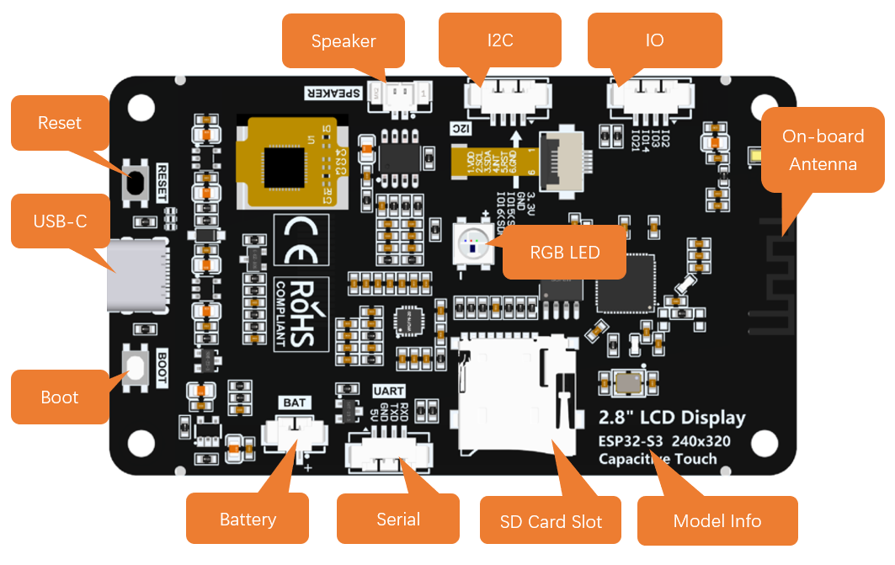

XiaoZhi AI Firmware
*************************

If your hardware does not yet have XiaoZhi firmware installed, you can follow the upcoming tutorial to re-flash the firmware onto the ESP32-S3.  

If your hardware already comes with XiaoZhi firmware pre-installed, you may skip this section.  

Installing Python (Required)
================================

Windows
----------------------

Download and install Python3 package.

https://www.python.org/downloads/windows/

Click Download Python 3.13.3

**Please note that “Add Python 3.13 to PATH” MUST be check.**

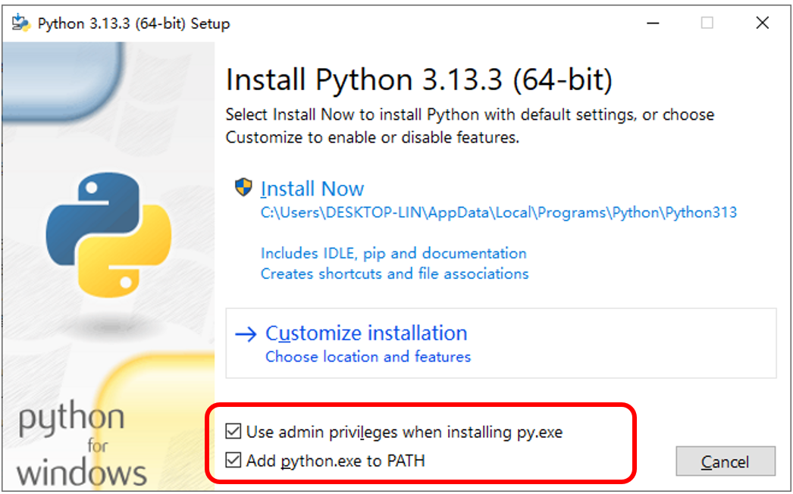

Check all the options and then click “Next”.

.. image:: ../_static/imgs/AI_Voice_Assistant_Based_on_XiaoZhi_AI/AI27.png
    :align: center

Here you can select the installation path of Python. We install it at D drive. If you are a novice, you can select the default path.

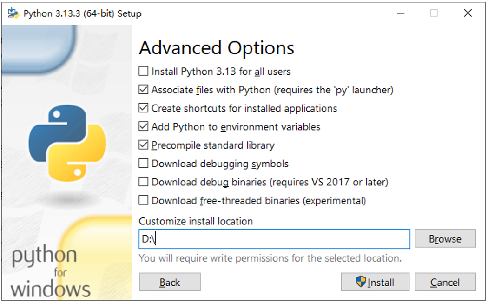

Wait for it to finish installing.

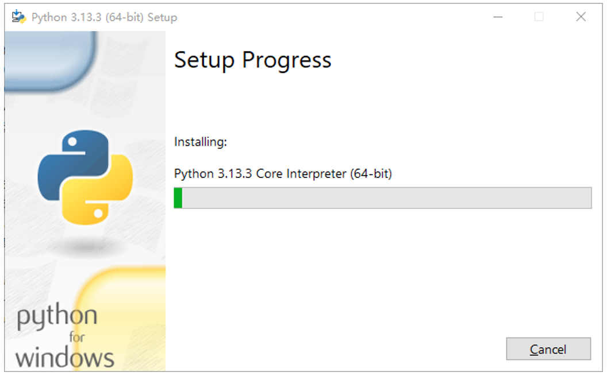

Now the installation is finished.

Mac
-----------------------------

Download installation package, link: https://www.python.org/downloads/

Click Download Python 3.13.3

Run the downloaded installation package. Click Continue

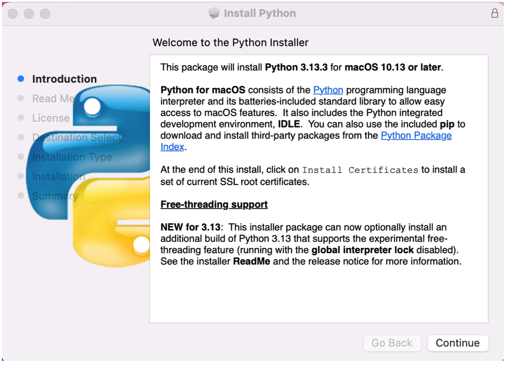

Click Continue

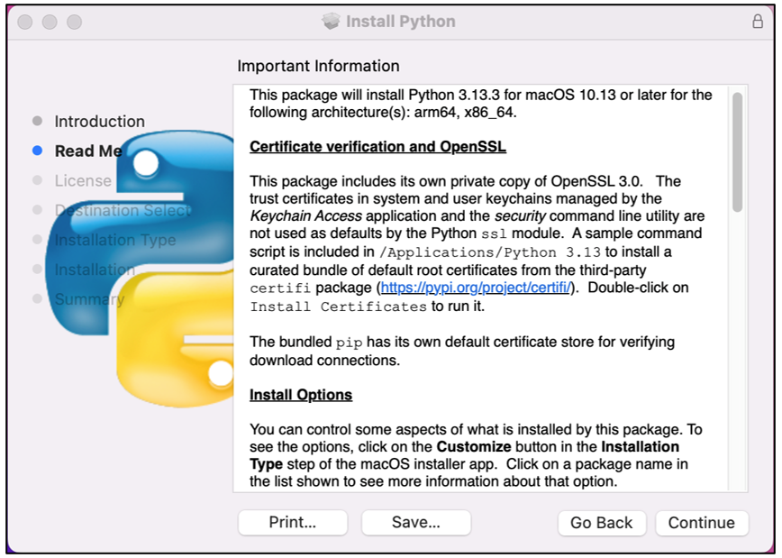

Click Continue

Click Install. If your computer has a password, enter the password and Install Software.

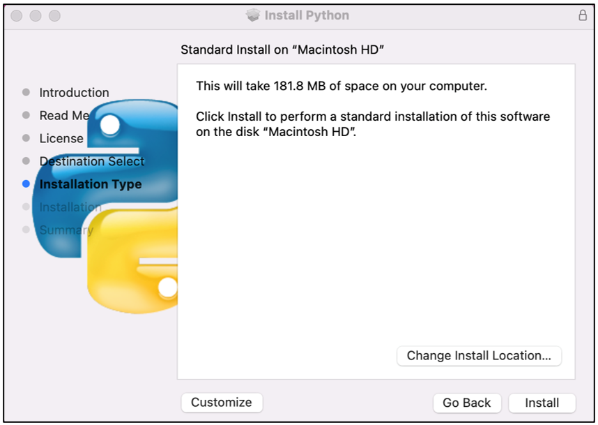

Now the installation succeeds.

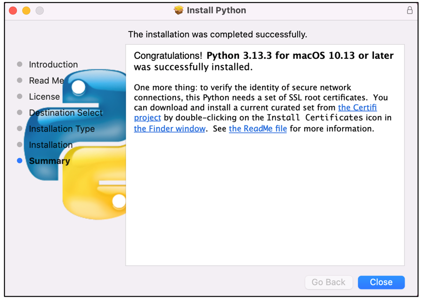

Linux
----------------------------

Check whether Python3 has already been installed.

.. code-block:: console
    
    python -version
    python3 -version

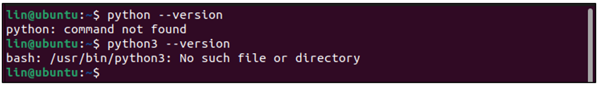

If it is not installed yet, run the following command to install it. This will install the latest version by default.

.. code-block:: console
    
    sudo apt install python3

.. image:: ../_static/imgs/AI_Voice_Assistant_Based_on_XiaoZhi_AI/AI37.png
    :align: center

Link python to Python 3.

.. code-block:: console
    
    sudo rm /usr/bin/python
    sudo ln -s /usr/bin/python3 /usr/bin/python

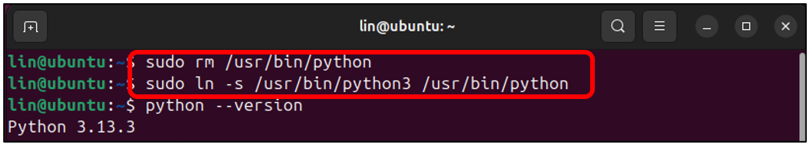

Install python3.13-venv virtual environment.

.. code-block:: console
    
    sudo apt install python3-venv

.. image:: ../_static/imgs/AI_Voice_Assistant_Based_on_XiaoZhi_AI/AI39.png
    :align: center

Install python3-pip.

.. code-block:: console
    
    sudo apt install python3-pip

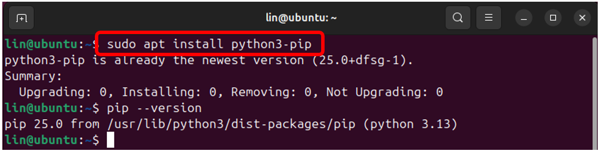

Firmware Uploading
================================

Windows
--------------------------------

Enter the Upload_Xiaozhi_Bin folder.

.. image:: ../_static/imgs/AI_Voice_Assistant_Based_on_XiaoZhi_AI/AI41.png
    :align: center

Type "CMD" in the file address bar and press Enter.

.. image:: ../_static/imgs/AI_Voice_Assistant_Based_on_XiaoZhi_AI/AI42.png
    :align: center

Type "python --version" to check if Python is installed. If no Python version information is displayed, it means Python is not properly installed—please reinstall it.

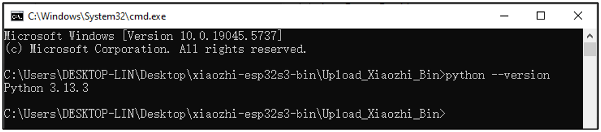

Connect the ESP32-S3 to your computer using a USB cable

.. image:: ../_static/imgs/AI_Voice_Assistant_Based_on_XiaoZhi_AI/AI44.png
    :align: center

Type "python upload_xiaozhi_bin.py" and press Enter.

If your computer does not have esptool or its required dependencies installed, they will be automatically installed.

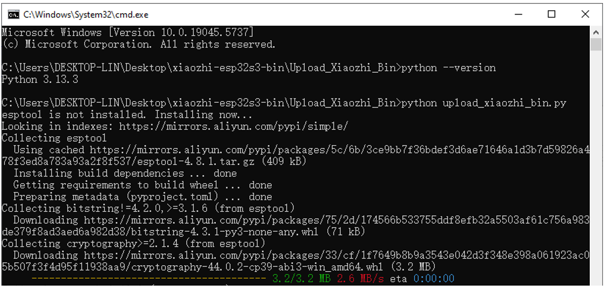

Then, it will invoke esptool to upload the files from the bin folder to the ESP32-S3.

.. image:: ../_static/imgs/AI_Voice_Assistant_Based_on_XiaoZhi_AI/AI46.png
    :align: center

You will see the following messages display on ESP32 S3 board.

.. image:: ../_static/imgs/AI_Voice_Assistant_Based_on_XiaoZhi_AI/AI47.png
    :align: center

Mac
------------------------------

Enter the Upload_Xiaozhi_Bin folder.

.. image:: ../_static/imgs/AI_Voice_Assistant_Based_on_XiaoZhi_AI/AI48.png
    :align: center

Type "python --version" to check if Python is installed. If no Python version information is displayed, it means Python is not properly installed—please reinstall it.

Connect the ESP32-S3 to your computer using a USB cable

.. image:: ../_static/imgs/AI_Voice_Assistant_Based_on_XiaoZhi_AI/AI50.png
    :align: center

Type "python upload_xiaozhi_bin.py" and press Enter.

.. image:: ../_static/imgs/AI_Voice_Assistant_Based_on_XiaoZhi_AI/AI51.png
    :align: center

Then, it will invoke esptool to upload the files from the bin folder to the ESP32-S3.

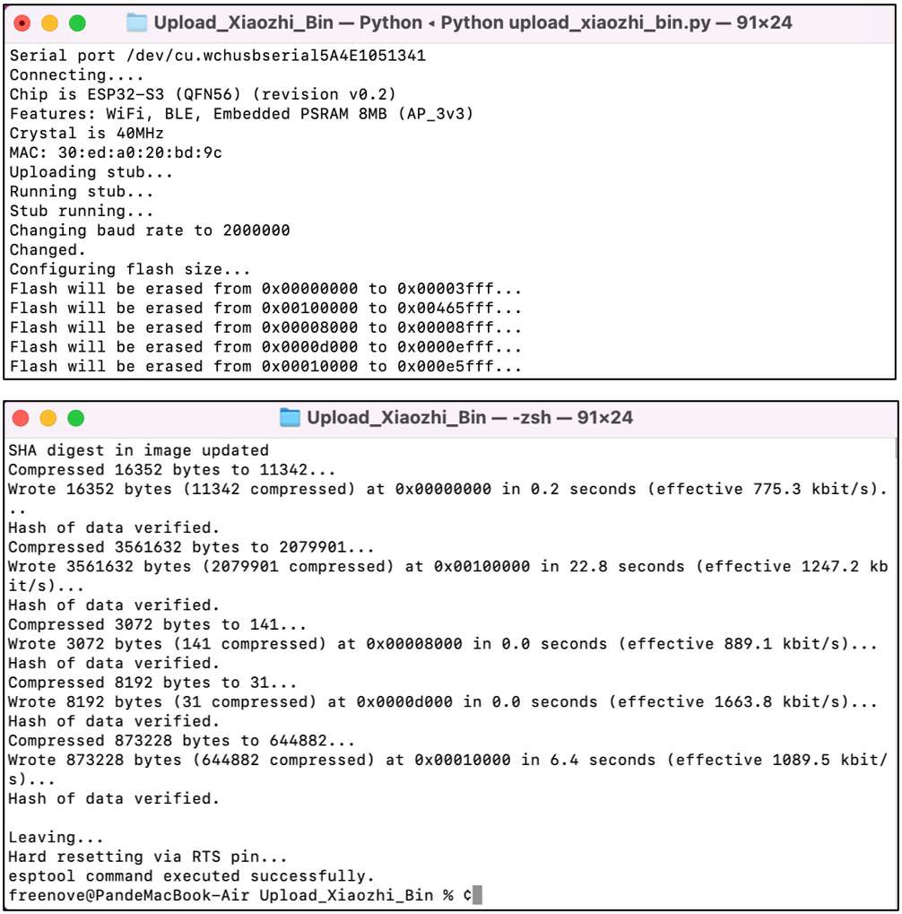

You will see the following messages display on ESP32-S3 board.

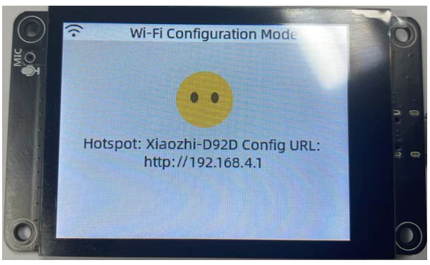

Linux
---------------------------

Enter the Upload_Xiaozhi_Bin folder.

.. code-block:: console
    
    cd Upload_Xiaozhi_Bin

.. image:: ../_static/imgs/AI_Voice_Assistant_Based_on_XiaoZhi_AI/AI54.png
    :align: center

Enter **"python --version"** to check if the Python environment is installed. If the Python version information is not displayed, it means Python is not properly installed. Please reinstall it.

.. image:: ../_static/imgs/AI_Voice_Assistant_Based_on_XiaoZhi_AI/AI55.png
    :align: center

Connect the ESP32-S3 to your computer using a USB cable, making sure to plug it into the correct Type-C port (do not use the wrong connector).

.. image:: ../_static/imgs/AI_Voice_Assistant_Based_on_XiaoZhi_AI/AI56.png
    :align: center

Create a virtual environment and name it as “myvenv”.

.. code-block:: console
    
    python -m venv myvenv

.. image:: ../_static/imgs/AI_Voice_Assistant_Based_on_XiaoZhi_AI/AI57.png
    :align: center

You can run the following command to activate or exit the virtual environment.

.. code-block:: console
    
    source myvenv/bin/activate
    deactivate

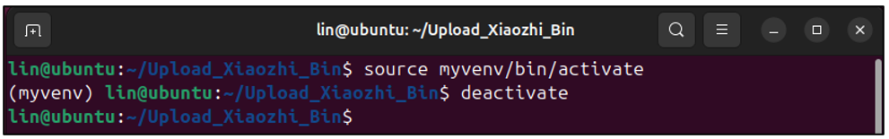

Activate the virtual environment.

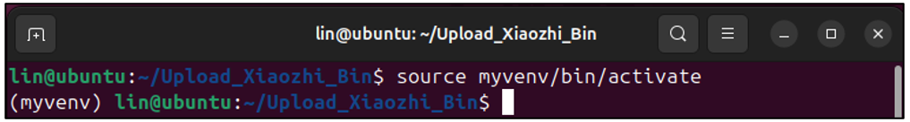

Run the command to check the port of ESP32S3.

.. code-block:: console
    
    ls /dev/tty*

When the ESP32S3 is not connected to the computer, the ports are as shown below.

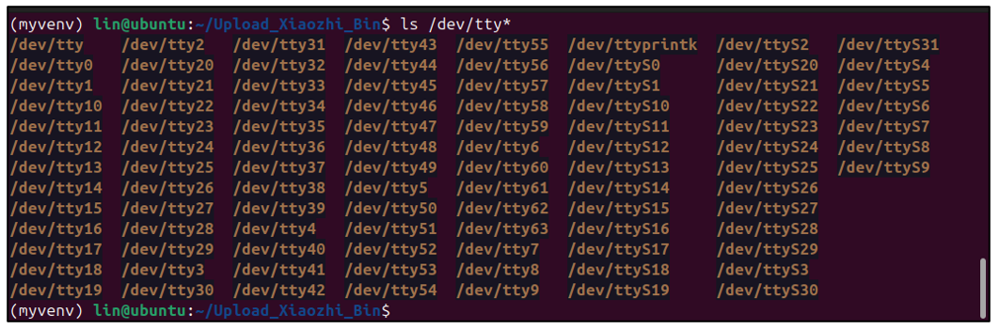

After connecting the ESP32S3, a new port is generated.

.. image:: ../_static/imgs/AI_Voice_Assistant_Based_on_XiaoZhi_AI/AI61.png
    :align: center

The newly generated one is the port of ESP32S3. Remember it.

Before running the python file, we need to modify the port.

Run the following command to open the python file.

.. code-block:: console
    
    sudo nano upload_xiaozhi_bin.py

.. image:: ../_static/imgs/AI_Voice_Assistant_Based_on_XiaoZhi_AI/AI62.png
    :align: center

In the text editor, locate the line '--port', 'COMx' and replace 'COMx' with the port number assigned to your ESP32-S3 on Linux computer.

.. image:: ../_static/imgs/AI_Voice_Assistant_Based_on_XiaoZhi_AI/AI63.png
    :align: center

The modification is as shown below.

.. image:: ../_static/imgs/AI_Voice_Assistant_Based_on_XiaoZhi_AI/AI64.png
    :align: center

Press “Ctrl+O” to save the changes and “Ctrl+X” to exit the file.

Run the python file.

.. code-block:: console
    
    python upload_xiaozhi_bin.py

.. image:: ../_static/imgs/AI_Voice_Assistant_Based_on_XiaoZhi_AI/AI65.png
    :align: center

The successful code uploading is as shown below.

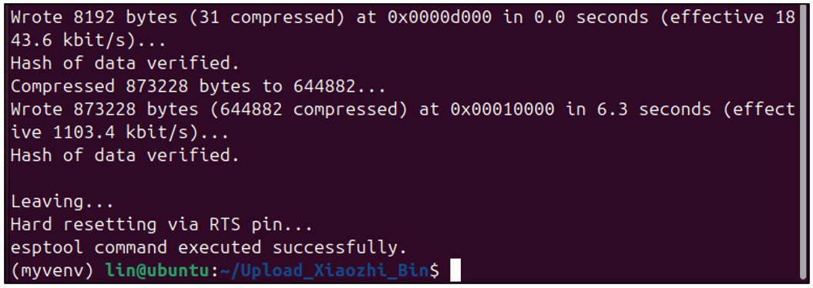

The display on the ESP32-S3 is as shown below.

.. image:: ../_static/imgs/AI_Voice_Assistant_Based_on_XiaoZhi_AI/AI67.png
    :align: center

ESP32-S3 Network Configuration
**********************************************

If your ESP32-S3 does not yet have the XiaoZhi AI firmware installed, proceed to the 

If you want to explore the XiaoZhi AI code, go to :ref:`the XiaoZhi AI Code section <fnk0104/codes/xiaozhi/xiaozhi_ai_code:xiaozhi ai code>`.

If your ESP32-S3 already has the XiaoZhi AI firmware integrated:

1.	On your smart phone, enable WiFi.

2.	Look for a hotspot named "Xiaozhi-XXXX" (an open network, no password required).

3.	Connect to it to proceed

.. image:: ../_static/imgs/AI_Voice_Assistant_Based_on_XiaoZhi_AI/AI68.png
    :align: center

After connecting to the WiFi, follow the on-screen prompts to tap the notification. This will automatically launch your mobile browser and direct you to http://192.168.4.1.

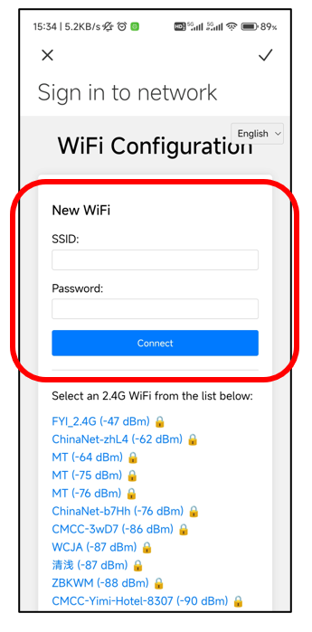

**WiFi Connection Setup for ESP32-S3**

**Enter WiFi Credentials:**

SSID: Enter your WiFi network name (2.4GHz only).

Password: Enter your WiFi password.

Click Connect to proceed.

**Important Notes:**

- The ESP32-S3 only supports 2.4GHz WiFi networks.

- If your router broadcasts both 2.4GHz and 5GHz, ensure the ESP32 connects to the 2.4GHz band only.

- Avoid mixed-mode (2.4GHz + 5GHz combined) settings, as this may prevent successful connection.

.. image:: ../_static/imgs/AI_Voice_Assistant_Based_on_XiaoZhi_AI/AI70.png
    :align: center

When you see the following screen, it means your ESP32-S3 has successfully connected to your WiFi network.

.. image:: ../_static/imgs/AI_Voice_Assistant_Based_on_XiaoZhi_AI/AI71.png
    :align: center

XiaoZhi AI Server Configuration
***************************************

Ensure your phone/computer and ESP32-S3 are connected to the same router WiFi network.

Open a browser on your device and visit: https://xiaozhi.me/

:combo:`red font-bolder:Please note that due to varying internet policies in different countries, users from certain regions may experience difficulties accessing the website. For specific details, please refer to the relevant national internet policies.`

.. image:: ../_static/imgs/AI_Voice_Assistant_Based_on_XiaoZhi_AI/AI72.png
    :align: center

If you don't have an account yet, please click Console and register using your mobile number.

Please note that currently, XiaoZhi AI servers only support mobile number registration from the following countries.

If you do not have an account yet, please register one and login.

.. image:: ../_static/imgs/AI_Voice_Assistant_Based_on_XiaoZhi_AI/AI73.png
    :align: center

Click "Console" to start setting up your XiaoZhi AI server.

.. image:: ../_static/imgs/AI_Voice_Assistant_Based_on_XiaoZhi_AI/AI74.png
    :align: center

Click **"Create Agent"** to set up a new AI assistant.

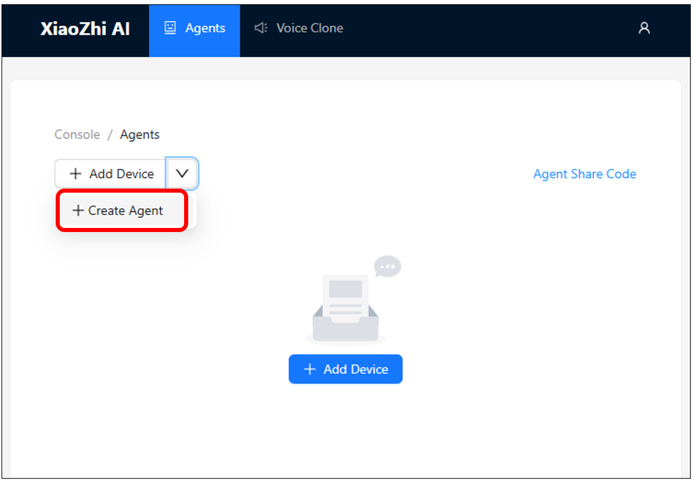

Name it whatever you like and click “Confirm”.

.. image:: ../_static/imgs/AI_Voice_Assistant_Based_on_XiaoZhi_AI/AI76.png
    :align: center

Click **“Configure Role”** to configure your AI assistant.

.. image:: ../_static/imgs/AI_Voice_Assistant_Based_on_XiaoZhi_AI/AI77.png
    :align: center

Click "English Tutor" (keep all other options unchanged). 

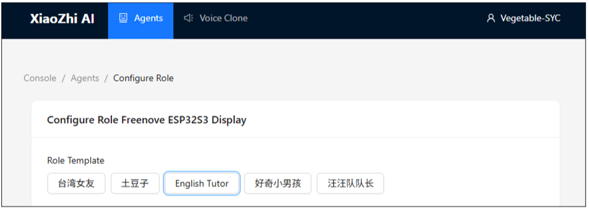

Scroll to the bottom of the page and click "Save" to confirm all settings.

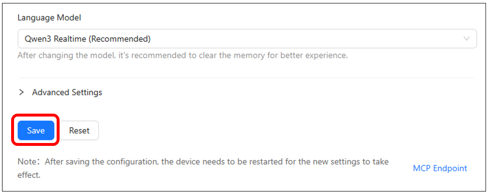

Click "Agents" to return to the main dashboard and select "Add Device" to register new hardware.

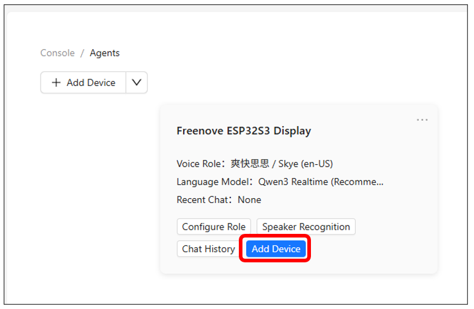

In the new pop-up window, enter the on-screen numeric code displayed on your ESP32-S3. Click "Confirm" to complete pairing.

.. image:: ../_static/imgs/AI_Voice_Assistant_Based_on_XiaoZhi_AI/AI81.png
    :align: center

The interface will now display as shown below.

.. image:: ../_static/imgs/AI_Voice_Assistant_Based_on_XiaoZhi_AI/AI82.png
    :align: center

Press the RST button on the Freenove ESP32 S3 Display board to restart the board.

.. image:: ../_static/imgs/AI_Voice_Assistant_Based_on_XiaoZhi_AI/AI83.png
    :align: center

You've successfully finished configuring XiaoZhi AI!

Connect speaker

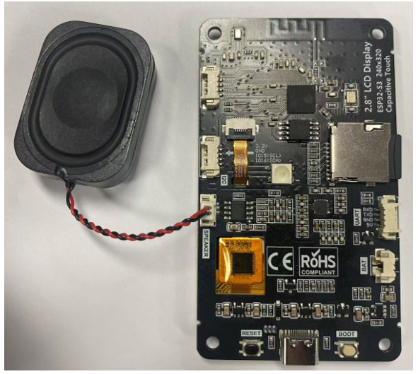

To activate, say "Hi, ESP" to the microphone; the system will now respond to your voice commands

.. image:: ../_static/imgs/AI_Voice_Assistant_Based_on_XiaoZhi_AI/AI85.png
    :align: center

You can communicate with it in either Chinese or English.