##############################################################################
Local Server
##############################################################################

Disclaimer
********************************

This project is derived from the open-source repository: https://github.com/xinnan-tech/xiaozhi-esp32-server, licensed under MIT License. The XiaoZhi AI firmware operates on servers provided by Xiage’s company. We have only adapted it for third-party learning and AI functionality trials, without any commercial promotion or application. This tutorial is intended solely for enthusiasts to supplement their learning. 

Deploying XiaoZhi AI on a Local Server
***************************************************************

If you prefer not to use the XiaoZhi AI server, you can also set up a simplified version of the server on your own computer. In this section, we will use the open-source project at https://github.com/xinnan-tech/xiaozhi-esp32-server to deploy a local server and establish a connection with the ESP32-S3. 

If you encounter any bugs in the code during use, please submit an issue at https://github.com/xinnan-tech/xiaozhi-esp32-server. Please note that we do not have an in-depth understanding of this project and may not be able to provide extensive assistance.

Installing Ollama
===============================================================

Windows
---------------------------------------------------------------

Before getting started, we need to install the Ollama tool locally, which allows us to run any open-source AI model on our computer.

If you haven't installed Ollama yet, please visit https://ollama.com/download to download and install it.

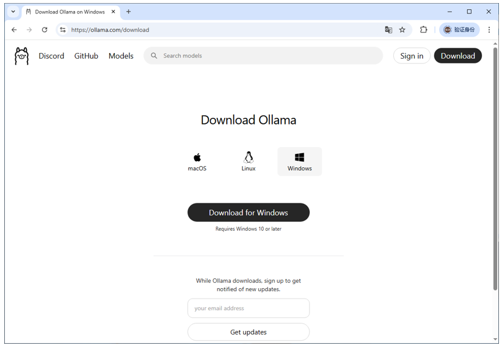

Run the Ollama Installing Package, click Install.

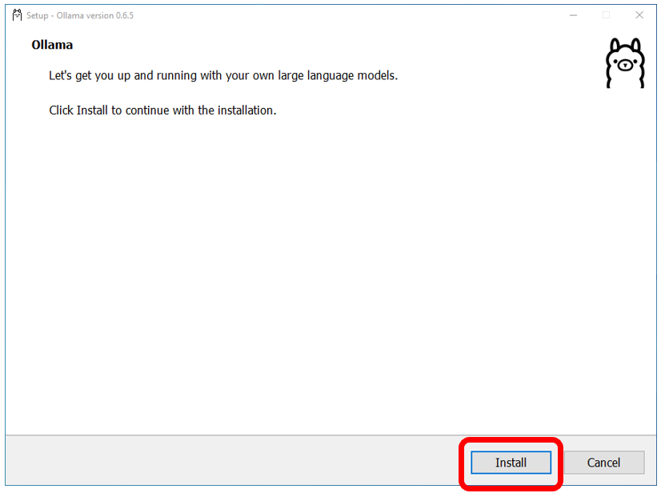

After installation, you'll see the Ollama icon appear in your taskbar.

Return to your desktop, right-click on "This PC" (or "My Computer"), and select "Properties" from the context menu.

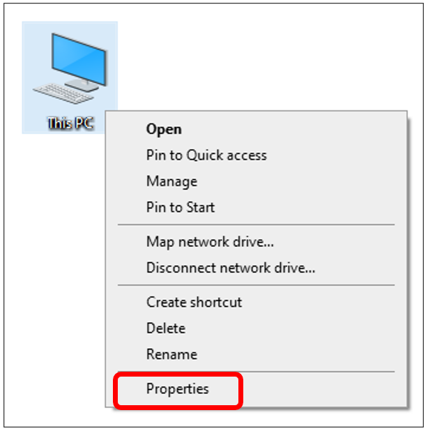

In the newly opened window, locate and click on "Advanced system settings".

.. image:: ../_static/imgs/Local_Server/Local04.png
    :align: center

In the newly opened window, click “Environment Variables”.

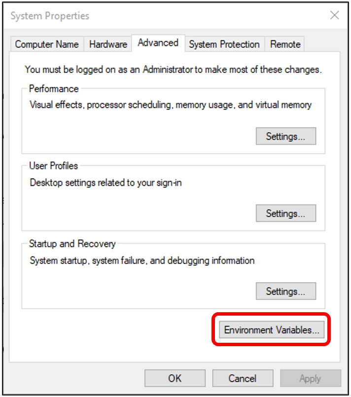

Click “New”.

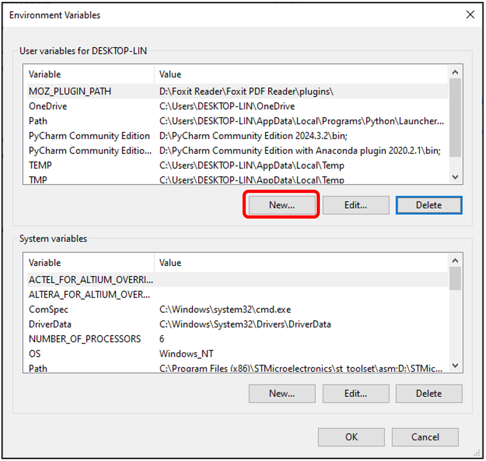

In the Variable name field, enter: OLLAMA_HOST; In the Variable value field, enter: 0.0.0.0:11434; Click OK to save.

By doing so, all devices on your local network to access Ollama via your computer's IP address.

Without this setting, Ollama would only be accessible locally (from the host computer itself).

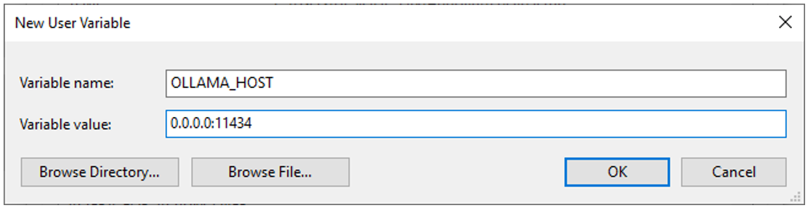

Mac OS
------------------------------

Before getting started, we need to install the Ollama tool locally, which allows us to run any open-source AI model on our computer.

If you haven't installed Ollama yet, please visit https://ollama.com/download to download and install it.

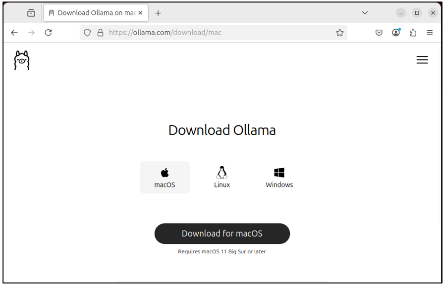

Find “Ollama.app” under “Downloads” and double click to open it.

.. image:: ../_static/imgs/Local_Server/Local09.png
    :align: center

Click “Next” -> “Install” -> “Finish”.

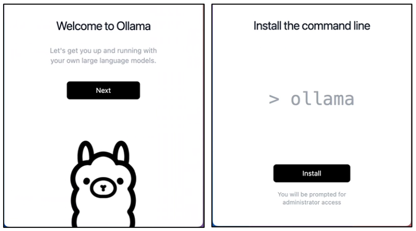

The interface will close automatically upon completion.

Open your terminal and check if Ollama is properly installed using the specified command.

.. code-block:: console
    
    ollama --version

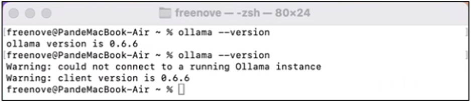

Note: Ollama is located in your Applications folder. 

As shown in the image above:

If Ollama is already running, executing ollama --version will display its version number.

If Ollama isn't running, the same command will return a connection error ("could not to connect to a running Ollama instance")

Linux 
------------------------------------

Before getting started, we need to install the Ollama tool locally, which allows us to run any open-source AI model on our computer.

If you haven't installed Ollama yet, please visit https://ollama.com/download to download and install it.

Open the Terminal and run the following command to install Ollama.

.. image:: ../_static/imgs/Local_Server/Local12.png
    :align: center

The installation should appear as shown in the image above. You can verify Ollama's installation by running the command: **ollama --version**

.. image:: ../_static/imgs/Local_Server/Local13.png
    :align: center

LLM Model
===============================================================

Please visit https://ollama.com/search and select the LLM model that suits your computer or your favorite.

.. image:: ../_static/imgs/Local_Server/Local14.png
    :align: center

Here we take qwen2.5 as an example. Click “qwen2.5” model.

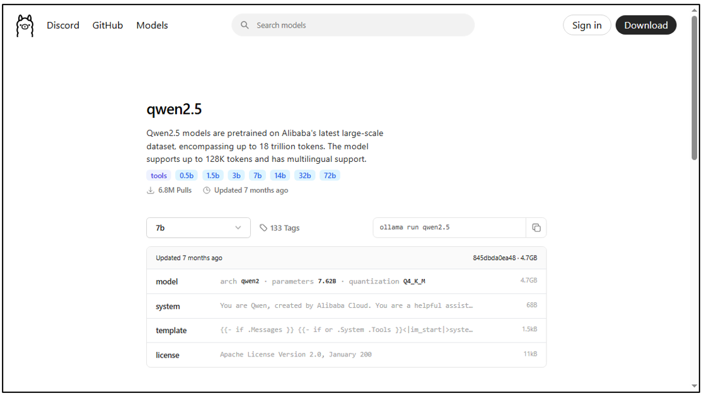

Please note that when selecting a model, you need to choose the appropriate model based on your computer's GPU memory or CPU RAM configuration.  

1. Larger models offer higher intelligence, while smaller models provide lower intelligence.

2. For high-end systems (strong GPU/CPU with ample memory), choose larger models for optimal performance; for low-end systems (limited GPU/CPU memory), opt for smaller models to ensure smooth operation.

3. Selecting an oversized model on a weak system may cause failure to load or extremely slow inference speeds.

You can select the appropriate model parameters via the dropdown menu.

.. image:: ../_static/imgs/Local_Server/Local16.png
    :align: center

Smaller models are less capable but faster. For this demonstration, we'll use qwen2.5:0.5b as an example. 

Copy the command from the webpage:

.. code-block:: console
    
    ollama run qwen2.5:0.5b

.. image:: ../_static/imgs/Local_Server/Local17.png
    :align: center

Next, install your preferred LLM model by selecting the version compatible with your operating system.

Windows
------------------------

Use the shortcut "Win+R", enter "CMD" in the pop-up window, and open the CMD interface.

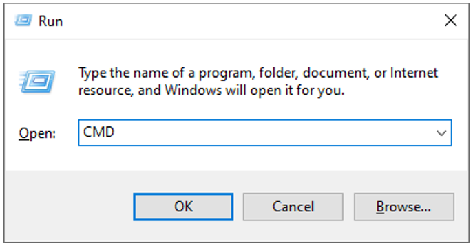

Run the command **“ollama --version”** to see if ollama has been installed.

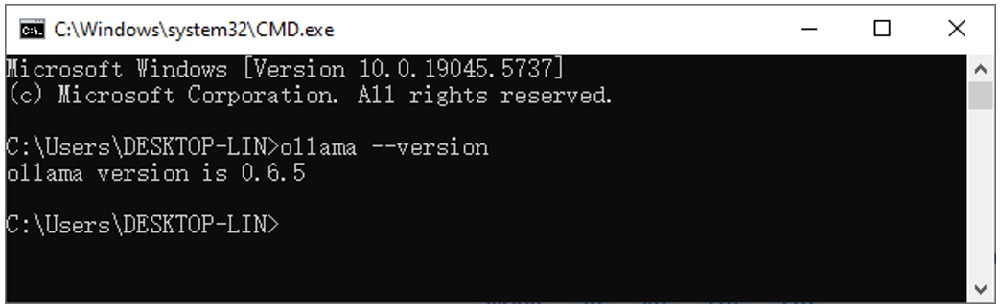

Enter **“ollama run qwen2.5:0.5b”** to download the model to the local.machine.

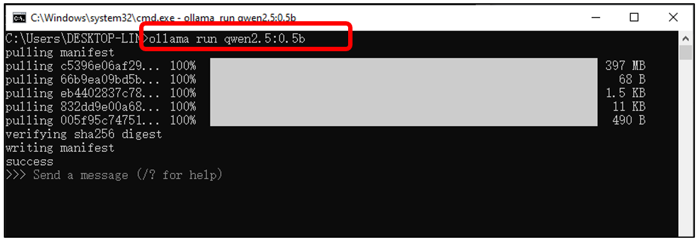

After installation is complete, you can directly chat with Qwen2.5-0.5B in the CMD interface.

.. image:: ../_static/imgs/Local_Server/Local21.png
    :align: center

You can press Ctrl+D to exit chat mode.

You can start the Ollama server by running the command **“ollama serve”**

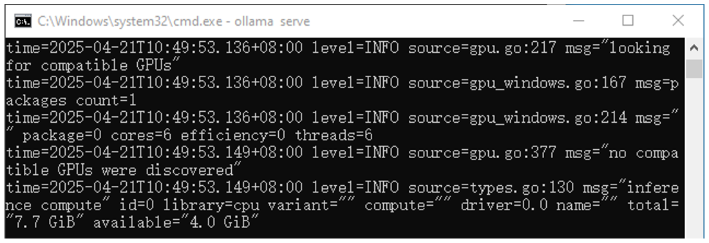

.. note::
    
    If Ollama is already running (indicated by its icon in the system taskbar), executing ollama serve will cause an error. Both methods launch the same service.

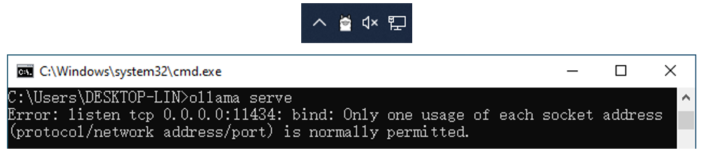

Mac OS
-----------------------------------

Run the command **“ollama --version”** on the Terminal to check whether Ollama has been installed.

.. image:: ../_static/imgs/Local_Server/Local24.png
    :align: center

If you see the prompt “Warning: could not connect to a running Ollama instance”, it indicates that Ollama has not been run. Go to Applications to run it.

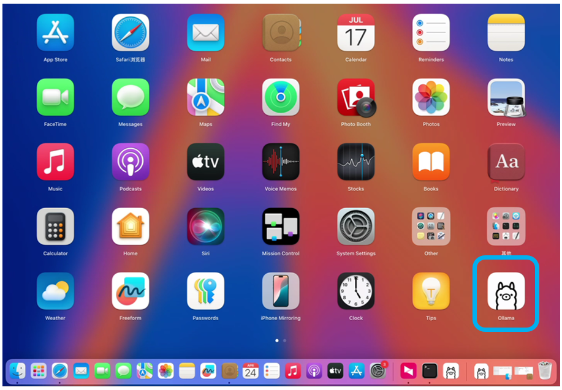

Check whether it is running again on the Terminal.

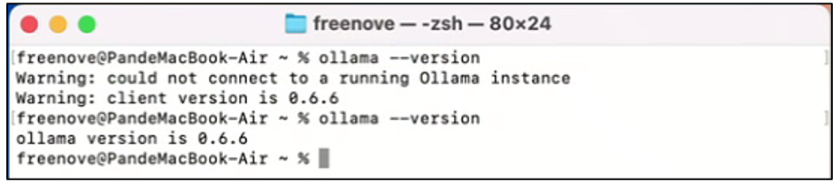

On the Terminal, run **“ollama run qwen2.5:0.5b”** to install the model to your computer.

.. image:: ../_static/imgs/Local_Server/Local27.png
    :align: center

After installation is complete, you can directly chat with Qwen2.5-0.5B in the Terminal interface.

.. image:: ../_static/imgs/Local_Server/Local28.png
    :align: center

You may exit by pressing “Ctrl+D”.

You can start the Ollama Server by running the command **“ollama serve”**.

.. image:: ../_static/imgs/Local_Server/Local29.png
    :align: center

If Ollama has been running, you will see the following message.

.. image:: ../_static/imgs/Local_Server/Local30.png
    :align: center

:combo:`red font-bolder:To access Ollama's user guide, run command Ollama.`

Linux
-----------------------------------

Run the command “ollama --version” on the Terminal to check whether Ollama has been installed.

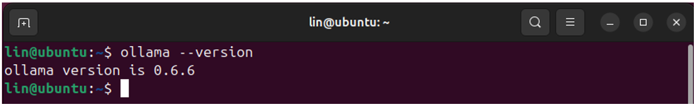

Run the command **“ollama run qwen2.5:0.5b”** to download the model to your computer.

.. image:: ../_static/imgs/Local_Server/Local32.png
    :align: center

After installation is complete, you can directly chat with Qwen2.5-0.5B in the Terminal interface

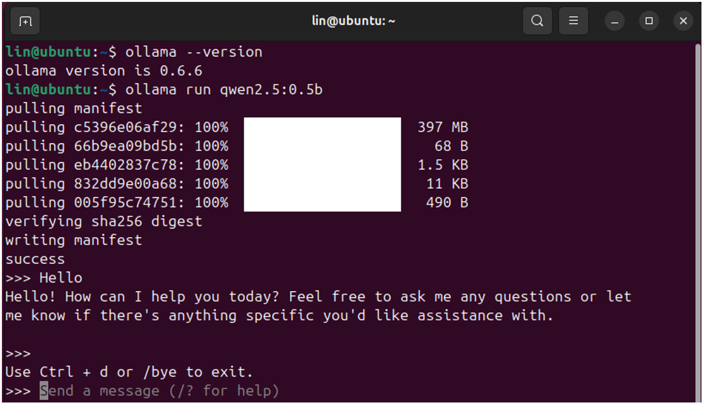

To exit it, press “Ctrl+D”.

:combo:`red font-bolder:To access Ollama's user guide, run command Ollama.`

.. image:: ../_static/imgs/Local_Server/Local34.png
    :align: center

Installing Conda
===============================================================

The xiaozhi-esp32-server open-source project offers four installation methods. In this tutorial, we'll demonstrate the simplest configuration example. For other usage methods, please refer to the project's website for further exploration.

Windows
---------------------------------

This example uses Conda for dependency management. Therefore, you'll need to have Conda installed on your system beforehand. If you haven't installed Conda yet, you can download and install it from: https://www.anaconda.com/download/success

Select the appropriate installer for your operating system.

Miniconda is an installer by Anaconda that comes preconfigured for use with the Anaconda Repository.

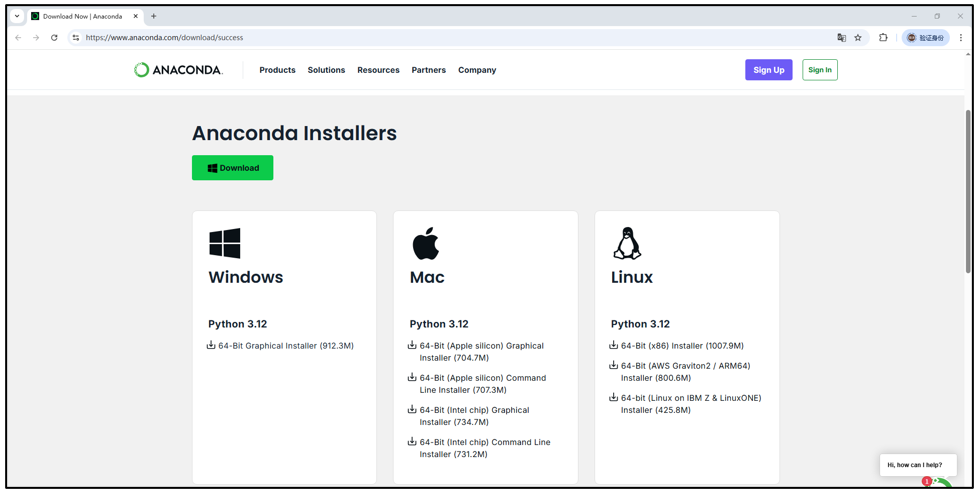

Here, we'll use Windows as an example. Double-click the downloaded Conda installer and click Next.

.. image:: ../_static/imgs/Local_Server/Local36.png
    :align: center

Click “I Agree”.

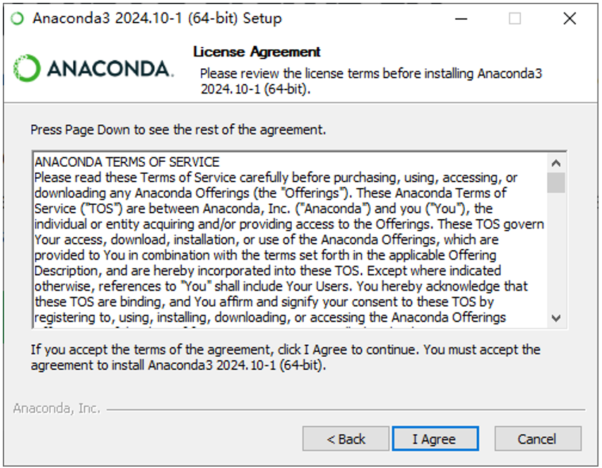

Select the installation type based on your needs. Typically, choose "All Users" for system-wide installation.

.. image:: ../_static/imgs/Local_Server/Local38.png
    :align: center

Specify the installation location for the software,

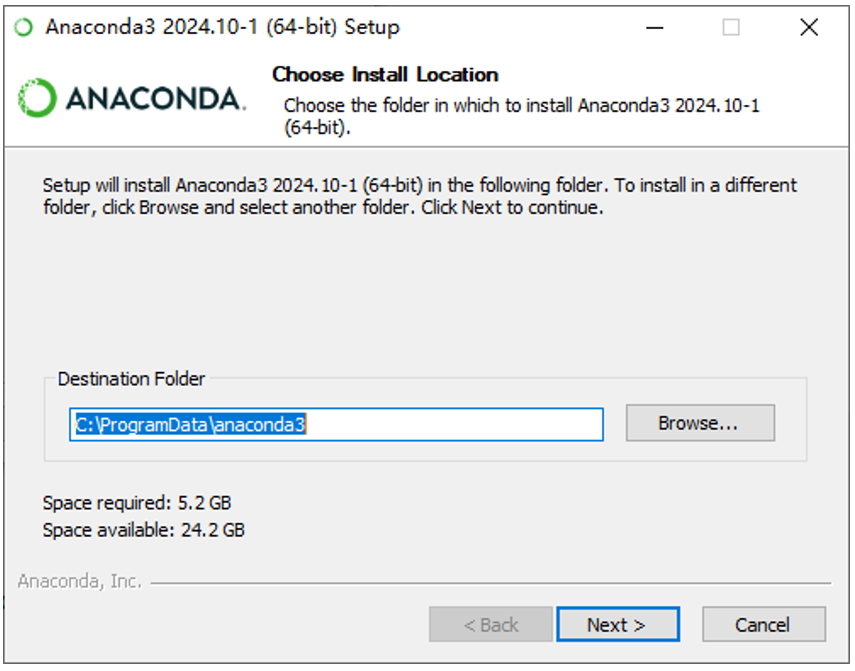

Keep the following configuration as default and click Install.

.. image:: ../_static/imgs/Local_Server/Local40.png
    :align: center

Wait for the installation to finish, which may take a while.

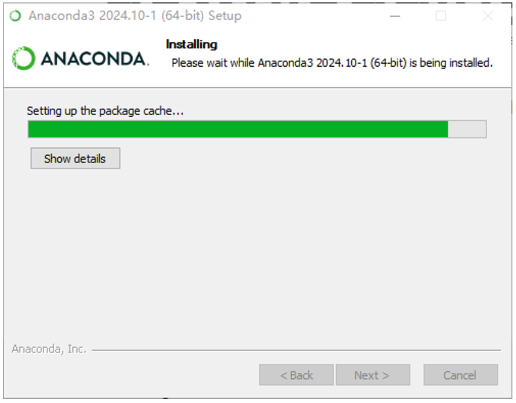

So far, the software has been installed.

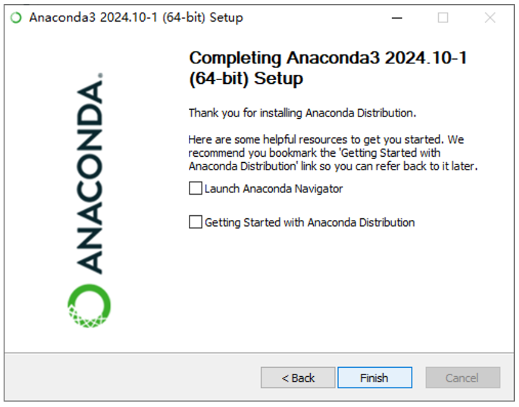

Use the shortcut "Win+R", enter "CMD" in the pop-up window, and open the CMD interface.

.. image:: ../_static/imgs/Local_Server/Local43.png
    :align: center

Enter **conda --version** and press Enter. If Anaconda3 is installed correctly, you should see version information like this:

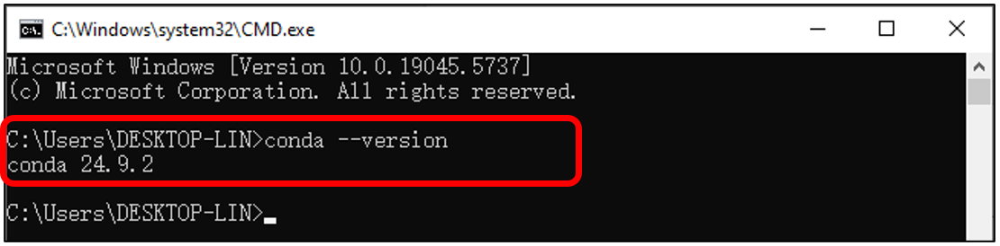

Mac OS
-----------------------------------

This example uses Conda for dependency management. Therefore, you'll need to have Conda installed on your system beforehand. If you haven’t installed Conda yet, you can download and install it from: https://www.anaconda.com/download/success 

Select the appropriate installer for your operating system.

Miniconda is an installer by Anaconda that comes preconfigured for use with the Anaconda Repository.

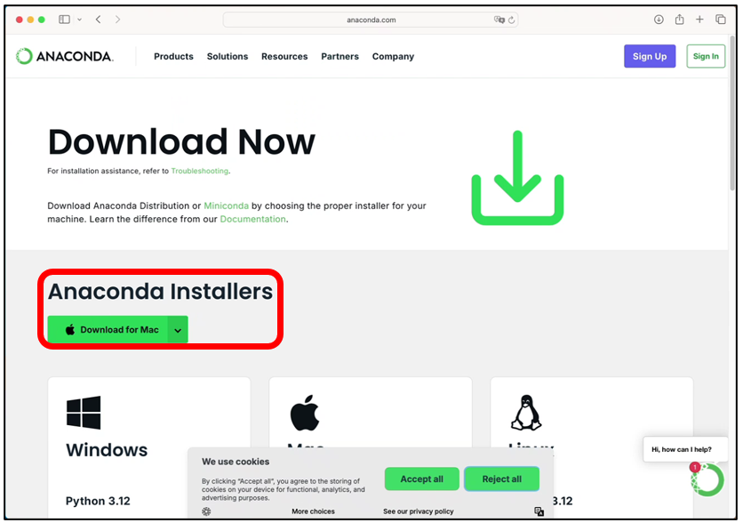

Double click to open the Conda application and click Continue.

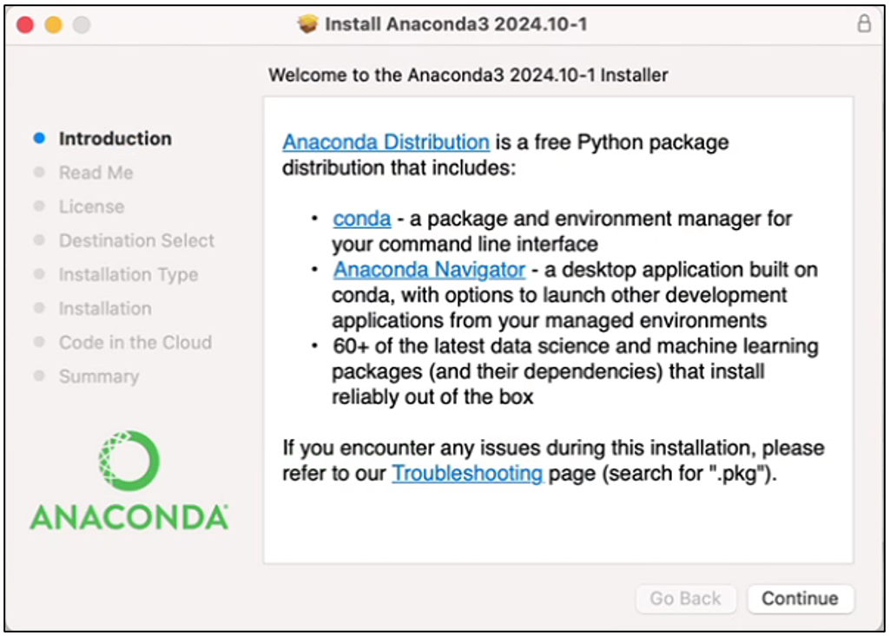

Click Continue.

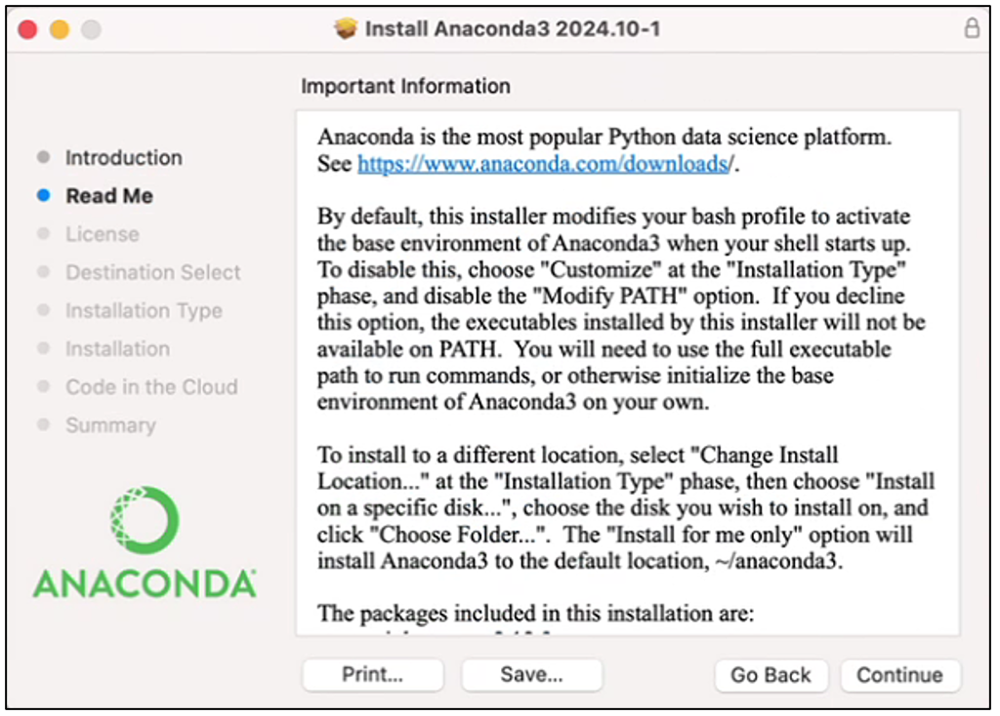

Click Continue.

.. image:: ../_static/imgs/Local_Server/Local48.png
    :align: center

Click Agree.

.. image:: ../_static/imgs/Local_Server/Local49.png
    :align: center

Click "Continue" to proceed with default settings.

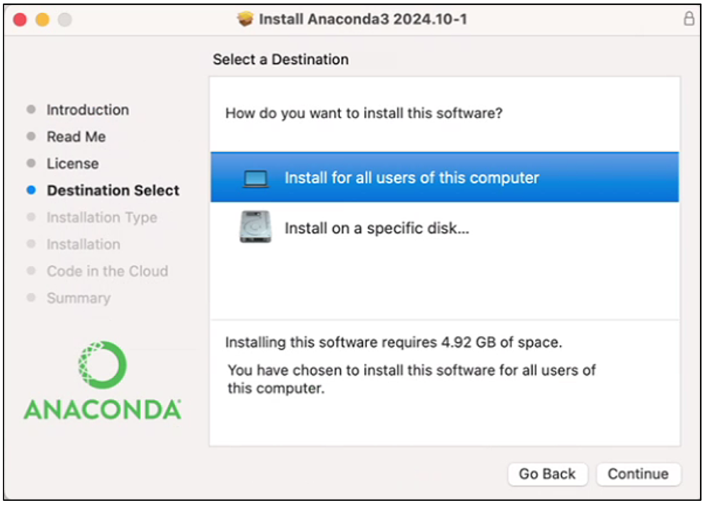

Click Install.

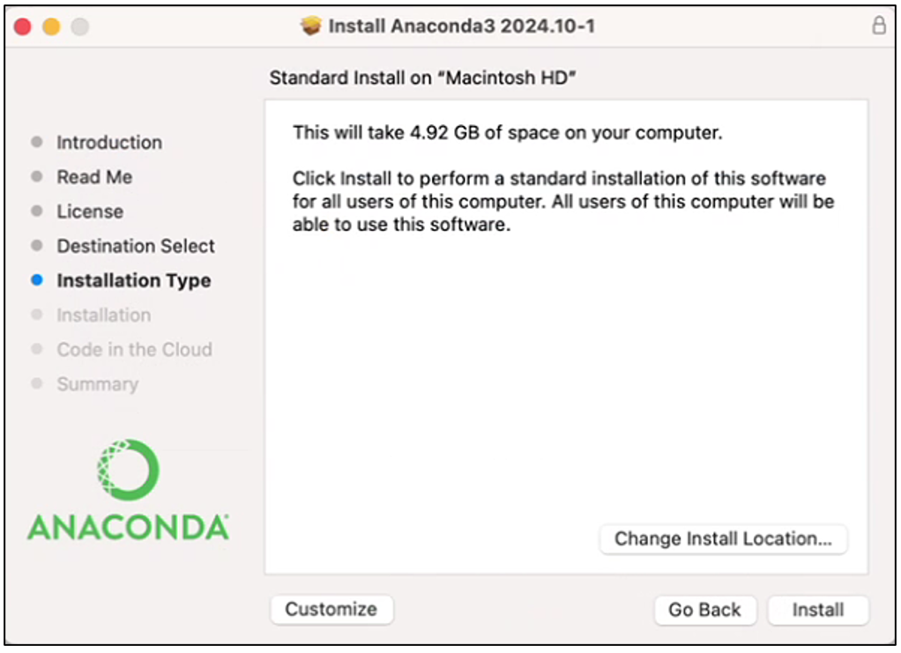

Wait for minutes for the installation to complete.

.. image:: ../_static/imgs/Local_Server/Local52.png
    :align: center

Click Continue.

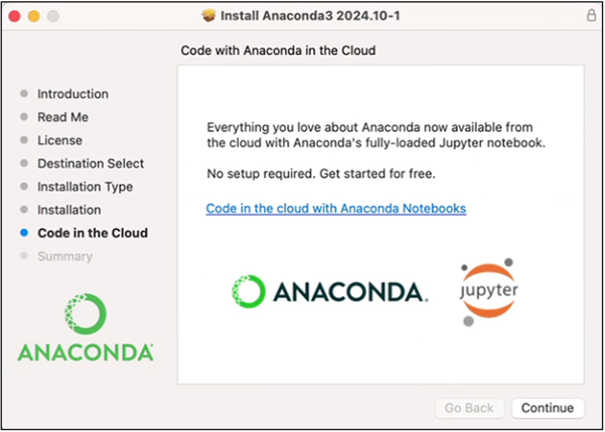

Click Close.

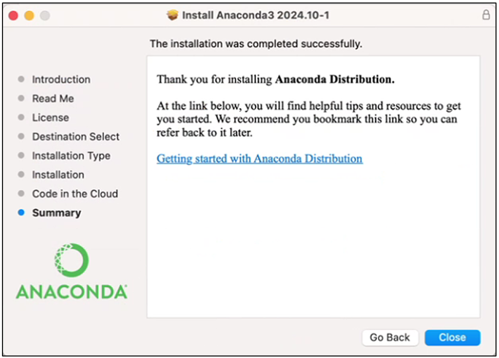

You have now successfully installed Conda. The application will be available in your programs/applications lists.

.. image:: ../_static/imgs/Local_Server/Local55.png
    :align: center

Double-click to run it. This step will not produce any visible response.

Then reopen the terminal. You will notice the "(base)" prompt appearing.

You can also check the conda version by running the command conda --version.

.. image:: ../_static/imgs/Local_Server/Local56.png
    :align: center

You can use conda -h to view more usage instructions. 

.. image:: ../_static/imgs/Local_Server/Local57.png
    :align: center

If you are using conda for the first time, you need to run the command conda init to initialize and activate the installed conda environment.

.. code-block:: console
    
    conda init

You can use conda activate to enable a virtual environment, or conda deactivate to exit it.

.. code-block:: console
    
    conda activate
    conda deactivate

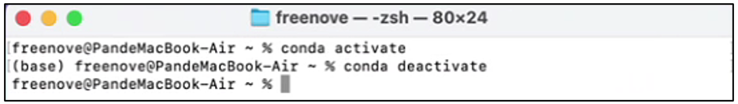

To automatically activate the conda environment upon terminal launch, use: **conda config --set auto_activate_base true**

To disable this auto-activation, use: **conda config --set auto_activate_base false**

.. code-block:: console
    
    conda config --set auto_activate_base false
    conda config --set auto_activate_base true

Linux
-----------------------------------

This example uses Conda for dependency management. Therefore, you'll need to have Conda installed on your system beforehand. If you haven’t installed Conda yet, you can download and install it from: https://www.anaconda.com/download/success 

Select the appropriate installer for your operating system.

Miniconda is an installer by Anaconda that comes preconfigured for use with the Anaconda Repository.

.. image:: ../_static/imgs/Local_Server/Local59.png
    :align: center

The downloaded file here is named "Anaconda3-2024.10-1-Linux-x86_64.sh". Note that the filename may vary across different computers.

To install Anaconda, open a terminal and execute the following command:

.. code-block:: console
    
    sh Anaconda3-2024.10-1-Linux-x86_64.sh

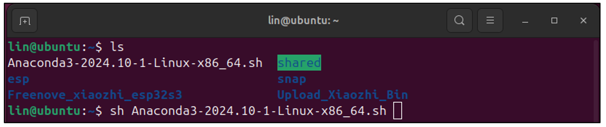

Keep pressing the Enter key and release it until you see the prompt as shown below. Type “Yes”.

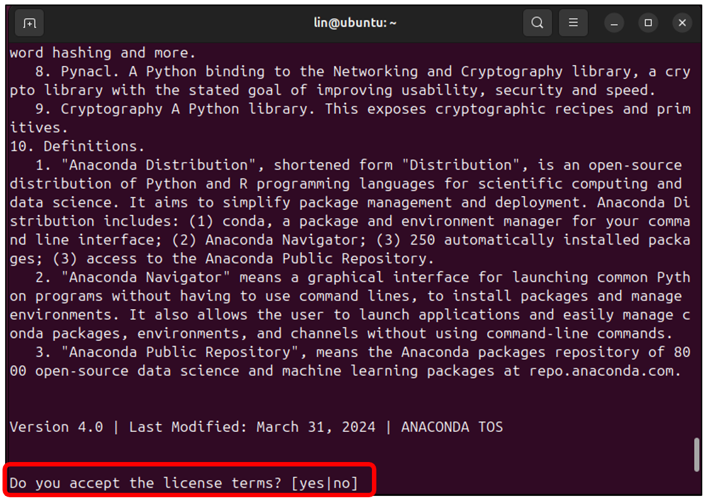

Select where to install the application and press Enter. You may use the default location.

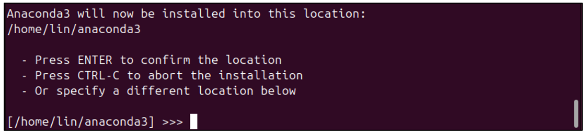

The installation requires an internet connection. Please ensure you have a stable network connection and wait patiently for a few minutes until the following prompt appears on your screen.

.. note::
    
    You will need to type Yes to proceed.

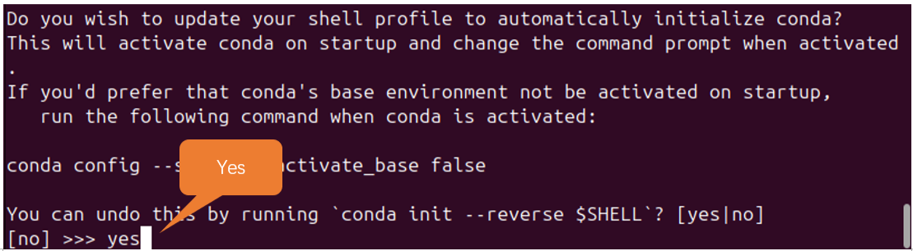

The appearance of the following prompt indicates that conda has been successfully installed.

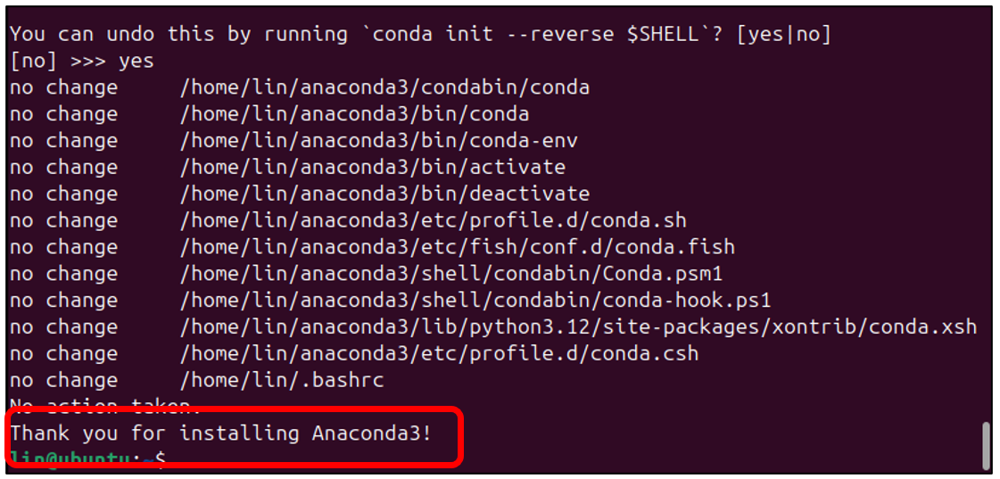

To automatically activate the conda environment upon terminal launch, use: conda config --set auto_activate_base true

To disable this auto-activation, use: **conda config --set auto_activate_base false**

.. code-block:: console
    
    conda config --set auto_activate_base false
    conda config --set auto_activate_base true

We do not recommend auto-activation. Therefore, run “conda config --set auto_activate_base false”

.. image:: ../_static/imgs/Local_Server/Local65.png
    :align: center

Reopen the Terminal, run the command conda --version to check the conda version.

.. code-block:: console
    
    conda --version

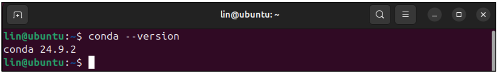

The following two commands allow you to activate or exit the conda virtual environment.

.. code-block:: console
    
    conda activate
    conda deactivate

.. image:: ../_static/imgs/Local_Server/Local67.png
    :align: center

If you see the following error when checking the conda version,

.. code-block:: console
    
    conda -version

.. image:: ../_static/imgs/Local_Server/Local68.png
    :align: center

it indicates that while Conda is installed, it hasn't been added to your PATH environment variable.

Please follow these steps to add Conda to your PATH:

Edit the **".bashrc"** file using nano:

.. code-block:: console
    
    cd ~
    sudo nano ./.bashrc

.. image:: ../_static/imgs/Local_Server/Local69.png
    :align: center

Add the following contents to the end of the file.

.. code-block:: console
    
    export PATH=”$HOME/anaconda3/bin:$PATH”

.. image:: ../_static/imgs/Local_Server/Local70.png
    :align: center

Press “Ctrl+O” to save the file and “Ctrl+X” to exit editing.

Run the source command to have it take effect, and check the conda version again.

.. code-block:: console
    
    source ./.bashrc
    conda --version

.. image:: ../_static/imgs/Local_Server/Local71.png
    :align: center

Deploying Virtual Environment
===============================================================

**Please note that the commands for deploying virtual environments are universal across Windows, Mac, and Ubuntu systems. The examples shown here use Windows, but the same operations apply to other platforms.**

Open the CMD/Terminal interface, run the following command to create a virtual environment named "xiaozhi-esp32-server" with Python 3.10 pre-installed.

.. code-block:: console

    conda create -n xiaozhi-esp32-server python=3.10 -y

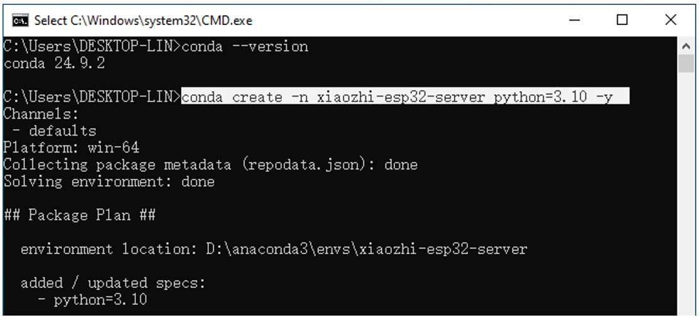

When you see the following messages, it indicates that the virtual environment has been created.

.. image:: ../_static/imgs/Local_Server/Local73.png
    :align: center

To delete the virtual environment, run the following command:

.. code-block:: console

    conda remove -n xiaozhi-esp32-server --all -y

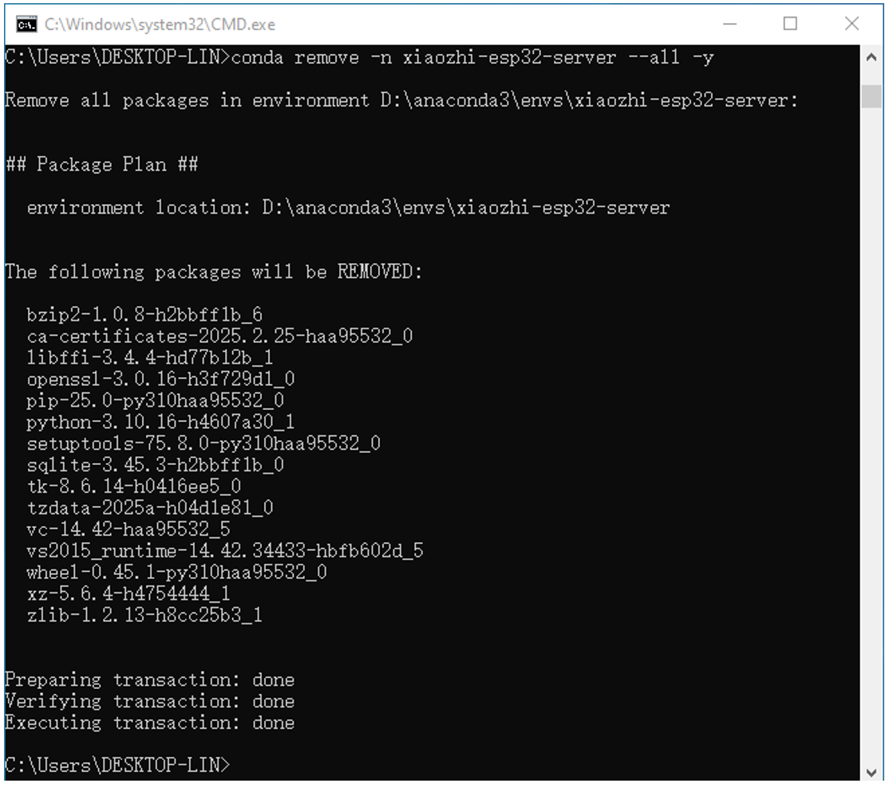

You can also use the following two commands to activate or exit the virtual environment.

.. code-block:: console

    conda activate xiaozhi-esp32-server
    conda deactivate

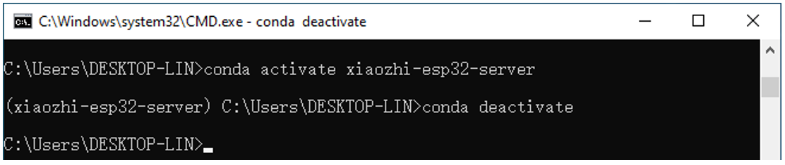

:combo:`red font-bolder:Important Note:`

:combo:`red font-bolder:If you receive a prompt suggesting to run conda init when activating your environment, execute “conda init” and restart your terminal for changes to take effect`

Deploying xiaozhi-esp32-server
===============================================================

If you're a Windows user, open the Command Prompt (CMD). 

For macOS or Ubuntu users, launch the Terminal instead.

The tutorial primarily uses Windows screenshots for demonstration. Where differences exist, we’ll provide corresponding examples from other operating systems.

Activate the virtual environment.

.. code-block:: console

    conda activate xiaozhi-esp32-server

.. image:: ../_static/imgs/Local_Server/Local76.png
    :align: center

Install libopus under the virtual environment.

.. code-block:: console

    conda install libopus -y

.. image:: ../_static/imgs/Local_Server/Local77.png
    :align: center

Install ffmpeg under the virtual environment.

.. code-block:: console

    conda install ffmpeg -y

.. image:: ../_static/imgs/Local_Server/Local78.png
    :align: center

Install git under the virtual environment.

.. code-block:: console

    conda install git -y

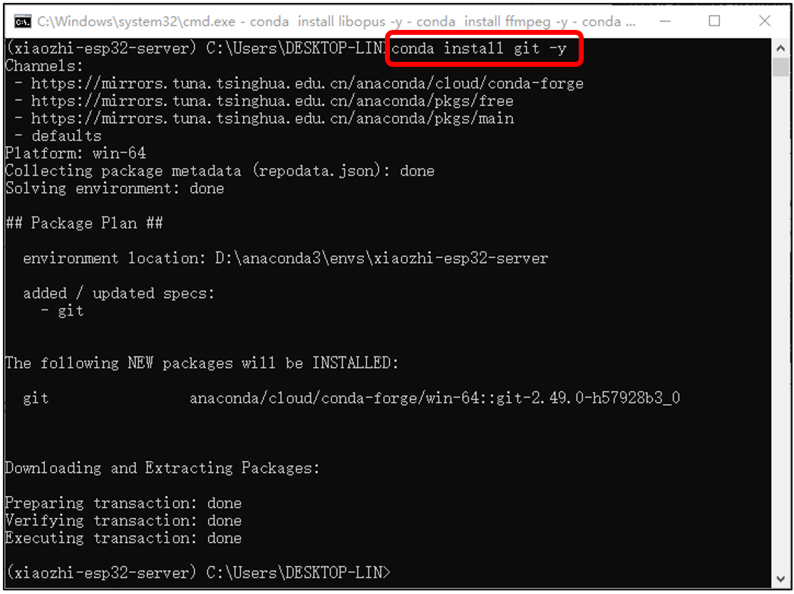

Use the git clone command to download the source code of the server.

.. code-block:: console

    git clone https://github.com/Freenove/xiaozhi-esp32-server.git

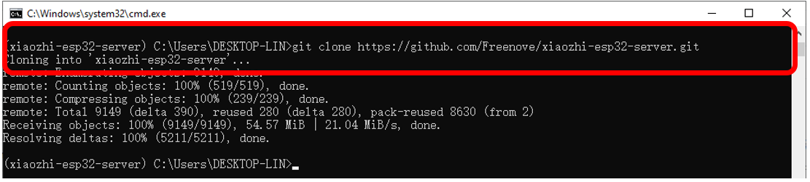

Navigate to the server's source code directory.

Windows users: Use backslashes (\) in paths

.. code-block:: console

    cd xiaozhi-esp32-server\main\xiaozhi-server

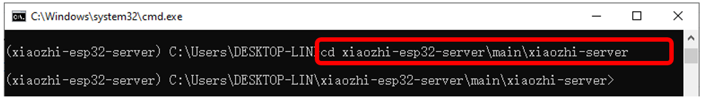

Mac or Linux users: Use forward slashes (/) in paths

.. code-block:: console

    cd xiaozhi-esp32-server/main/xiaozhi-server

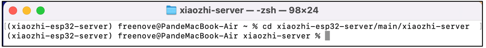

Install the required libraries for the server source code.

This process may take some time — ensure you have a stable internet connection and do not interrupt the installation.

.. code-block:: console

    pip config set global.index-url https://mirrors.aliyun.com/pypi/simple/
    pip install -r requirements.txt

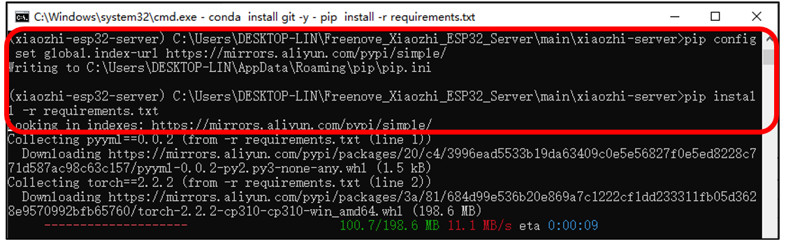

The installation is complete when the output matches the following screenshot.

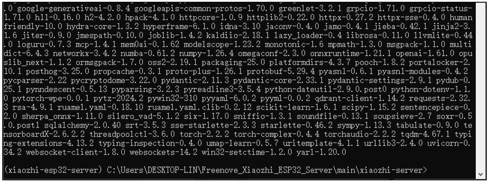

Install the voice model.

.. code-block:: console

    git clone https://www.modelscope.cn/iic/SenseVoiceSmall.git

.. image:: ../_static/imgs/Local_Server/Local85.png
    :align: center

Use the copy command to copy the model.pt file from SenseVoiceSmall to the models/SenseVoiceSmall folder.

If you are a Windows user, use the copy command.

.. code-block:: console

    copy .\SenseVoiceSmall\model.pt .\models\SenseVoiceSmall\

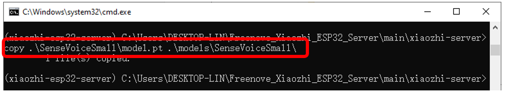

If you are a Mac or Linux user, use the cp command.

.. code-block:: console

    cp ./SenseVoiceSmall/model.pt ./models/SenseVoiceSmall/

.. image:: ../_static/imgs/Local_Server/Local87.png
    :align: center

Entering the command "mkdir data && copy config.yaml data.config.yaml" in the CMD interface, it will create a folder named "data" in the xiaozhi-server and copy the "config.yaml" file from the current directory into the "data" folder, renaming it as ".config.yaml".

If you are a Windows user, please execute:

.. code-block:: console
    
    mkdir data && copy config.yaml data\.config.yaml

.. image:: ../_static/imgs/Local_Server/Local88.png
    :align: center

If you are a MAC/Linux user, run the following one:

.. code-block:: console
    
    mkdir data && cp config.yaml data/.config.yaml

.. image:: ../_static/imgs/Local_Server/Local89.png
    :align: center

Open and modify the config.yaml.

On Windows, run:

.. code-block:: console
    
    code .\data\.config.yaml

On Mac/Linunx. Run:

.. code-block:: console
    
    code ./data/.config.yaml

:combo:`red font-bolder:Note: If your VSCode is not properly installed, running the command may result in an error. You can also manually open this file using VSCode.`

Find **"selected_module:"** , change **"LLM: ChatGLMLLM"** to **"LLM: OllamaLLM"**

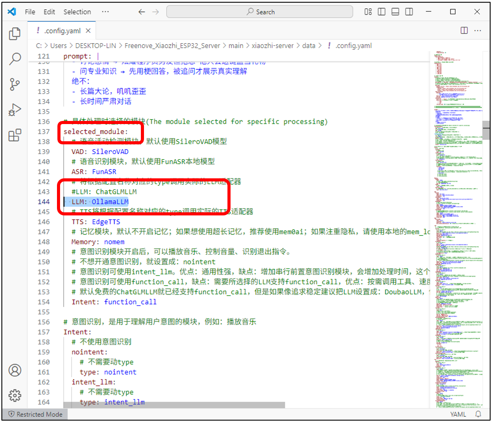

Find **“OllamaLLM:”** under **“LLM:”**, change **“model_name: qwen2.5”** to **“model_name: qwen2.5:0.5b”**. 

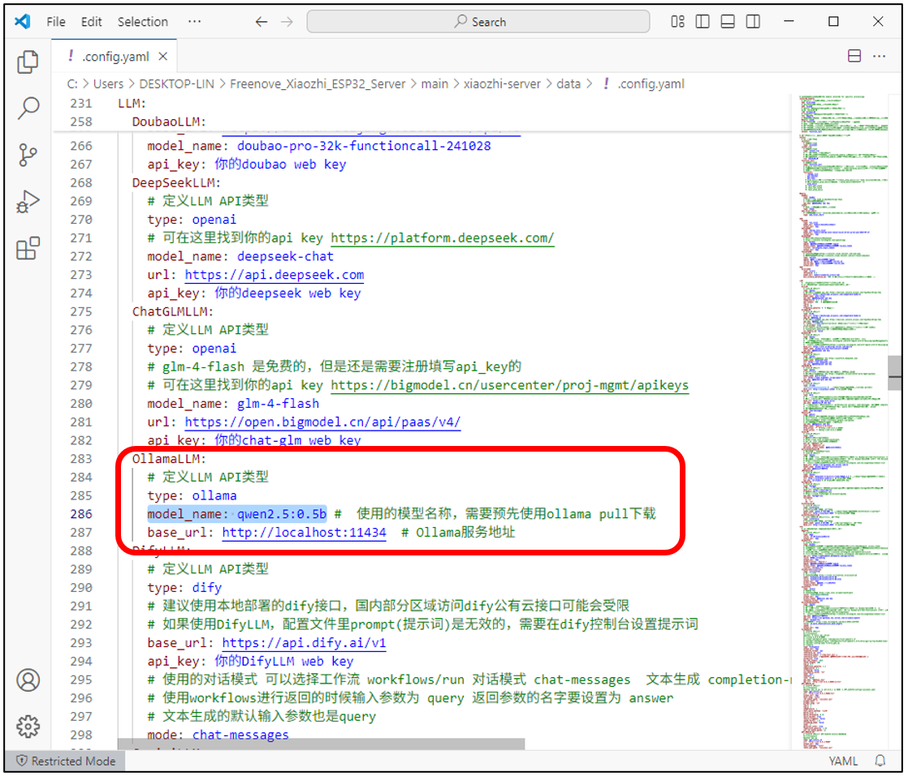

:combo:`red font-bolder:Important Note: To ensure smooth usage of XiaoZhi AI's visual recognition feature, please follow the steps below to configure the Visual Recognition Large Model (VLLM). If you do not require this feature at the moment, you may skip this step and proceed with the next steps.`

Continue editing the config.yaml file: First, follow the prompted steps to register for the corresponding API key.Then, insert the generated API key into the code.

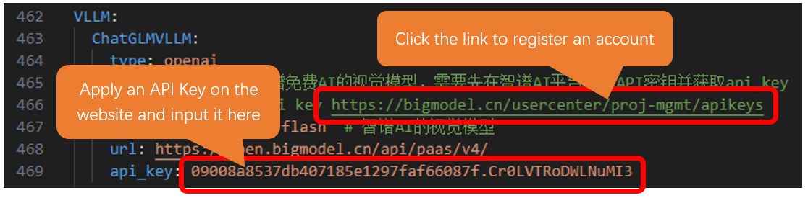

Save and exit the file.

You can also choose other models, such as the default ChatGLM-LLM. Please note that configuring different LLM models requires you to explore and set them up manually.

Run the xiaozhi-esp32-server code.

.. code-block:: console
    
    python app.py

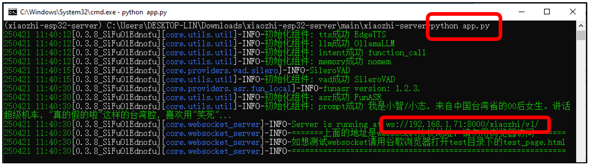

.. note::
    
    The server will now show an access port—remember it, as you'll need it later in the tutorial.

.. image:: ../_static/imgs/Local_Server/Local94.png
    :align: center

At this point, you can use a browser to open the HTML file located in xiaozhi-esp32-server\\main\\xiaozhi-server\\test.

The testing steps are as follows.

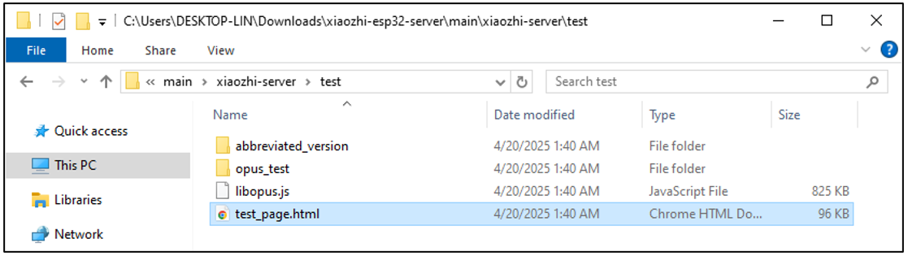

Click “Connect”.

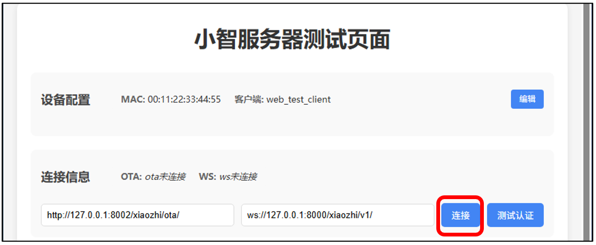

Test xiaozhi-esp32-server by typing any message and clicking "Send”.

.. image:: ../_static/imgs/Local_Server/Local97.png
    :align: center

If the server is running properly, you can start chatting with it.

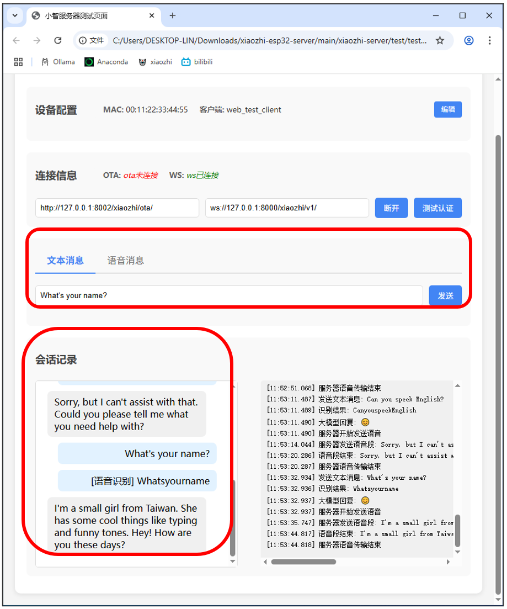

Important: Both xiaozhi-esp32-server and Ollama must be running simultaneously. If Ollama is not active, you'll see an error message like the example below.

.. image:: ../_static/imgs/Local_Server/Local99.png
    :align: center

You can refer to :ref:`LLM Model <fnk0104/codes/xiaozhi/local_server:llm model>` to run Ollama.

Visiting xiaozhi-esp-server via ESP32S3
*********************************************

Please note that in the previous code, we explained the configuration of the XiaoZhi AI code. In this chapter, we need to modify the project configuration to enable the ESP32S3 to access the local server of xiaozhi-esp32-server.

Open Visual Studio Code and select the previous xiaozhi-esp32 project. Click on the SDK Configuration Editor (menuconfig).

.. image:: ../_static/imgs/Local_Server/Local100.png
    :align: center

Set the Connection Type to “Websocket”, and type in the access port that the xiaozhi-esp32-server previously printed to connect.

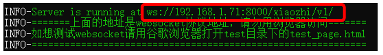

Click save and compile the code again, as shown below.

.. image:: ../_static/imgs/Local_Server/Local102.png
    :align: center

Click “Build Project” at the bottom of the interface to compile to code.

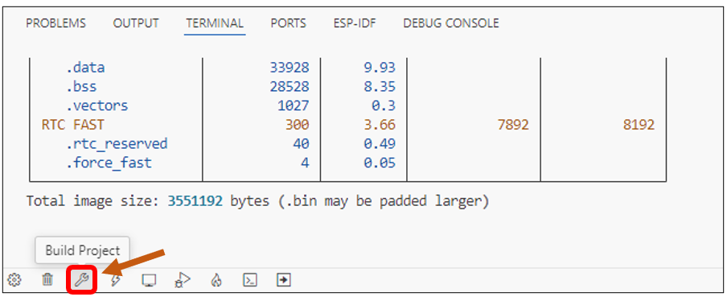

Click “Flash Device” at the bottom to upload the code to the ESP32S3.

.. image:: ../_static/imgs/Local_Server/Local104.png
    :align: center

Congratulations! You have now completed the setup for XiaoZhi AI. Simply say "Hi, ESP" into the microphone to start chatting with your local server.

.. note::

    The local server requires high-performance hardware. If your PC isn't very powerful, try using LLM APIs from big tech firms, as they are less demanding on your system.