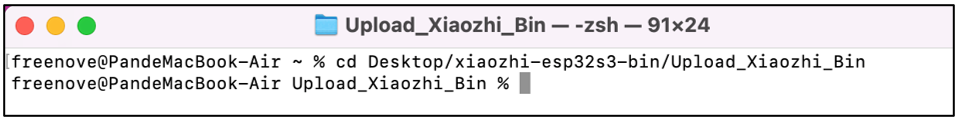
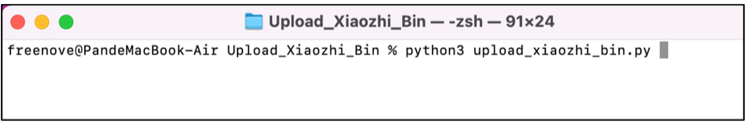
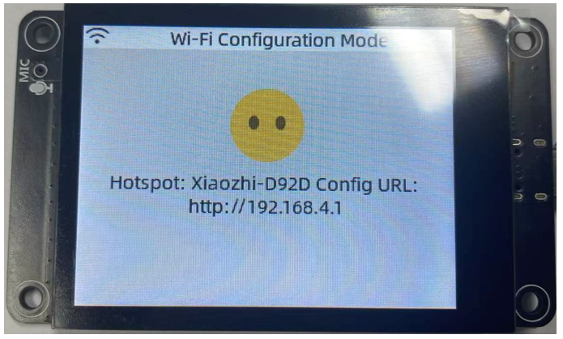
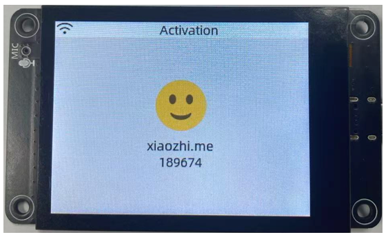

##############################################################################
基于小智AI的语音助手
##############################################################################

该项目采用Freenove ESP32 S3显示屏实现AI语音助手功能，需具备一定的编程功底，并熟悉ESP-IDF开发框架及开源大模型技术。

关于本项目
*********************************

该语音助手项目（https://github.com/Freenove/xiaozhi-esp32）衍生自开源项目（https://github.com/78/xiaozhi-esp32），可在嵌入式设备上调用主流大语言模型（LLM），通过语音活动检测（VAD）、自动语音识别（ASR）、语音转文本（STT）、文本转语音（TTS）、记忆存储及意图识别等多模块服务实现语音对话功能。Freenove公司已将其适配至Media Kit产品，本文将阐述如何在Media Kit上运行该项目。

1、在线模式：连接至小智（xiaozhi.me）服务器，目前面向个人用户免费开放体验。

2、离线模式：需在本地计算机部署全部服务模块（包括VAD语音活动检测、ASR自动语音识别、STT语音转文本、TTS文本转语音、记忆存储、意图识别等）。实际体验完全取决于所选模型性能及本地机器配置。其本地服务器项目（https://github.com/Freenove/xiaozhi-esp32-server）衍生自开源项目（https://github.com/xinnan-tech/xiaozhi-esp32-server）。

模式选择建议：

1、普通用户：推荐使用在线版本，可获得稳定AI助手服务

2、开发者用户：可尝试部署离线版本以深入理解AI助手的技术实现架构。但需注意，个人电脑可能难以同时运行所有服务（尤其是核心大语言模型LLM服务），可能导致体验不佳，因此该模式主要适用于学习研究场景。

注意事项
*********************************

* 项目版权声明

  - 语音助手项目：原开发者"Xiage"，Freenove公司为适配Media Kit进行分支修改，基于MIT开源协议发布。

  - 本地服务器项目：原开发者"xinnan-tech"，Freenove公司同样为Media Kit集成进行分支改造，采用MIT开源协议。

* 支持国家/地区

  - 在线版本：服务可用性取决于小智(xiaozhi.me)服务器覆盖范围，部分区域可能不可用。当前支持地区详见：https://xiaozhi.me/login?redirect=/console/agents

注：用户体验与服务器连接质量直接相关，若至小智服务器的网络状况不佳可能导致性能下降

  - 离线版本：无地域限制，可在全球所有国家/地区部署

* 支持语言

  - 在线版本：当前支持普通话、粤语、英语、日语、韩语等。若您不使用这些语言，可能无法与小智AI有效交互。

  - 离线版本：取决于所部署的ASR模型。默认FunASR模型仅支持普通话、粤语、英语、日语及韩语。

* 费用说明

  - 在线版本：当前小智(xiaozhi.me)提供免费服务，但我们无法保证该在线服务器将永久免费。

  - 离线版本：前述子服务中部分为付费项目，部分为免费项目——实际成本取决于您的选择。

* 获取帮助

  - 若遵循教程后仍存在问题，请联系：support@freenove.com

  - 重要提示：由于在线服务由小智(xiaozhi.me)提供，若其停止服务，我们将同步移除相关文档、教程及代码。

免责声明
**********************************

- 本实现基于开源项目（https://github.com/78/xiaozhi-esp32）进行适配开发，仅供第三方学习及AI功能测试用途，不提供商业应用支持与推广。本教程仅面向技术爱好者个人学习开发使用。

注意事项：

1、由于本项目为第三方开源项目，若学习过程中遇到问题，请提交至原项目issue跟踪系统：https://github.com/78/xiaozhi-esp32/issues。

2、当前小智AI语音识别仅支持：普通话、粤语、英语、韩语、日语，其他语言暂不支持。

3、小智服务器界面目前仅支持英文、中文、日文显示，手机号注册仅限以下国家/地区用户（详见下表），其他地区用户暂无法注册

本项目通过WebSocket协议实现ESP32-S3与小智AI服务器的数据通信。

Freenove ESP32 S3 Display
**********************************

.. table::
    :align: center
    :class: table-line

    +-------------+-------------+
    | Top         | Bottom      |
    |             |             |
    | |Preface00| | |Preface01| |
    +-------------+-------------+

.. |Preface00| image:: ../_static/imgs/Preface/Preface00.png
.. |Preface01| image:: ../_static/imgs/Preface/Preface01.png

硬件接口
**********************************

.. image:: ../_static/imgs/AI_Voice_Assistant_Based_on_XiaoZhi_AI/AI01.png
    :align: center

小智AI固件
*************************

若设备尚未安装小智AI固件，请按照后续教程为ESP32-S3重新烧录固件。

若设备已预装小智AI固件，则可跳过本步骤。

安装Python（必需）
================================

Windows
----------------------

请下载并安装Python3软件包： https://www.python.org/downloads/windows/

.. image:: ../_static/imgs/AI_Voice_Assistant_Based_on_XiaoZhi_AI/AI25.png
    :align: center

点击下载 Python 3.13.3

**重要提示：必须勾选"将 Python 3.13 添加到 PATH"选项**

.. image:: ../_static/imgs/AI_Voice_Assistant_Based_on_XiaoZhi_AI/AI26.png
    :align: center

勾选所有选项后点击"Next"

此处可指定Python安装路径（建议安装至D盘）。新手用户可直接使用默认路径。

.. image:: ../_static/imgs/AI_Voice_Assistant_Based_on_XiaoZhi_AI/AI28.png
    :align: center

请等待安装完成。

.. image:: ../_static/imgs/AI_Voice_Assistant_Based_on_XiaoZhi_AI/AI29.png
    :align: center

安装已完成。

Mac
-----------------------------

下载安装包，链接：https://www.python.org/downloads/

点击下载 Python 3.13.3

.. image:: ../_static/imgs/AI_Voice_Assistant_Based_on_XiaoZhi_AI/AI30.png
    :align: center

运行下载的安装包，点击"继续"

.. image:: ../_static/imgs/AI_Voice_Assistant_Based_on_XiaoZhi_AI/AI31.png
    :align: center

点击 Continue

.. image:: ../_static/imgs/AI_Voice_Assistant_Based_on_XiaoZhi_AI/AI32.png
    :align: center

点击 Continue

.. image:: ../_static/imgs/AI_Voice_Assistant_Based_on_XiaoZhi_AI/AI33.png
    :align: center

点击 Install。若系统提示输入密码，请验证后继续安装。

.. image:: ../_static/imgs/AI_Voice_Assistant_Based_on_XiaoZhi_AI/AI34.png
    :align: center

安装成功。

.. image:: ../_static/imgs/AI_Voice_Assistant_Based_on_XiaoZhi_AI/AI35.png
    :align: center

Linux
----------------------------

检查Python3是否已安装

.. code-block:: console
    
    python -version
    python3 -version

.. image:: ../_static/imgs/AI_Voice_Assistant_Based_on_XiaoZhi_AI/AI36.png
    :align: center

若尚未安装，请执行以下命令进行安装（默认将安装最新版本）

.. code-block:: console
    
    sudo apt install python3

将python关联至Python 3

.. code-block:: console
    
    sudo rm /usr/bin/python
    sudo ln -s /usr/bin/python3 /usr/bin/python

.. image:: ../_static/imgs/AI_Voice_Assistant_Based_on_XiaoZhi_AI/AI38.png
    :align: center

安装python3.13-venv虚拟环境

.. code-block:: console
    
    sudo apt install python3-venv

安装 python3-pip

.. code-block:: console
    
    sudo apt install python3-pip

.. image:: ../_static/imgs/AI_Voice_Assistant_Based_on_XiaoZhi_AI/AI40.png
    :align: center

固件烧录
================================

Windows
--------------------------------

进入 Upload_Xiaozhi_Bin 目录

在文件地址栏输入"CMD"并回车

输入"python --version"检查Python是否安装。若未显示版本信息，则说明安装异常，请重新安装。

.. image:: ../_static/imgs/AI_Voice_Assistant_Based_on_XiaoZhi_AI/AI43.png
    :align: center

使用USB数据线将ESP32-S3连接至电脑

输入“python upload_xiaozhi_bin.py”并按回车键。

如果您的电脑未安装esptool或其必需的依赖项，它们将会自动安装。

.. image:: ../_static/imgs/AI_Voice_Assistant_Based_on_XiaoZhi_AI/AI45.png
    :align: center

随后，程序将调用esptool，将bin文件夹中的文件烧录至ESP32-S3。

您将在ESP32-S3开发板上看到以下信息显示。

Mac
------------------------------

进入 Upload_Xiaozhi_Bin 文件夹。

输入 python --version 以检查是否已安装 Python。若未显示版本信息，则说明 Python 未正确安装，请重新安装。

.. image:: ../_static/imgs/AI_Voice_Assistant_Based_on_XiaoZhi_AI/AI49.png
    :align: center

使用USB数据线将ESP32-S3开发板连接至电脑

输入 python upload_xiaozhi_bin.py 并按回车键执行

随后系统将自动调用 esptool 工具，将 bin 目录下的固件文件烧录至 ESP32-S3 开发板

.. image:: ../_static/imgs/AI_Voice_Assistant_Based_on_XiaoZhi_AI/AI52.png
    :align: center

此时 ESP32-S3 开发板将显示以下运行日志：

.. image:: ../_static/imgs/AI_Voice_Assistant_Based_on_XiaoZhi_AI/AI53.png
    :align: center

Linux
---------------------------

进入 Upload_Xiaozhi_Bin 目录

.. code-block:: console
    
    cd Upload_Xiaozhi_Bin

输入 python --version 检查 Python 环境是否已安装。若未显示版本信息，则表明 Python 未正确安装，请重新安装。

使用 USB 数据线将 ESP32-S3 开发板连接至电脑，请确保插入正确的 Type-C 接口（切勿接错端口）。

创建名为 myvenv 的虚拟环境

.. code-block:: console
    
    python -m venv myvenv

可通过以下命令激活或退出虚拟环境

.. code-block:: console
    
    source myvenv/bin/activate
    deactivate

.. image:: ../_static/imgs/AI_Voice_Assistant_Based_on_XiaoZhi_AI/AI58.png
    :align: center

激活虚拟环境

.. image:: ../_static/imgs/AI_Voice_Assistant_Based_on_XiaoZhi_AI/AI59.png
    :align: center

执行以下命令检测 ESP32-S3 端口号

.. code-block:: console
    
    ls /dev/tty*

当 ESP32-S3 未连接电脑时，端口显示如下

.. image:: ../_static/imgs/AI_Voice_Assistant_Based_on_XiaoZhi_AI/AI60.png
    :align: center

当连接 ESP32-S3 后，系统将生成新端口

新生成的端口即为 ESP32-S3 所用，请记录该端口号。

运行 Python 文件前，需先修改端口配置。

执行以下命令打开 Python 文件：

.. code-block:: console
    
    sudo nano upload_xiaozhi_bin.py

在文本编辑器中定位 '--port' 参数行，将其中的 'COMx' 替换为 Linux 系统中 ESP32-S3 分配的实际端口号

修改后的配置如下所示：

按下 Ctrl+O 保存修改，Ctrl+X 退出文件

执行 Python 文件

.. code-block:: console
    
    python upload_xiaozhi_bin.py

固件烧录成功的运行结果如下：

.. image:: ../_static/imgs/AI_Voice_Assistant_Based_on_XiaoZhi_AI/AI66.png
    :align: center

ESP32-S3 开发板显示如下：

ESP32-S3 网络配置指南
**********************************************

如果您的ESP32-S3尚未安装小智AI固件，请前往

若想探索小智AI代码，请参阅 :ref:`小智AI代码章节 <fnk0104/codes/xiaozhi_cn/xiaozhi_ai_code:小智ai代码>`

若您的ESP32-S3已集成小智AI固件：

在智能手机上启用WiFi

寻找名为"Xiaozhi-XXXX"的热点（开放网络，无需密码）

连接该网络以继续

连接WiFi后，按屏幕提示点击通知。系统将自动打开手机浏览器并跳转至 http://192.168.4.1

.. image:: ../_static/imgs/AI_Voice_Assistant_Based_on_XiaoZhi_AI/AI69.png
    :align: center

ESP32-S3的WiFi连接设置

**输入WiFi凭证：**

SSID：输入您的WiFi网络名称（仅支持2.4GHz）

密码：输入WiFi密码

点击"连接"继续

**重要提示：**

    - ESP32-S3仅支持2.4GHz WiFi网络

    - 若路由器同时广播2.4GHz和5GHz信号，请确保设备仅连接2.4GHz频段

    - 避免使用混合模式（2.4GHz+5GHz合并）设置，否则可能导致连接失败

当出现以下界面时，表示ESP32-S3已成功连接您的WiFi网络

XiaoZhi AI 服务器配置
***************************************

确保您的手机/电脑和 ESP32-S3 连接到同一个路由器 WiFi 网络。

在您的设备上打开浏览器并访问：https://xiaozhi.me/

:combo:`red font-bolder:请注意，由于各国互联网政策不同，部分地区用户在访问网站时可能会遇到困难。具体详情请参考相关国家互联网政策。`

.. image:: ../_static/imgs/AI_Voice_Assistant_Based_on_XiaoZhi_AI/AI72.png
    :align: center

如果您还没有帐户，请点击“控制台”并使用您的手机号码注册。

请注意，目前小智 AI 服务器仅支持以下国家的手机号码注册。

如果您还没有帐户，请注册一个并登录。

点击“控制台”开始设置您的小智 AI 服务器。

点击 “新建智能体” 来设置一个新的人工智能助理。

.. image:: ../_static/imgs/AI_Voice_Assistant_Based_on_XiaoZhi_AI/AI75.png
    :align: center

随意命名并点击“确认”。

点击 “配置角色” 来配置您的人工智能助理。

点击“英语家教”（保持所有其他选项不变）。

.. image:: ../_static/imgs/AI_Voice_Assistant_Based_on_XiaoZhi_AI/AI78.png
    :align: center

滚动到页面底部并点击“保存”以确认所有设置。

.. image:: ../_static/imgs/AI_Voice_Assistant_Based_on_XiaoZhi_AI/AI79.png
    :align: center

点击“智能体”返回主仪表板并选择“添加设备”以注册新硬件。

.. image:: ../_static/imgs/AI_Voice_Assistant_Based_on_XiaoZhi_AI/AI80.png
    :align: center

在新的弹出窗口中，输入您的 ESP32-S3 上显示的屏幕数字代码。点击“确定”完成配对。

界面现在将如下所示。

按下 Freenove ESP32 S3 Display上的 RST 按钮重新启动电路板。

您已成功完成小智 AI 的配置！

连接扬声器

.. image:: ../_static/imgs/AI_Voice_Assistant_Based_on_XiaoZhi_AI/AI84.png
    :align: center

要激活，请对麦克风说“嗨，ESP”；系统现在将响应您的语音命令

您可以使用中文或英文与它交流。