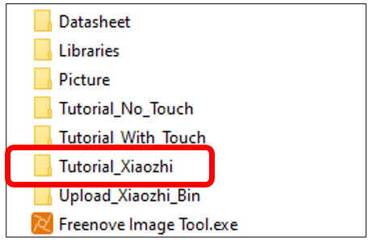
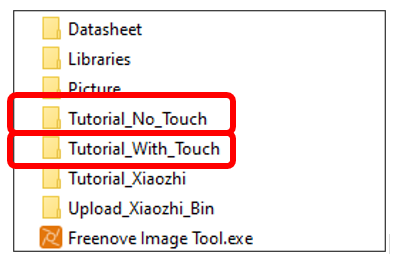
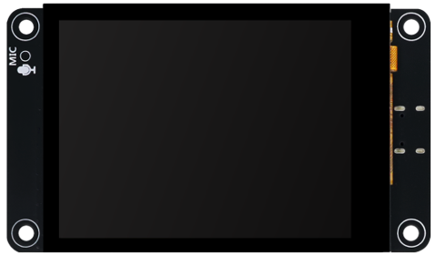
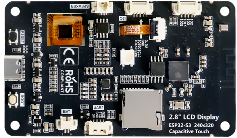
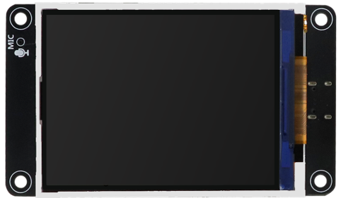
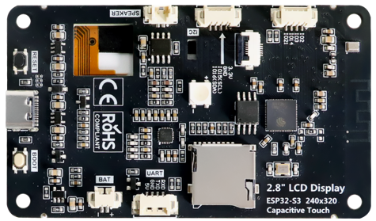
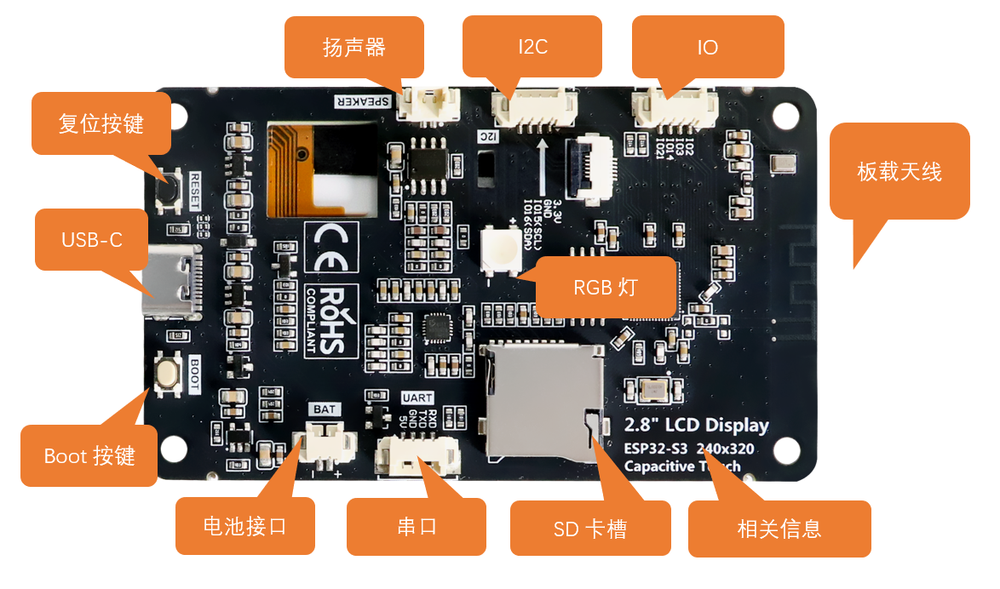

##############################################################################
Freenove ESP32S3 Display
##############################################################################

截至本教程编写时，Freenove ESP32-S3 Display系列开发板提供两种型号：一种配备触摸屏功能，另一种不带触摸功能，两种型号都可以通过这个教程来学习如何使用XiaoZhi AI。

Touch
***********************************

.. table::
    :align: center
    :class: table-line
    :width: 100%

    +-------------+-------------+
    | **Top**     | **Bottom**  |
    |             |             |
    | |Display01| | |Display02| |
    +-------------+-------------+

NonTouch
************************************

.. table::
    :align: center
    :class: table-line
    :width: 100%

    +-------------+-------------+
    | **Top**     | **Bottom**  |
    |             |             |
    | |Display03| | |Display04| |
    +-------------+-------------+

硬件接口
**********************************************

