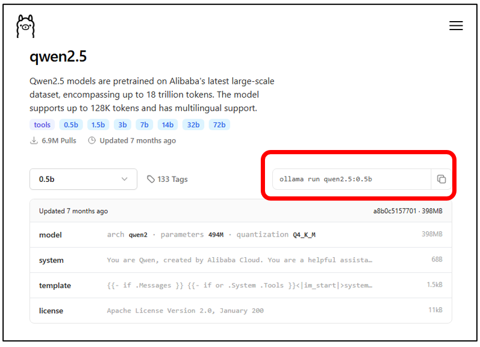
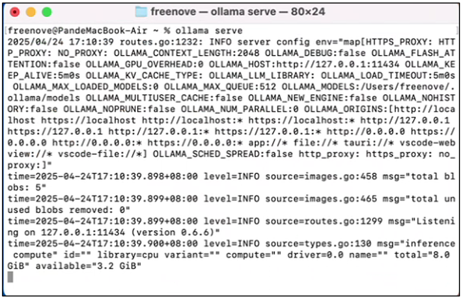

##############################################################################
本地服务器
##############################################################################

免责声明
********************************

本项目基于开源仓库（MIT License）开发：https://github.com/xinnan-tech/xiaozhi-esp32-server。小智AI固件运行于虾哥的公司提供的服务器，我们仅对其进行了第三方学习与AI功能试用的适配，不涉及任何商业推广或实际应用。本教程仅供爱好者学习补充使用。

在本地服务器部署小智AI
***************************************************************

如果您不想使用小智AI官方服务器，也可以在本地计算机上搭建简化版服务端。本节我们将使用开源项目 https://github.com/xinnan-tech/xiaozhi-esp32-server 部署本地服务器，并与ESP32-S3建立连接。

若使用过程中发现代码存在bug，请前往 https://github.com/xinnan-tech/xiaozhi-esp32-server 提交issue。请注意，我们对该项目并无深入了解，可能无法提供大量协助。

安装Ollama
===============================================================

Windows
---------------------------------------------------------------

在开始之前，我们需要在本地安装Ollama工具，该工具可让我们在计算机上运行任何开源AI模型。

若您尚未安装Ollama，请访问 https://ollama.com/download 下载并安装。

.. image:: ../_static/imgs/Local_Server/Local00.png
    :align: center

运行Ollama安装程序，点击安装。

.. image:: ../_static/imgs/Local_Server/Local01.png
    :align: center

安装完成后，您将在任务栏中看到Ollama图标出现。

.. image:: ../_static/imgs/Local_Server/Local02.png
    :align: center

返回桌面，右键点击"此电脑"（或"我的电脑"），从上下文菜单中选择"属性"。

.. image:: ../_static/imgs/Local_Server/Local03.png
    :align: center

在打开的新窗口中，找到并点击"高级系统设置"。

在打开的新窗口中，点击"环境变量"。

.. image:: ../_static/imgs/Local_Server/Local05.png
    :align: center

点击 “新建”.

.. image:: ../_static/imgs/Local_Server/Local06.png
    :align: center

在变量名输入框填写：OLLAMA_HOST 在变量值输入框填写：0.0.0.0:11434 点击确定保存

通过此设置，您局域网内的所有设备均可通过本机IP地址访问Ollama服务。

若未进行此配置，Ollama将仅限本地主机访问（即仅安装该服务的计算机可用）。

.. image:: ../_static/imgs/Local_Server/Local07.png
    :align: center

Mac OS
------------------------------

在开始前，我们需要在本地安装Ollama工具，这将允许我们在计算机上运行任何开源AI模型。

若您尚未安装Ollama，请访问 https://ollama.com/download 下载并安装。

.. image:: ../_static/imgs/Local_Server/Local08.png
    :align: center

在"下载"文件夹中找到"Ollama.app"，双击打开该应用。

点击"下一步" → "安装" → "完成"。

.. image:: ../_static/imgs/Local_Server/Local10.png
    :align: center

安装完成后界面将自动关闭。

打开终端，使用指定命令检查Ollama是否安装成功：

.. code-block:: console
    
    ollama --version

.. image:: ../_static/imgs/Local_Server/Local11.png
    :align: center

注意：Ollama 位于您的"应用程序"文件夹中。

如图所示：

    - 若Ollama已在运行，执行 ollama --version 将显示版本号

    - 若Ollama未运行，该命令将返回连接错误（"无法连接到正在运行的Ollama实例"）

Linux
------------------------------------

在开始前，我们需要在本地安装Ollama工具，这将允许我们在计算机上运行任何开源AI模型。

若您尚未安装Ollama，请访问 https://ollama.com/download 下载并安装。

打开终端，运行以下命令安装Ollama：

安装过程应如上图所示。您可以通过运行以下命令验证Ollama是否安装成功：

LLM Model
===============================================================

请访问 https://ollama.com/search 并选择适合您计算机配置或您偏好的LLM大语言模型。

这里我们以qwen2.5模型为例，点击"qwen2.5"模型。

.. image:: ../_static/imgs/Local_Server/Local15.png
    :align: center

请注意，在选择模型时，您需要根据计算机的GPU显存或CPU内存配置选择合适的模型规格。

1、参数规模更大的模型具备更高智能水平，而较小模型则智能水平相对较低

2、高端配置设备（高性能GPU/CPU且内存充足）建议选择大模型以获得最佳表现；低配置设备（GPU/CPU内存有限）应选用小模型以保证运行流畅

3、若在性能不足的系统上选择过大的模型，可能导致无法加载或推理速度极其缓慢

您可以通过下拉菜单选择适配的模型参数规模。

较小规模的模型能力稍弱但运行更快。本次演示我们将以qwen2.5:0.5b模型为例。

请从网页复制以下命令：

.. code-block:: console
    
    ollama run qwen2.5:0.5b

请选择与您操作系统兼容的版本，安装您首选的大语言模型(LLM)。

Windows
------------------------

请使用快捷键"Win+R"，在弹出的窗口中输入"CMD"，即可打开命令提示符界面。

.. image:: ../_static/imgs/Local_Server/Local18.png
    :align: center

运行命令 **“ollama --version”** 以验证是否已成功安装ollama。

.. image:: ../_static/imgs/Local_Server/Local19.png
    :align: center

输入命令 **“ollama run qwen2.5:0.5b”** 将模型下载至本地计算机。

.. image:: ../_static/imgs/Local_Server/Local20.png
    :align: center

安装完成后，您可直接在命令提示符（CMD）界面与Qwen2.5-0.5B进行对话。

您可通过以下方式退出或启动服务：

1、按下 Ctrl+D 组合键退出对话模式

2、运行命令 “ollama serve” 启动服务端

.. image:: ../_static/imgs/Local_Server/Local22.png
    :align: center

.. note::
    
    若Ollama已在运行（系统任务栏显示其图标），再次执行 ollama serve 将引发错误。这两种方式实际启动的是同一服务。

.. image:: ../_static/imgs/Local_Server/Local23.png
    :align: center

Mac OS
-----------------------------------

在终端中运行命令 **“ollama --version”** 以检测Ollama是否已安装成功。

若出现提示 “Warning: could not connect to a running Ollama instance”，表明Ollama服务未启动。请前往应用程序目录手动运行。

.. image:: ../_static/imgs/Local_Server/Local25.png
    :align: center

请在终端重新检测服务运行状态。

.. image:: ../_static/imgs/Local_Server/Local26.png
    :align: center

在终端中运行 **“ollama run qwen2.5:0.5b”** 以将模型安装至本地计算机。

安装完成后，您可以直接在终端界面与Qwen2.5-0.5B进行对话。

您可以通过按下 “Ctrl+D” 退出。

您可以通过运行命令 “ollama serve” 来启动 Ollama 服务器。

如果 Ollama 已在运行，您将看到以下信息。

.. image:: ../_static/imgs/Local_Server/Local30.png
    :align: center

:combo:`red font-bolder:要访问 Ollama 的用户指南，请运行命令 Ollama。`

Linux
-----------------------------------

在终端运行命令 **“ollama --version”** 以检查 Ollama 是否已安装。

.. image:: ../_static/imgs/Local_Server/Local31.png
    :align: center

运行命令 **“ollama run qwen2.5:0.5b”** 将模型下载到您的计算机。

安装完成后，您可以直接在终端界面与 Qwen2.5-0.5B 进行对话。

.. image:: ../_static/imgs/Local_Server/Local33.png
    :align: center

按 Ctrl+D 即可退出。

:combo:`red font-bolder:要查看 Ollama 用户指南，请运行命令 ollama。`

安装 Conda
===============================================================

小智-ESP32服务器开源项目提供四种安装方式。本教程将演示最简单的配置示例，其他使用方法请参考项目官网进一步探索。

Windows
---------------------------------

本示例使用 Conda 进行依赖项管理，因此您需要提前在系统中安装 Conda。若尚未安装，可从以下地址下载安装：https://www.anaconda.com/download/success

请选择适合您操作系统的安装程序。

Miniconda 是 Anaconda 提供的轻量级安装工具，已预配置支持 Anaconda 资源库。

.. image:: ../_static/imgs/Local_Server/Local35.png
    :align: center

此处我们以 Windows 系统为例。双击下载的 Conda 安装程序，点击 下一步 继续。

点击 “我同意”.

.. image:: ../_static/imgs/Local_Server/Local37.png
    :align: center

根据需求选择安装类型，通常建议选择 “为所有用户安装” 以实现系统级部署。

指定软件安装位置

.. image:: ../_static/imgs/Local_Server/Local39.png
    :align: center

保持以下配置为默认值，点击 安装 继续。

请等待安装完成，此过程可能需要一些时间。

.. image:: ../_static/imgs/Local_Server/Local41.png
    :align: center

至此，软件已安装完成。

.. image:: ../_static/imgs/Local_Server/Local42.png
    :align: center

使用快捷键 Win+R，在弹出的窗口中输入 cmd 即可打开命令提示符界面。

输入 conda --version 并按回车键。若 Anaconda3 安装正确，您将看到如下版本信息：

.. image:: ../_static/imgs/Local_Server/Local44.png
    :align: center

Mac OS
-----------------------------------

本示例使用 Conda 进行依赖管理，因此需提前在系统中安装 Conda。若尚未安装，请从以下地址下载安装： https://www.anaconda.com/download/success

请根据操作系统选择对应的安装程序。

Miniconda 是 Anaconda 官方提供的轻量级安装工具，已预配置可无缝对接 Anaconda 资源库。

.. image:: ../_static/imgs/Local_Server/Local45.png
    :align: center

双击打开 Conda 安装程序，点击 继续 按钮。

.. image:: ../_static/imgs/Local_Server/Local46.png
    :align: center

点击继续

.. image:: ../_static/imgs/Local_Server/Local47.png
    :align: center

点击继续

点击同意

.. image:: ../_static/imgs/Local_Server/Local49.png
    :align: center

点击 “继续” 使用默认设置进行安装。

.. image:: ../_static/imgs/Local_Server/Local50.png
    :align: center

点击 安装。

.. image:: ../_static/imgs/Local_Server/Local51.png
    :align: center

请等待数分钟以完成安装。

点击继续

.. image:: ../_static/imgs/Local_Server/Local53.png
    :align: center

点击关闭

.. image:: ../_static/imgs/Local_Server/Local54.png
    :align: center

Conda 已成功安装，该应用程序将出现在您的程序/应用列表中。

双击运行（此步骤不会显示任何可见响应），然后重新打开终端，此时应出现"(base)"前缀提示符。您也可通过运行命令 conda --version 验证版本信息。

您可通过运行 conda -h 查看更多使用说明。

首次使用 conda 时，需运行 conda init 命令初始化并激活已安装的 conda 环境。

.. code-block:: console
    
    conda init

您可通过 conda activate 启用虚拟环境，或使用 conda deactivate 退出当前环境。

.. code-block:: console
    
    conda activate
    conda deactivate

.. image:: ../_static/imgs/Local_Server/Local58.png
    :align: center

要实现终端启动时自动激活 conda 环境，请执行： **conda config --set auto_activate_base true**

若要禁用此自动激活功能，请运行： **conda config --set auto_activate_base false**

.. code-block:: console
    
    conda config --set auto_activate_base false
    conda config --set auto_activate_base true

Linux
-----------------------------------

本示例使用 Conda 进行依赖管理，因此需提前在系统中安装 Conda。若尚未安装，请从以下地址下载： https://www.anaconda.com/download/success

根据操作系统选择对应的安装程序。

Miniconda 是 Anaconda 官方提供的轻量级安装工具，已预配置可无缝对接 Anaconda 资源库。

.. image:: ../_static/imgs/Local_Server/Local59.png
    :align: center

此处下载的文件名为 "Anaconda3-2024.10-1-Linux-x86_64.sh"（注意：不同计算机上的文件名可能有所差异）。

要安装 Anaconda，请打开终端并执行以下命令：

.. code-block:: console
    
    sh Anaconda3-2024.10-1-Linux-x86_64.sh

.. image:: ../_static/imgs/Local_Server/Local60.png
    :align: center

持续按住回车键，直到出现如下提示后输入 “yes”。

.. image:: ../_static/imgs/Local_Server/Local61.png
    :align: center

选择安装路径后按回车键，可直接使用默认位置。

.. image:: ../_static/imgs/Local_Server/Local62.png
    :align: center

安装过程需要联网，请确保网络连接稳定并耐心等待数分钟，直至出现以下提示信息。

.. note::
    
    需输入 Yes 确认继续。

.. image:: ../_static/imgs/Local_Server/Local63.png
    :align: center

出现以下提示即表示 conda 已成功安装。

.. image:: ../_static/imgs/Local_Server/Local64.png
    :align: center

要在终端启动时自动激活 conda 环境，请执行： conda config --set auto_activate_base true

若要禁用此自动激活功能，请运行： conda config --set auto_activate_base false

.. code-block:: console
    
    conda config --set auto_activate_base false
    conda config --set auto_activate_base true

我们建议禁用自动激活功能，请执行： conda config --set auto_activate_base false

重新打开终端后，执行 conda --version 命令即可验证 conda 版本。

.. code-block:: console
    
    conda --version

.. image:: ../_static/imgs/Local_Server/Local66.png
    :align: center

以下两条命令可用于激活或退出conda虚拟环境。

.. code-block:: console
    
    conda activate
    conda deactivate

如果在检查conda版本时出现以下错误，

.. code-block:: console
    
    conda -version

这表明虽然已安装Conda，但尚未添加到您的PATH环境变量中。

请按以下步骤将Conda添加到PATH：

使用nano编辑 **".bashrc"** 文件：

.. code-block:: console
    
    cd ~
    sudo nano ./.bashrc

请将以下内容添加到文件末尾：

.. code-block:: console
    
    export PATH=”$HOME/anaconda3/bin:$PATH”

按 Ctrl+O 保存文件，按 Ctrl+X 退出编辑。

运行以下命令使配置生效，然后重新检查 conda 版本：

.. code-block:: console
    
    source ./.bashrc
    conda --version

部署虚拟环境
===============================================================

**请注意，部署虚拟环境的命令在Windows、Mac和Ubuntu系统中是通用的。本文示例使用Windows系统，但相同操作适用于其他平台。**

打开CMD/Terminal终端界面，运行以下命令创建一个名为"xiaozhi-esp32-server"、预装Python 3.10的虚拟环境。

.. code-block:: console

    conda create -n xiaozhi-esp32-server python=3.10 -y

.. image:: ../_static/imgs/Local_Server/Local72.png
    :align: center

当出现以下提示信息时，表示虚拟环境已创建成功。

要删除虚拟环境，请运行以下命令：

.. code-block:: console

    conda remove -n xiaozhi-esp32-server --all -y

.. image:: ../_static/imgs/Local_Server/Local74.png
    :align: center

您也可以使用以下两条命令来激活或退出虚拟环境。

.. code-block:: console

    conda activate xiaozhi-esp32-server
    conda deactivate

.. image:: ../_static/imgs/Local_Server/Local75.png
    :align: center

:combo:`red font-bolder:重要提示：`

:combo:`red font-bolder:若激活环境时收到建议运行 conda init 的提示，请执行以下操作：`

部署 xiaozhi-esp32-server 环境
===============================================================

Windows 用户请打开命令提示符（CMD） macOS 或 Ubuntu 用户请使用终端

本教程主要以 Windows 截图进行演示。若存在操作差异，我们将提供其他系统的对应示例。

激活虚拟环境

.. code-block:: console

    conda activate xiaozhi-esp32-server

在虚拟环境中安装 libopus

.. code-block:: console

    conda install libopus -y

在虚拟环境中安装 FFmpeg

.. code-block:: console

    conda install ffmpeg -y

在虚拟环境中安装 Git

.. code-block:: console

    conda install git -y

.. image:: ../_static/imgs/Local_Server/Local79.png
    :align: center

使用 git clone 命令下载服务器源代码

.. code-block:: console

    git clone https://github.com/Freenove/xiaozhi-esp32-server.git

.. image:: ../_static/imgs/Local_Server/Local80.png
    :align: center

进入服务器源代码目录

Windows 用户请注意：路径中使用反斜杠(\\)

.. code-block:: console

    cd xiaozhi-esp32-server\main\xiaozhi-server

.. image:: ../_static/imgs/Local_Server/Local81.png
    :align: center

Mac/Linux 用户请注意：路径中使用正斜杠(/)

.. code-block:: console

    cd xiaozhi-esp32-server/main/xiaozhi-server

.. image:: ../_static/imgs/Local_Server/Local82.png
    :align: center

安装服务器源代码所需的依赖库

请注意：

1、此过程可能需要较长时间

2、请确保网络连接稳定

3、不要中断安装过程

.. code-block:: console

    pip config set global.index-url https://mirrors.aliyun.com/pypi/simple/
    pip install -r requirements.txt

.. image:: ../_static/imgs/Local_Server/Local83.png
    :align: center

当输出内容与以下截图匹配时，表示安装已完成。

.. image:: ../_static/imgs/Local_Server/Local84.png
    :align: center

安装语音模型

.. code-block:: console

    git clone https://www.modelscope.cn/iic/SenseVoiceSmall.git

使用 copy 命令将 model.pt 文件从 SenseVoiceSmall 复制到 models/SenseVoiceSmall 文件夹

Windows 用户请使用 copy 命令

.. code-block:: console

    copy .\SenseVoiceSmall\model.pt .\models\SenseVoiceSmall\

.. image:: ../_static/imgs/Local_Server/Local86.png
    :align: center

macOS/Linux 用户请使用 cp 命令

.. code-block:: console

    cp ./SenseVoiceSmall/model.pt ./models/SenseVoiceSmall/

在CMD界面中输入命令“mkdir data && copy config.yaml data.config.yaml”，它将在xiaozhi-server中创建一个名为“data”的文件夹，并将当前目录下的“config.yaml”文件复制到“data”文件夹中，重命名为“.config.yaml”。

如果您是Windows用户，请执行：

.. code-block:: console
    
    mkdir data && copy config.yaml data\.config.yaml

如果您是 Mac/Linux 用户，请运行以下命令：

.. code-block:: console
    
    mkdir data && cp config.yaml data/.config.yaml

打开并修改 config.yaml 文件。

在 Windows 上运行：

.. code-block:: console
    
    code .\data\.config.yaml

在 Mac/Linux 上运行：

.. code-block:: console
    
    code ./data/.config.yaml

:combo:`red font-bolder:Note:如果您的 VSCode 未正确安装，运行命令可能会报错。您也可以手动使用 VSCode 打开此文件。`

找到 **"selected_module:"**，将 **"LLM: ChatGLMLLM"** 修改为 **"LLM: OllamaLLM"**

.. image:: ../_static/imgs/Local_Server/Local90.png
    :align: center

找到 **“LLM:”** 下的 **“OllamaLLM:”**，将 **“model_name: qwen2.5”** 修改为 **“model_name: qwen2.5:0.5b”**。

.. image:: ../_static/imgs/Local_Server/Local91.png
    :align: center

:combo:`red font-bolder:重要提示：为确保小智AI的视觉识别功能正常使用，请按以下步骤配置视觉大模型（VLLM）。若您当前无需此功能，可跳过此步骤继续后续操作。`

继续编辑config.yaml文件：首先，按照提示步骤注册获取相应的API密钥，然后将生成的API密钥填入代码中。

.. image:: ../_static/imgs/Local_Server/Local92.png
    :align: center

保存并退出文件。

您也可以选择其他模型，例如默认的ChatGLM-LLM。请注意，配置不同的LLM模型需要您手动探索和设置。

运行xiaozhi-esp32-server代码。

.. code-block:: console
    
    python app.py

.. image:: ../_static/imgs/Local_Server/Local93.png
    :align: center

.. note::
    
    服务器将显示一个访问端口号——请记住它，后续教程中会用到。

现在您可以通过浏览器打开位于 xiaozhi-esp32-server\\main\\xiaozhi-server\\test 目录下的 HTML 文件。

测试步骤如下：

.. image:: ../_static/imgs/Local_Server/Local95.png
    :align: center

点击 “连接”.

.. image:: ../_static/imgs/Local_Server/Local96.png
    :align: center

测试 xiaozhi-esp32-server 的方法：输入任意消息并点击"发送"按钮。

若服务器运行正常，您即可开始与系统进行对话。

.. image:: ../_static/imgs/Local_Server/Local98.png
    :align: center

重要提示：必须同时运行 xiaozhi-esp32-server 和 Ollama 两个服务。若 Ollama 未启动，您将看到如下示例的错误提示。

您可以参考 :ref:`LLM模型 <fnk0104/codes/xiaozhi_cn/local_server:llm model>` 来运行Ollama。

通过ESP32S3访问xiaozhi-esp-server
*********************************************

请注意，前文代码中我们已详解了小智AI代码的配置。本章需要修改项目配置，使ESP32S3能够访问xiaozhi-esp32-server的本地服务器。

将连接类型设置为"Websocket"，并输入之前 xiaozhi-esp32-server 显示的访问端口号进行连接。

.. image:: ../_static/imgs/Local_Server/Local101.png
    :align: center

点击保存并重新编译代码，如下图所示。

点击界面底部的"Build Project"按钮编译代码。

.. image:: ../_static/imgs/Local_Server/Local103.png
    :align: center

点击底部的"Flash Device"按钮，将代码烧录至ESP32S3。

恭喜！您已完成小智AI的全部配置。只需对着麦克风说"Hi, ESP"，即可开始与本地服务器对话。

.. note::
    
    本地服务器需要高性能硬件支持。若您的PC配置较低，建议改用科技大厂的LLM API服务，这类方案对系统要求较低。