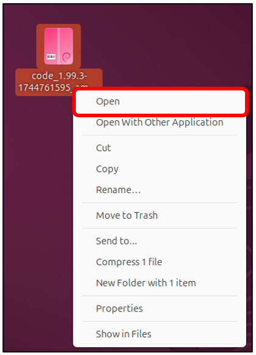
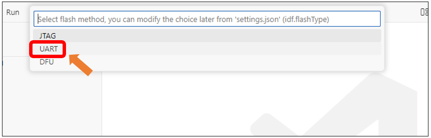

##############################################################################
小智AI代码
##############################################################################

Visual Studio Code
******************************

Windows
=============================

首先，访问 https://code.visualstudio.com/Download 下载 Visual Studio Code。根据您的操作系统选择对应版本，下载后进行安装。

双击下载的 .exe 文件运行安装程序。

勾选“我接受许可协议”选项。

然后点击“下一步”。

安装路径可保留默认设置，或修改为自定义目录。之后连续点击“下一步”继续。

在此界面，请确认已勾选“添加到 PATH”（如未勾选，请手动启用）。随后连续点击“下一步”完成安装。

安装已完成，如下图所示。

Mac
============================

通常情况下，macOS 系统已预装 Visual Studio Code。若您的设备未安装，请先完成安装。

访问 https://code.visualstudio.com 官网，点击"Download for macOS"（macOS 版下载）按钮。

双击运行程序。

Linux
============================

若您的设备未安装 Visual Studio Code，请先完成安装。

访问 https://code.visualstudio.com 官网，点击 .deb 格式安装包。

打开下载的 code_xxx.deb 安装包文件。

点击 Install（安装） 按钮完成 Visual Studio Code 的安装。

请等待安装完成。安装成功后，界面应如下图所示。

点击 Show Apps（显示应用程序） 即可在系统中看到 Visual Studio Code。

安装 ESP-IDF V5.3.2 
************************************

Visual Studio Code 是一款多功能代码编辑器。要使用 ESP-IDF SDK 进行编程，我们需要为其安装 ESP-IDF 扩展。

打开 Visual Studio Code。

点击菜单栏：文件(File) -> 首选项(Preferences) -> 扩展(Extensions)。

Mac OS 系统：点击菜单栏中的 “Code” -> “Preferences” -> “Extensions”（“扩展”）。

在扩展栏中搜索 “ESP-IDF”，从列表中选择正确的结果，然后点击 “Install” (安装) 按钮继续。

现在，ESP-IDF 扩展的图标会出现在左侧边栏中 —— 点击该图标即可继续操作。

向下滚动鼠标，找到并点击 “Advanced”(高级)选项。

点击第一个选项：“Configure ESP-IDF Extension”(配置 ESP-IDF 扩展)。

在右侧选择 “EXPRESS”（快速安装） 选项。

.. note::
    
    如果您使用的是 macOS 或 Ubuntu 系统，请根据提示完成必要的准备工作，再继续安装。

1. 勾选 “Show all ESP-IDF tags”(显示所有 ESP-IDF 版本标签) 的复选框。

2. 从下拉菜单中选择 “v5.3.2 (release version)”(v5.3.2 正式版)。

3. 选择您希望安装 ESP-IDF 环境 的目标路径。

4. 点击 “Install”(安装)按钮开始配置。

该过程将自动完成。

如果安装失败，请找到您选择的 ESP-IDF 目录，删除其中的安装失败文件夹，然后重新安装。

此步骤可能需要一些时间，请确保您的网络连接稳定且快速。

完整安装过程如下图所示。

有关 ESP-IDF 的更多信息，请参考

https://docs.espressif.com/projects/vscode-esp-idf-extension/en/latest/installation.html

代码下载
============================

Windows
-----------------------------------

在电脑上打开浏览器，输入 **“https://github.com/Freenove/xiaozhi-esp32”**。

.. image:: ../_static/imgs/XiaoZhi_AI_Code/xiaozhi23.png
    :align: center

点击 “Code” -> “Download ZIP”，将代码下载到你的电脑上。

将下载的 zip 文件解压到电脑上，并将解压后的文件夹重命名为 “xiaozhi-esp32”。

Mac
-----------------------------------

打开终端，使用 git 命令下载代码。

.. code-block:: console
    
    git clone https://github.com/Freenove/xiaozhi-esp32.git

Linux
-----------------------------------

打开终端，使用 git 命令下载代码。

.. code-block:: console
    
    git clone https://github.com/Freenove/xiaozhi-esp32.git

配置代码环境
====================================

解压下载的ZIP文件。

在Visual Studio Code中，点击“文件” -> “打开文件夹…”。

选择 **xiaozhi-esp32** 文件夹。此处以 Windows 系统界面为例，Mac 系统和 Linux 系统的操作类似。

勾选 “信任‘Downloads’父文件夹中所有文件的作者”，然后选择 “是，我信任这些作者”。

请注意：右下角将弹出提示框，点击 “生成 comple_commands.json”，系统将根据该文件下载对应的组件模块代码。

组件安装可能需要一些时间，请耐心等待并避免进行其他操作。安装完成后，右下角会显示完成通知。

.. image:: ../_static/imgs/XiaoZhi_AI_Code/xiaozhi32.png
    :align: center

使用USB线将ESP32-S3连接至电脑，注意必须插入正确的Type-C接口（请勿接错插口）

点击左下角的 'COMx' 按钮，显示电脑所有可用COM端口。找到并选择标有"ESP32-S3"的选项

点击左下角的 'ESP32' 按钮，显示所有可用ESP32型号，然后从列表中选择 'ESP32-S3'。

从新出现的选项菜单中，选择 'ESP32-S3芯片（通过ESP-PROG） - 使用ESP-PROG开发板调试ESP32-S3...'

请等待，直到右下角显示 “目标设备ESP32S3设置成功” 的提示。

点击底部的 “SDK配置编辑器(menuconfig)”

在新界面中，点击 '串行烧录器配置(Serial flasher config)'，并确认各项设置与下图所示配置一致。

点击 “分区表(Partition Table)”，并确认其设置与下图所示配置一致。

点击 “Xiao Assistant”，并确认其设置与下图所示配置一致。

点击 “加载多个唤醒词(Load Multiple Wake Words)”，并勾选 'Hi, ESP' 和 'Hi, Lily'（以及其他所需选项）的复选框。

最后点击 “保存(Save)” 以存储配置，操作成功后底部将显示完成提示。

代码编译
===================================

开始编译前，请确保前文所述的所有配置均正确无误。点击底部工具栏中的 '全部清理(Full Clean)' 按钮以重置构建缓存。

点击底部的 '构建项目(Build Project)' 开始编译整个工程。首次编译耗时可能较长，请耐心等待输出面板显示成功提示。

点击底部的 '烧录设备(Flash Device)' 开始将代码上传至ESP32-S3模块。

从新出现的选项菜单中，选择 'UART' 并等待代码上传完成。

当看到 '烧录完成。您可以使用"ESP-IDF: Monitor command"监控设备' 的提示时，即表示您已成功将XiaoZhi AI固件烧录至ESP32-S3模块。

至此，编译已完成，可进行二次开发。